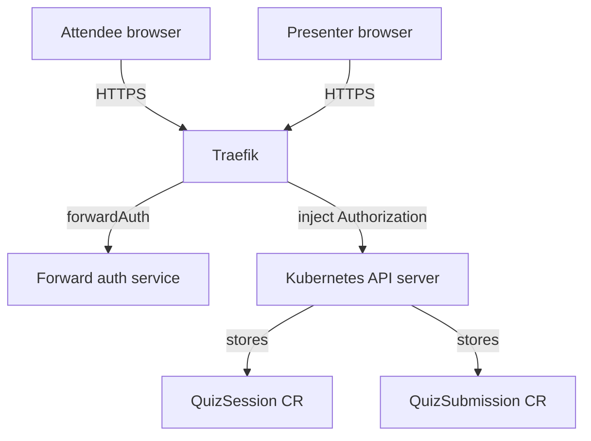

# Architecture (chosen path)

This repo implements a live quiz webapp where the **Kubernetes API server is the API**.

Main choices (deliberate, for simplicity and to match the talk narrative):

- Kubernetes API is publicly reachable, protected by `Traefik`.
- A **simple forward-auth service** validates a session join code and sets up a per-browser device session.
  - Implementation choice: **Go**, to keep the trusted computing base small (single static binary, tiny container image) while using the standard Kubernetes `client-go` support for TokenRequest.
- **Real Kubernetes tokens never leave the server side**; `Traefik` injects `Authorization` upstream.
- Frontend is a **static SPA** (Vue 3 + Vite + TypeScript + shadcn-vue).

## 1. Summary

Goal: let the attendee frontend call Kubernetes REST endpoints directly (create a `QuizSubmission` CR, read the `QuizSession` CR), without a bespoke application backend that re-implements the domain API.

Approach:

1. Put `Traefik` in front of the Kubernetes API server endpoint.
2. Require a session join code on first entry (QR).
3. A small auth service:
   - validates the join code
   - creates a per-browser device session
   - mints short-lived Kubernetes tokens using TokenRequest (BoundServiceAccountToken)
4. `Traefik` injects `Authorization: Bearer <token>` only on the upstream request to Kubernetes.
5. `Traefik` rejects junk traffic early and applies rate limiting, CORS, and request size limits.

This makes Kubernetes the API in the most literal sense, which aligns strongly with your talk theme.

## 2. Proposed component model

Components:

1. Browser frontend (attendee and presenter)
2. Traefik (internet-facing)
3. Forward-auth service (very small)
4. Kubernetes API server (upstream)
5. CRDs and CRs in a dedicated namespace

Mermaid view:

## 3. Traffic flow (detailed)

### 3.0 Join flow and device session

To get “one device session per browser” without sending Kubernetes tokens to the client:

1. QR link opens the SPA with a join code.
2. Browser hits any protected endpoint.
3. Traefik forward-auth calls the auth service.
4. Auth service validates the join code and creates a **device session**.
5. Auth service sets a **Secure, HttpOnly cookie** on the browser (device session id).
6. Subsequent requests use the cookie, not the join code.

Notes:

- This is not strict one-person-one-vote, but it allows reasonable per-device throttling.
- Join codes should be high entropy; cookies should be short-lived.

### 3.1 Read session definition

1. Browser requests `GET /apis/<group>/<version>/namespaces/<ns>/quizsessions/<name>`.
2. Traefik calls the auth helper (ForwardAuth) with the original request headers.
3. Auth service validates either:
   - join code on first request, or
   - device session cookie on subsequent requests
4. If valid, auth helper responds `200` and provides an auth response header that Traefik copies into the upstream request, e.g. `Authorization: Bearer <token>`.
5. Traefik forwards to Kubernetes API server.

### 3.2 Submit answers

1. Browser posts `POST /apis/<group>/<version>/namespaces/<ns>/quizsubmissions`.
2. Same ForwardAuth flow.
3. Traefik forwards with injected `Authorization`.
4. Kubernetes RBAC authorizes the token to create only the allowed CRDs in the allowed namespace.

### 3.3 Presenter live view

You have options:

- Poll: `GET` list endpoints repeatedly.
- Watch: `GET ...?watch=1`.

Watch is more “Kubernetes-native” but can be risky from a public endpoint perspective (long-lived connections, amplification, API server load).

## 4. Traefik pattern: forwardAuth + header injection

Use Traefik `ForwardAuth` middleware:

- Forward-auth service returns `200` and includes `Authorization: Bearer ...` in the auth response headers.
- Traefik forwards that header upstream to the Kubernetes API server.

Critical hardening requirements:

- Traefik must *strip* any client-provided `Authorization` header before forwarding.
- Traefik should reject missing/invalid codes without touching Kubernetes.
- Apply IP-based and per-code rate limits.
- Set max request body size to avoid large payload DoS.

## 5. Token strategy (chosen)

Mint short-lived **BoundServiceAccountTokens** using the Kubernetes **TokenRequest** API (a dedicated API call that mints temporary service-account tokens on demand). **The forward-auth auth-service is responsible for retrieving these short-lived access tokens** via `POST /api/v1/namespaces/<ns>/serviceaccounts/<sa>/token` and caching them per device session.

Properties:

- Minted by the forward-auth service.
- Scoped by RBAC to the minimal CRD verbs in one namespace.
- Short-lived.
- Cached per device session, refreshed on expiry.

Why:

- Tokens never reach the browser.
- You get per-device sessions (soft uniqueness) for throttling and visibility.
- Short-lived tokens reduce the blast radius of accidental exposure.

## 6. CORS and browser constraints

If browsers call the Kubernetes API, you must handle:

- CORS preflight (OPTIONS) at Traefik.
- Allowed methods: GET, POST, OPTIONS (and maybe WATCH via GET).
- Allowed headers: Content-Type, Authorization (even though injected upstream), and your code header if used.

Important: treat the join code and device session id as credentials.

## 7. Risks

This section is intentionally blunt because this approach exposes Kubernetes API semantics to the public internet.

### 7.1 Increased attack surface

Even with tight RBAC, exposing the Kubernetes API server path structure invites:

- Endpoint discovery and probing.
- Expensive API calls: list/watch patterns can create load.
- Abuse of long-lived watch connections.

Mitigations:

- Rate limit aggressively.
- Consider disallowing watch from the public side; do polling or do presenter-only watch from a trusted network.
- Limit concurrency and connection duration.

### 7.2 Credential replay and brute force of the session code

If the code is the only auth factor, an attacker can:

- guess it (if short)
- share it
- replay it

Mitigations:

- Use high-entropy codes (at least 128-bit random, encoded).
- Rate limit by IP and by code.
- Optionally rotate codes (e.g., change every N minutes) and show a new QR.

### 7.3 Token leakage via misconfiguration

If Traefik ever returns the injected token to the client (headers or error bodies), you lose.

Mitigations:

- Ensure injected Authorization is only on the upstream request, never a response.
- Strip upstream headers on responses.
- Prefer short-lived minted tokens.

### 7.4 RBAC mistakes become internet-facing incidents

If RBAC accidentally allows broader verbs/resources (e.g., list secrets, create pods), the public endpoint becomes catastrophic.

Mitigations:

- Dedicated namespace.
- Dedicated ServiceAccount.
- Automated RBAC tests.
- Admission policies (ValidatingAdmissionPolicy / Gatekeeper / Kyverno) to restrict to your CRDs.

### 7.5 API server availability impact

During a live talk, a traffic spike or malicious traffic can:

- degrade the Kubernetes API server
- affect other workloads in the cluster

Mitigations:

- Use a dedicated cluster for the demo.
- Apply API Priority and Fairness (APF) policies to cap the impact.
- Put strict rate limits at Traefik.

### 7.6 Browser security and XSS

If the frontend has an XSS issue, an attacker can steal the session code and submit spam.

Mitigations:

- Content Security Policy.
- Keep frontend minimal.
- Treat session code as sensitive.

### 7.7 Auditability vs privacy

Kubernetes audit logs may capture request metadata.

Mitigations:

- Avoid logging query parameters containing the code.
- Prefer header-based codes over query parameters.
- Ensure Traefik access logs redact code headers.

## 8. Operational recommendations (still within this chosen model)

- Use a dedicated cluster for the demo.
- Apply API Priority and Fairness to cap impact.
- Apply strict Traefik rate limits, body size limits, and concurrency caps.
- Use strict RBAC plus admission controls so only your CRDs can be written.
