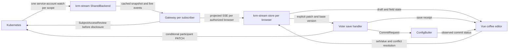

# Architecture

Voter is a coffee and voting demo consuming public infrastructure components. Room Pass
is an independent enrollment service being prepared for extraction. krm-stream owns
generic live-resource behavior. The krm-stream 0.4.0 integration with shared streams
is deployed; the running revision is **`d9f3d93`**, verified on **2026-09-15**.
Remaining targets are tracked in [PLAN.md](PLAN.md).

## Ownership

| Component | Owns | Boundary |
| --- | --- | --- |
| Voter Vue app | Coffee/voting screens, cart, field presentation, save intent | Uses library resource state; no custom reconciliation |
| Voter Go backend | Application OIDC session/CSRF, fixed resource scope, participant-token requests, coffee pricing/orders, QuizSubmission validation/aggregation, commit-request orchestration | No fallback participant writes as a ServiceAccount; no generic stream engine |
| krm-stream | Kubernetes watch-to-SSE protocol, shared-watch cache/fan-out, projections, snapshots, reconciliation, draft/conflicts, patch generation, generic recovery and optional framework adapters | No coffee semantics, application credentials, login UI or Git commit workflow |
| Room Pass | Room lifecycle, rotating codes, browser enrollment, stable participant identity, bound handoff to Dex | No application grants or token signing; no Voter dependency |
| Dex | OAuth 2.0/OIDC authorization server and OpenID Provider, connectors, codes and signed tokens | Trusts Room Pass assertions only through a protected authproxy integration |
| Kubernetes | Resource storage, token authentication, RBAC and audit | Identity does not itself grant permission. Admission is Kubernetes' too, but **this cluster runs no policy or webhook**, which is why one refusal in the demo is the application's — see [talk-checklist.md](docs/talk-checklist.md) |
| ConfigButler | Persisting accepted configuration changes to Git, commit status/history | Request acceptance is distinct from an observed commit |
| Platform GitOps repository | Installed versions, routes, CRDs, RBAC, issuer configuration and deployment | Live application changes arrive through Flux |

0.4.0 exports managed recovery and save-capture/reconciliation primitives,
plus the bounded HTTP delivery and stream lifecycle observations Voter once
hand-rolled. The Vue
binding and conditional-save controller are tested, copyable examples, not package
exports. Voter may own thin binding/request glue while the core owns reconciliation.
Proposal 0005 is discussion; 0006 sequences follow-ups. Neither makes upstream watch
continuation, replay, version notifications or a generic writer released capabilities.
What using the library has taught us, including the places Voter works around it
and the ones where we think it is right as it stands, is collected for its
maintainers in [docs/krm-stream-feedback.md](docs/krm-stream-feedback.md). What
running gitops-reverser has taught us is kept the same way, from operating it
rather than consuming it, in
[docs/gitops-reverser-feedback.md](docs/gitops-reverser-feedback.md).

This is a demo that has to be read from the back of a room, so some robustness
was traded away for a model an audience can hold. The places where we looked at a
real failure mode and chose not to defend against it -- what keeps each gap
closed in practice, and how to recover if it bites -- are written down in
[docs/deliberate-simplifications.md](docs/deliberate-simplifications.md). A guard
that is deleted without an entry there is indistinguishable from one nobody
noticed was missing.

## Identity flow and Room Pass's product boundary

```mermaid
sequenceDiagram
    participant B as Browser
    participant V as Voter OIDC client
    participant D as Dex
    participant R as Room Pass
    participant K as Kubernetes
    B->>V: Sign in
    V-->>B: Dex authorization request with PKCE
    B->>D: Authorization request
    D-->>B: Room Pass connector callback
    B->>R: Browser-bound room enrollment/handoff
    R->>K: Read Room and Participant; enroll if eligible
    R->>D: Trusted identity assertion on connector callback
    D-->>B: Authorization code for Voter
    B->>V: OIDC callback
    V->>D: Code exchange and token validation
    V->>K: SelfSubjectReview with participant token
    V-->>B: Encrypted HttpOnly application session cookie
    B->>V: REST read or mutation with session cookie
    V->>K: Request with participant's own ID token
```

## The operator page

`/room` is the presenter's own screen: the Room's rotating join code as a QR,
open/close for each round, and a switch that widens what the audience may do.
It holds no admin check. The page opens the same
watches any signed-in browser may ask for, carrying that browser's own token, and
renders what Kubernetes is willing to send — a participant's RBAC grants nothing
on rooms, so a participant sees a refusal and no code. `/admin` stays reachable by
everyone on purpose, but what it offers depends on the caller: the audience may
read the CoffeeConfig and watch it change, and may not save until an operator
grants it. The page explains the gap from `/auth/rules` and still lets the save
be attempted, so the refusal the room sees is a real 403 rather than a disabled
button.

Two locks guard the stream. `scopePolicy` in `participant_stream.go` says which
KINDS may be streamed at all and `streamAllowlist` says which objects of them, so
a verb granted to the audience for some other reason cannot by itself become a
new stream; RBAC then decides per subscriber. Opening a round patches the
QuizSession with the caller's own token, which is why the refusal a participant
sees is the API server's own.

The audience switch is the same idea applied to permission itself. It creates or
deletes one RoleBinding with the operator's own token, binding the static
`voter-audience-coffee-admin` Role — which lives in Git and is reconciled — to
the room's group. The **binding is deliberately not in the Flux kustomization**:
Flux would recreate whatever the switch deletes, and the grant would stop being
revocable. gitops-reverser mirrors it to the audit trail instead, so widening
what a room may do arrives in Git as a reviewable diff authored by whoever did
it. Every phone discovers the change by polling `/auth/rules`; nothing is pushed
and no session is re-established.

Operators reach `/room` through `/auth/login?connector=github`, allowlisted by
`OIDC_CONNECTOR_CHOICES`. The default path is unchanged and still sends a room
full of strangers straight to the Room Pass join form.

Room Pass is currently an **authenticating proxy for Dex**, not an OAuth authorization
server or standalone OpenID Provider. Dex's authproxy connector consumes a trusted
upstream identity; Dex handles the application's OAuth/OIDC exchange. See
[Dex authproxy](https://dexidp.io/docs/connectors/authproxy/) and the distinction between
OAuth authorization and OIDC authentication in the
[OpenID Foundation introduction](https://openid.net/developers/how-connect-works/).

Keep the product name **Room Pass** with a description such as “room-code sign-in for
applications, powered by Dex.” The combination supports ordinary OIDC applications;
those applications need no CoffeeConfig or Kubernetes client. Room Pass itself still
uses Kubernetes storage. Naming it `room-oauth` would imply protocol responsibilities
it currently delegates to Dex. Native OIDC issuance would require a separate design
and a mature provider implementation; it is not part of extraction.

Room Pass already has a separate Go module, Docker build, controller, CRDs and tests.
Remaining coupling includes the module's Voter repository path, parent CI/tasks, the
new Voter browser fixture, and demo-specific group/email assumptions. Extraction
preserves the API group, object UIDs, cookie keys, connector ID and subject mapping;
a new repository must not unexpectedly create new identities.

## HTTP endpoints

Every route the Go binary serves. `Session` means the handler is wrapped in
`requireParticipant`: a valid application cookie is required, and any method
other than GET/HEAD/OPTIONS must also carry the CSRF token. `/auth/logout` is
the one deliberate exception and its row says why. No route accepts a
browser-asserted identity, and no route falls back to the ServiceAccount for a
participant's write — a request that cannot be made with the caller's own token
fails instead.

### Identity

| Endpoint | Methods | Session | Why it exists |
| --- | --- | --- | --- |
| `/auth/login` | GET | — | Starts the OIDC transaction with PKCE. `?connector=` picks a Dex connector from `OIDC_CONNECTOR_CHOICES`; `?code=` and `?return=` carry a scanned QR's room code and destination |
| `/auth/callback` | GET | — | Completes the exchange, validates the token, mints the application session |
| `/auth/session` | GET | — | The **only** way the SPA learns who it is. Identity metadata and a CSRF token; never the ID token. 401 with a JSON body rather than a redirect, because a redirect inside `fetch()` is how login loops get built |
| `/auth/whoami` | GET | Session | A fresh `SelfSubjectReview` with the reader's own token, as YAML. There is no stored login object to show instead — a Kubernetes identity is derived per request |
| `/auth/rules` | GET | Session | A `SelfSubjectRulesReview` in the app's namespace: "what may I do?". `?as=yaml` returns the raw review. Needs no grant of its own — `system:basic-user` gives it to `system:authenticated` |
| `/auth/logout` | POST | CSRF only | Clears this app's cookie only — not the Dex session, not Room Pass enrolment, not the issued token. Deliberately **not** session-guarded: it verifies CSRF when a valid session exists and otherwise just clears the cookie and returns 204, so someone holding an expired cookie can still get rid of it |

### Coffee

| Endpoint | Methods | Session | Why it exists |
| --- | --- | --- | --- |
| `/public/storefront` | GET | Session | The menu as the shop renders it, priced by the server |
| `/public/vouchers` | GET | Session | Redemption counts. Process-local, and the page says so |
| `/public/orders` | GET, POST | Session | POST places an order and prices it server-side; GET returns the bounded in-memory feed, placements and refusals both |
| `/public/orders/stream` | GET | Session | Hand-written SSE for that feed. Not the krm-stream gateway: there is no watch to share and no object to authorize against |
| `/public/coffeeconfig` | GET, PATCH | Session | The editor's read and its conditional write. PATCH carries UID plus `resourceVersion` as a precondition and only `spec` is editable; a stale base is a real 409 |
| `/public/stream` | GET | Session | The projected krm-stream SSE for the one configured CoffeeConfig. Two locks: `scopePolicy` says which kinds may stream at all, `streamAllowlist` which objects — then RBAC decides per subscriber |

### Voting

| Endpoint | Methods | Session | Why it exists |
| --- | --- | --- | --- |
| `/public/rounds` | GET | Session | Lists the rounds this identity may read |
| `/public/rounds/{name}` | GET, POST | Session | GET returns a fresh round plus a `voted` flag so a returning voter sees the outcome rather than a form they cannot submit. POST casts the ballot |
| `/public/rounds/{name}/state` | POST | Session | Opens or closes a round, patched with the caller's own token — which is why a participant's refusal here is the API server's |
| `/public/rounds/{name}/results` | GET | Session | Counts, numeric averages and text answers, without QuizSubmission metadata |

### Authorization control

| Endpoint | Methods | Session | Why it exists |
| --- | --- | --- | --- |
| `/public/audience/coffee-admin` | GET, PUT | Session | Reads and moves the audience's coffee grant by creating or deleting one RoleBinding, with the caller's own token. Reading it needs `get` on `rolebindings`, which the audience does not hold — so a participant never sees the switch, and Kubernetes decided that, not the page |

### Unauthenticated

| Endpoint | Methods | Session | Why it exists |
| --- | --- | --- | --- |
| `/healthz` | GET | — | Liveness. No dependencies, so it cannot fail because Kubernetes is unreachable |
| `/public/build-info` | GET | — | Commit, build date and dirty flag, so a deployment can be verified from outside the cluster |
| `/metrics` | GET | — | Served on a **separate listener** (`METRICS_ADDRESS`) and explicitly 404'd on the public mux, so the application ingress can never route to it |
| `/` | GET | — | The built SPA with an SPA fallback. An unknown path returns the app, not a 404 — which is why probing an API path that does not exist appears to "work" |

Two endpoints deliberately have no sibling. There is no update, patch or delete
for a submitted answer: `QuizSubmission` is create-only through Voter and the
participant's RBAC matches. And there is no endpoint that returns a CoffeeConfig
object from a save — saves return a receipt, because a bare 204 cannot carry
partial success and the watch echo already owns resource updates.

## Trust boundaries

Voter owns `/auth/login`, `/auth/callback`, `/auth/session`, `/auth/whoami`,
`/auth/rules` and `/auth/logout`. It uses established OIDC libraries. The signed/encrypted, Secure HttpOnly cookie
contains the ID token; JavaScript receives identity metadata and a CSRF token only.
Persistent keys preserve established sessions across restarts; pending logins are
process-local. `/auth/whoami` is the identity page's "show me the real object"
link: it spends a fresh SelfSubjectReview with the reader's own token and returns
the apiserver's answer as YAML. Nothing is stored to read instead — a Kubernetes
identity is derived per request, never persisted — so that review is the only
login object there is.

`/auth/rules` is its companion and answers the next question: a
`SelfSubjectRulesReview`, in the application's namespace, with the same token.
Every authenticated identity may ask -- `system:basic-user` grants it to
`system:authenticated` -- so it needs no grant of its own, and it reports RBAC
and only RBAC. Admission is invisible to it, as it is to `kubectl auth can-i`;
see [talk-checklist.md](docs/talk-checklist.md). The SPA polls it rather than
watching, because a participant holds no permission on RBAC objects and the
stream's scope allowlist deliberately does not list them.

Neither endpoint is a permission model. Screens use the answer to EXPLAIN a
refusal in advance, never to gate the attempt: the buttons stay live and the
API server produces the real 403. Where the two disagree, the API server is
right.

Cookie custody does not make XSS harmless: same-origin script can
still perform actions as the user even though it cannot read the token.

Direct REST reads and writes use the session's token against a fixed API server with
TLS verification. The new shared watch uses a narrowly authorized service account;
`kube.SubjectAccessReviewAuthorizer` asks Kubernetes whether each subscriber may list and watch the
fixed scope before serving cached data. Its identity mapping uses the authenticated
session token's Kubernetes SelfSubjectReview result at stream opening, including UID/extras, not
browser headers or guessed prefixes. The host must enforce that verdict before disclosure.
The service account needs read and SubjectAccessReview creation permissions, not
impersonation or application write grants. Shared watch audit events identify the
service account; CoffeeConfig writes and CommitRequests retain participant attribution.
The stream policy fixes namespace and name as well as the resource type.

The deployed issuer combines `github`, `room-pass` and `linkedin`. Platform
containment derives usernames from Dex's `federated_claims.connector_id` and restricts
room identities to demo groups. Display names and synthetic email are attribution,
not verified personal identity. Voter obtains the Kubernetes username through
SelfSubjectReview. See [authorization.md](docs/authorization.md) for intended grants;
additive platform bindings, including `system:authenticated`, still need auditing.

Room Pass strips untrusted identity headers before proxying, accepts only configured
return URLs and uses a browser-bound single-use handoff. Every callback alias must
remain protected, with no bypass route to the authproxy assertion endpoint. The
standalone fixture routes issuer traffic through Room Pass; the shared platform also
routes other connectors through Traefik. Preserve each topology's header sanitization,
callback routing and network isolation instead of treating their manifests as interchangeable.
See [handoff.md](room-pass/docs/handoff.md) for the protocol and
[csp-form-action.md](room-pass/docs/csp-form-action.md) for browser redirect constraints.

A participant may also arrive by scanning the presenter's QR code, which encodes
`/auth/login?code=<current>&return=<path>`. The destination rides in the Voter login
transaction, server-side, as any `return` does. The room code uses a **Room Pass
feature**, not a Voter one: an application sharing the join host may pre-supply a code
in the plain `__Host-room-pass-joincode` cookie, and the join page then asks only for a
display name. Room Pass owns that cookie's name, accepted values and attributes; Voter is
one consumer, and nothing in the channel knows what a QR code is. The cookie exists
because the join URL is built by Room Pass after Dex from a handoff id Voter never sees,
and it is delivered only because the join origin and the application origin are one host.
It is untrusted by construction: it becomes a prefill and is checked against the Room's
valid codes through the ordinary POST, so a forged one is a wrong code and a stale one is
an expired code. Voter vouches for nothing it carries, holds none of Room Pass's keys,
and never signs it. Room Pass keeps the typed path for anyone who cannot scan. The
contract is in [qr-join.md](room-pass/docs/qr-join.md).

A rejected code or name re-renders the join form with the reason on it and the offending
field marked, rather than a dead-end error page: the code an audience mistypes is the
most common failure of the whole demo, and the back button loses both the typed name and
the single-use CSRF token, which is minted per render.

Application mutations require CSRF proof. Logout clears the Voter session, not Room
Pass enrollment or an issued Dex token. Stopping a Room blocks new enrollment/assertions;
it does not revoke existing tokens. Open Kubernetes watches are not immediately
re-authorized on every event. The deployed implementation bounds each subscription by session/token
expiry. The new shared-stream integration uses 0.4.0's authorization checks at snapshot cycles plus a 30-second
`ReauthorizationInterval` and five-second `ReauthorizationTimeout`. Timed checks pause
that subscriber's delivery; denial, timeout or changed projection policy terminates it.
The target withdrawal-to-termination bound is 60 seconds, including check and sink
scheduling, subject to cancellable callbacks and bounded writes. At 200 subscribers,
periodic list/watch SARs add about 13.3 requests/second plus opening/cycle checks.
The captured principal does not refresh session validity; Voter owns its expiry deadline. RBAC withdrawal
is rechecked for that captured subject; IdP membership changes do not update the
subject or already-issued token claims. Those changes remain bounded by session/token
expiry, not the 30-second SAR interval. See the [revocation timing](docs/authorization.md#revocation-timing-and-the-cached-subject).
Tests must prove
that expiry or denial ends the affected subscription and rejects reconnects while
other authorized viewers continue. The shared upstream stops when its last subscriber
leaves, not when the first attendee's session expires.

## Live editing: implementation versus target

Voter pins krm-stream gateway/kube and npm `@configbutler/krm-stream`
to **0.4.0**, used through `useLiveCoffeeConfig`. Production revision `85de0c0`
enables the library's documented
[SharedBackend integration](https://github.com/ConfigButler/krm-stream/blob/main/docs/auth.md#two-things-that-are-easy-to-confuse).
One process-wide backend instance maintains one upstream watch per scope. The first
subscriber opens it; later authorized subscribers receive a snapshot from its cache
and subsequent events. Bounded live-event queues isolate slow viewers and trigger
library resynchronization. No custom fan-out/cache is added to Voter.

With one replica and one CoffeeConfig scope, 200 subscriptions therefore share one
steady-state Kubernetes watch while retaining 200 browser SSE connections and individual
access reviews. Sharing is process-local; more replicas mean more upstream watches.
Per-browser drafts remain independent. This integration is required alongside the editor
refactor, in a separate reviewable change. A 200-session rehearsal must verify actual
watch count, convergence, resource usage, reconnect bursts, expiry and isolation;
sharing support alone is not evidence that the deployed system meets the capacity goal.

The storefront uses a read-only library store. AdminScreen now renders the library's
draft, derived changes and conflicts directly. Every edit and row operation goes
through store APIs. Products/vouchers use atomic array reconciliation; existing SKU/code
inputs are read-only. Display fallbacks do not modify the resource or its base.

The diagram describes the deployed editor/save and shared-watch implementation:

```mermaid
flowchart LR
    K[Kubernetes] -->|one service-account watch per scope| B[krm-stream SharedBackend]
    B -->|cached snapshot and live events| G[Gateway per subscriber]
    G -->|SubjectAccessReview before disclosure| K
    G -->|projected SSE per authorized browser| S[krm-stream store per browser]
    S -->|draft and field state| U[Vue coffee editor]
    U -->|setValue and conflict resolution| S
    S -->|explicit patch and base version| H[Voter save handler]
    H -->|conditional participant PATCH| K
    H -->|save receipt| U
    H -->|CommitRequest| C[ConfigButler]
    C -->|observed commit status| U
```

A thin Vue binding follows the upstream example and owns subscription cleanup for
one fixed UID; the connection creator owns closing the connection. Snapshot discovery
precedes editor mounting, and replacement identities receive new editor instances.
Use `connectManagedResourceStream` over same-origin fetch with the existing HttpOnly
cookie. Its states cover connecting, syncing, live, retrying, closed, terminal and
exhausted; Voter maps error codes to session/access presentation and login actions.
No token moves into JavaScript. The host save controller follows the tested example,
using exported `captureSave` and `captureReconciliation`; it owns HTTP/CSRF/receipts,
not merging or retry scheduling. Voter supplies the CoffeeConfig type/scope,
editable fields, labels and business actions. No parallel server copy, dirty registry or handwritten merge exists
in the component. Path addresses use arrays of segments, including numeric indices,
so arbitrary object keys remain unambiguous.

A stream snapshot is the sole initialization path. Manual and conflict-recovery GETs
use `captureReconciliation` on the same store, preserving GVK, UID, resourceVersion and
JSON value types. REST reads use `gateway.Project(ProjectionFull)` and no-store caching.
Save responses are receipts, not resource objects. The wrapper checks resource identity
and basic shape; it retains unknown resource fields instead of rebuilding business DTOs.
Redactions render as separate indicators. CoffeeConfig Secret references are name/key
references, not payloads; Voter does not resolve them or invent GET redaction counters.

Arrays are atomic unless an authoritative structural schema declares associative
keys. Optional keyed behavior uses `withOpenAPIKeyedLists`; Voter does not invent its
own positional reconciliation. Products/vouchers require schema uniqueness and key
semantics before enabling it. Keep existing SKU/code fields read-only initially;
create/delete are explicit actions. A future rename must explain replacement identity
and handle references. Even with keyed merging, RFC 7386 writes arrays whole.

## Save consistency

Three-way merge compares previous server state, local draft and incoming server state.
It protects typing from incoming events. It cannot prevent an unseen concurrent write
between the last event and a save. Optimistic concurrency closes that separate race.

The editor calls `store.captureSave(uid)` before any await, capturing a detached
patch, resourceVersion and UID from the same base. The
host validates scope, editable paths and projection (`gateway.ValidateMergePatch`),
then submits a conditional PATCH using the participant token. A stale version produces
409. Capture `store.captureReconciliation(uid)` before a most-recent, uncached,
projected reread. Accepted reads advance the base and preserve local edits. A rejected
guard can mean a newer event/read, snapshot recovery, missing UID or unknown redaction
metadata; its boolean is not a reason taxonomy. Follow the example's conservative
read recovery before enabling another write. Never attach a newly fetched version to the old
patch: that would bypass the protection. A deleted/recreated resource is a new identity.

Use `ProjectionFull` for this integration. Projection may suppress invisible changes,
so an observed version can legitimately be stale: refresh/reconcile on rejection,
not a reason to remove the precondition. A narrow patch alone does not prevent lost
updates to the same field or atomic array. The delivered resourceVersion is genuine
but identifies the last delivered revision, not guaranteed current state; keep it opaque.
Full projection can suppress bookkeeping-only changes; spec projection also suppresses
status changes. An accepted GET refreshes the base, but subsequent churn can reject a
new save again. Keep conditional merge patch as Voter's baseline. SSA ownership is a
different host policy, not per-user stale-read protection or a drop-in use of these helpers.
0.4.0 provides the client primitives; Voter retains mandatory precondition enforcement
and actual Kubernetes mutation. A client helper cannot enforce
policy against callers that bypass it.

The save response is HTTP 200 with a receipt containing Kubernetes-save and
commit-request status, **without a resource object**. This preserves partial-success
reporting that a bare 204 cannot express. The normal watch echo updates the store;
a missing echo recovers through a projected read. Remove Voter's save-object adoption
path. Library synchronization must preserve edits made during the request and prevent
a delayed read from regressing newer state. Save failure leaves the form and draft visible. Session expiry, disconnect, forbidden access and
resource deletion are explicit states; a failed stream never masquerades as live.

The implemented UI distinguishes a stale version (“Configuration refreshed; review and save again”)
from actual conflicting fields, recovering state, and an unavailable/replaced object.
Serialize saves; require live state, the original UID and resolved conflicts. The
example's `saved` outcome means Kubernetes accepted the write; pending synchronization
and Git receipt states remain separate. Never automatically retry a stale payload.
`takeTheirs` resolves a conflict; a reviewed keep-local action can resolve then reapply
the chosen value as a new store edit, with no intervening await and boundary tests.
There is still no exported keep-local primitive in 0.4.0.

Deletion is an exception to draft retention: store pruning removes the old draft.
Offer recovery of unsaved text from a host-owned in-memory copy captured before pruning,
with explicit missing-object presentation. Never transfer it to a replacement UID;
clear it on disposal/logout/identity change. This recovery copy is not another merge base.
Cross-login draft restoration is not implemented: navigating away discards the copy.
A reconnect within the mounted editor preserves its draft; reauthentication navigation
needs a separate identity-bound recovery flow before claiming preservation across login.

0.4.0 reconnects with snapshots, not downstream replay. Routine upstream watch closure
also resnapshots subscribers; a warm shared cache saves watches, not browser bytes.
Measure resets by cause and snapshot traffic during the 200-attendee rehearsal. Upstream
checkpoint continuation is a separate 0006 follow-up, not a second Voter watch engine.

## Coffee and Git responsibilities

Voter serves the SPA and backend in one image. Pricing and voucher enforcement
remain server-authoritative. Changing `maximumUsage` affects subsequent orders.
The full endpoint list is below.

Orders are deliberately NOT Kubernetes objects, and the demo says so out loud on
`/admin/orders`: they are an append-only ring buffer in the process, fanned out
over hand-written SSE rather than through the krm-stream gateway, which has no
watch to share and no object to authorize against. An order is an event, not
configuration — nothing reviews it, reconciles toward it, or would benefit from a
commit per coffee. The feed carries display names only, because every signed-in
participant can read it.

Redemptions and orders are both in process memory: a restart resets counts and
forgets the feed, and a second replica would enforce a different tally. Keep one
replica until shared atomic persistence exists. A resource watch is neither order
storage nor change history. The config-change history screen remains separate work.

ConfigButler should own durable Git history and commit completion. The UI needs three
separate facts: Kubernetes saved, CommitRequest accepted, Git commit observed. The
deployed receipt uses `commitRequested` for request acceptance and does not claim an
observed commit; an earlier revision called that flag `committed`, which claimed more
than it could back.

The CommitRequest CRD was installed on 2026-09-11 and gitops-reverser is running, so
the Git payoff is no longer hypothetical: one GitProvider and three GitTargets mirror
the namespace into `ConfigButler/k8s-audit-trail`, and both a participant's vote and an
operator's RoleBinding commit with the human as Author and the bot as Committer.
**The third fact is still missing.** Nothing observes commit completion and no commit
reference is shown back to the user, so the UI distinguishes two of the three states.

## Release and deployment boundaries

Room Pass will publish its own versioned image/manifests and maintain its own minimal
OIDC fixture. Voter will test against those releases. Voter-specific CoffeeConfig and
live-editor tests move out of Room Pass before its extraction is complete. Generic
merge/transport regression suites live in krm-stream; application tests prove the
integration, authorization and user-visible race handling. Voter is on published 0.4.0
npm and Go artifacts; the duplicate editor has been replaced using its existing APIs.
Both Go modules require Go 1.27.1; validate the consuming module, CI and image builds
outside upstream's workspace. Main consumes published packages and production consumes
validated releases. Track 0006's contract and watch-continuation work independently;
neither a new Vue package nor a generic save controller is a migration prerequisite.

The live deployment is owned by Flux in the private `ConfigButler/k8s` repository:
`external/k8s/k8s.koudijs.dev/2-gitops/voter-demo/`. Publish tested artifacts, update
image references in Git, wait for Flux, then verify deployed digests and the browser
journey. Roll back by reverting the Git change. Do not mutate live application
workloads with kubectl; disposable fixtures use explicit local kubeconfigs.

**Three objects are exceptions, and editing them in Git does nothing.**
`CoffeeConfig/demo-coffee` and both `QuizSession`s carry
`kustomize.toolkit.fluxcd.io/ssa: IfNotPresent`, so Flux creates them once and
never applies them again — otherwise the room's voucher edit would be reverted
within the reconcile interval, and a round opened on stage would close itself.
Re-seeding means deleting the object. The runtime RoleBinding behind the audience
switch is a fourth exception in the other direction: not in the kustomization at
all, because Flux would recreate it. Both are explained in the runbook's "Two
repositories".

The library-store migration, conditional saves and shared streaming are all deployed;
an authenticated production smoke test of the shared stream is still outstanding.
[PLAN.md](PLAN.md) records release digests, rollback,
remaining acceptance criteria and platform follow-up. Design history belongs in Git.

## Current release verification

Verified **2026-09-15**. Older verifications are deleted rather than kept: this
section records what is running now, and the history is in Git.

| | |
| --- | --- |
| Voter | `ghcr.io/sunib/voter:sha-d9f3d93@sha256:b978fba4…`, digest-pinned |
| Room Pass | `sha-359c09b`, unchanged because its source was |
| CI | run [34966818357](https://github.com/sunib/voter/actions/runs/34966818357), all seven jobs |
| GitOps | `ConfigButler/k8s` commit `0a10ba8`; Flux `voter-demo` Ready at that revision |
| Build metadata | `/public/build-info` reports `d9f3d93` with `gitDirty: 0` |

The rounds are `demo1-round-2026-09-15` (live) and `demo2-round-2026-09-15`
(closed); both are seeded by GitOps and then left alone — see the runbook's
"Two repositories". Room `demo` is open through **2026-09-30 18:00 UTC**.

The mirror is verified in both directions, which is the claim worth re-testing
rather than assuming: a participant's vote reaches
`clusters/k8s.koudijs.dev/demo1/submissions.yaml`, and an operator's audience
grant reaches `demo1/authorization.yaml` as `+18` lines on create and a clean
`+0/-18` on revoke, each authored by the human and committed by the bot.

The 16-case browser suite was run against the disposable fixture for this
revision. Authenticated editing and voting are covered there and in CI; this
deployment check created no production QuizSubmissions. Roll back by reverting
the GitOps commit.

## Voting rounds

The restored voting flow uses the same Dex application session as coffee. Voting
and coffee are peers in the SPA: `/` is a home page that shows the signed-in
identity, lists the open rounds and links to the coffee bar at `/coffee`, and a
top bar carries the same two-tab navigation on every screen. The badge in that
bar is a link to `/me`, which reports the whole `/auth/session` payload, renders
the permission grid from `/auth/rules`, and is
the only place the app offers to sign out -- quietly, and next to a warning,
because signing out clears this app's cookie while Dex and Room Pass keep
theirs. The home page
reads QuizSessions through `/public/rounds`; `/answer/:session` reads a fresh round
and posts answers with its UID/resourceVersion and the session CSRF token. The
backend rereads the round, requires `state: live`, checks the question version,
required answers, answer types, choices and numeric/text bounds, then constructs a
QuizSubmission with the participant token. Namespace, timestamp and QuizSubmission name
are server-owned. No ForwardAuth route or browser-supplied identity remains.

QuizSubmissions are create-only through Voter: drafts can change before submission,
but there is no update, patch or delete endpoint for submitted answers. Participant
RBAC grants create/read access without update or patch. This is not a CRD-wide
immutability guarantee against administrators or other identities with broader grants.
Kubernetes stores QuizSubmissions durably. A deterministic hash of round UID and OIDC
subject supplies the create-only QuizSubmission name, making duplicate tabs/retries one
vote per enrollment in that round. The round GET looks that name up and returns a
`voted` flag beside the round, so a returning voter is shown the outcome instead of a
form they cannot submit; the create stays authoritative, so a failed lookup costs only
the early warning. Reopening a round preserves votes; create a
new named round for another vote. Drafts are scoped to participant and round UID.
`/public/rounds/:name/results` reads QuizSubmissions selected by round UID and returns
counts, numeric averages and text answers without QuizSubmission metadata. The browser
refreshes results on demand; this flow opens no extra watches or polling loops.

Round definitions come from GitOps; see `voter/config/demo-round.yaml`. Keep the
question set unchanged after voting starts: changing it can invalidate existing
answers, which results exclude. A close takes effect when the submission handler
reads the round; a submission already in flight can finish afterward because a
round read and QuizSubmission create are separate Kubernetes operations.

This is an audience demo, not an anonymous voting or election system. Participants
can read submissions through their Kubernetes grants; the UI explains that answers
are shared. Validation and duplicate rules are enforced by the application, not
admission, and direct API writers can bypass them. One enrollment is one identity,
not proof of one physical person. Stronger rules would require a separately scoped
admission/policy design. Existing coffee shared-stream and merge work is independent
of restoring voting.
