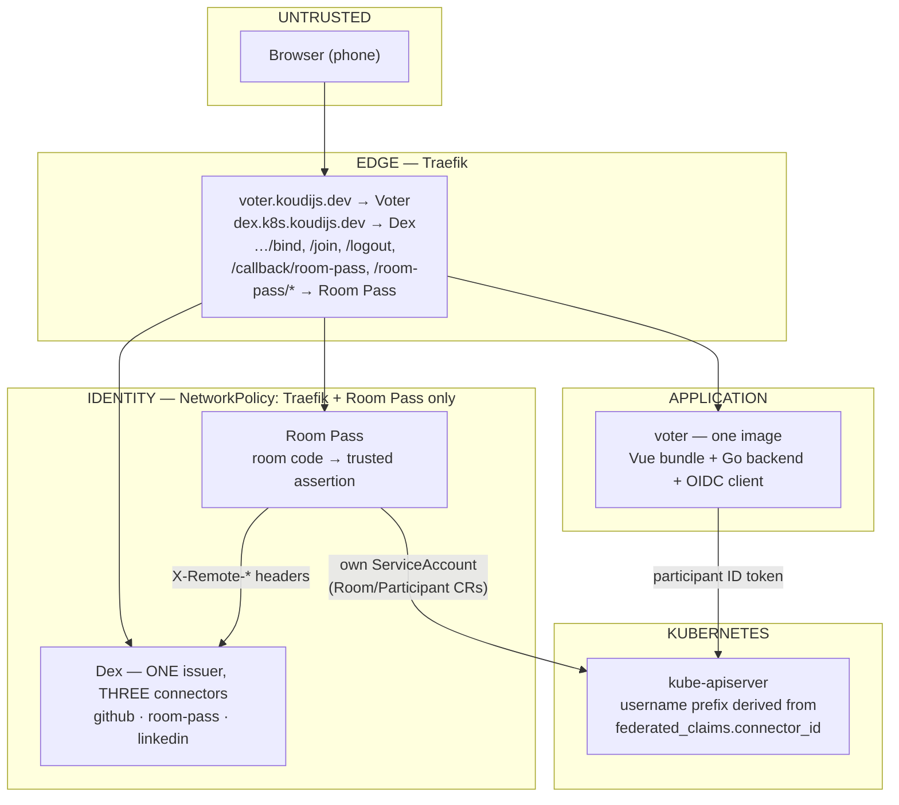
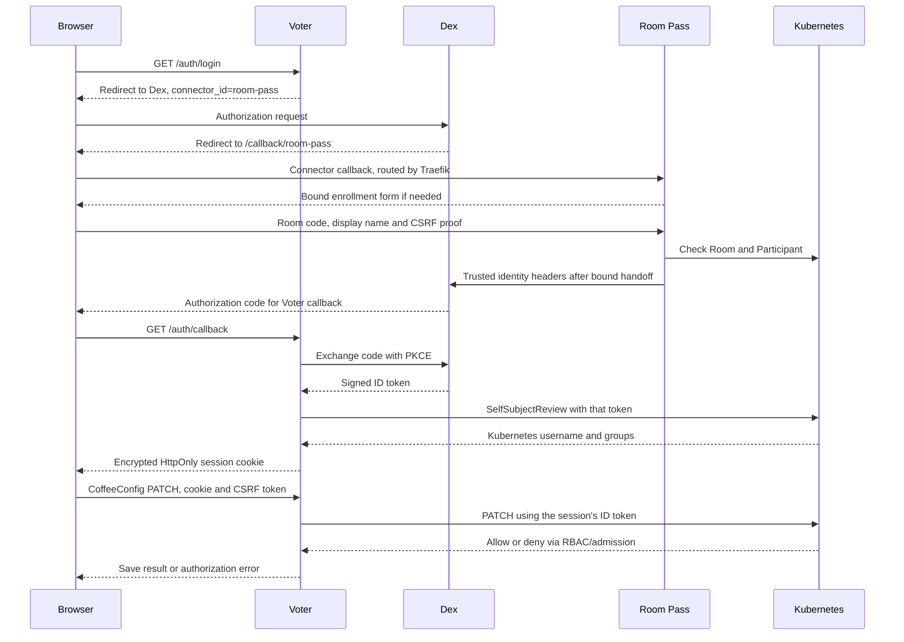

# Architecture

How Voter and Room Pass work today. Verified 2026-09-10 against the source in
this repository, the platform checkout under `external/k8s/`, and the running
`k8s.koudijs.dev` cluster.

Companion documents: [who may do what](docs/authorization.md) for the access
matrix, [PLAN.md](PLAN.md) for what is still missing, and
[room-pass/docs/handoff.md](room-pass/docs/handoff.md) for the browser-bound
handoff protocol in detail.

## The idea

Kubernetes is the application API. A conference attendee signs in with a room
code, and the request they make from their phone reaches the kube-apiserver
carrying *their* identity — so RBAC, admission and the audit log all see a
person rather than a service account. ConfigButler then turns an accepted change
into a Git commit.

Everything below exists to make that one sentence true without letting a room
code become cluster access.

## Components

```mermaid
flowchart TB
    subgraph untrusted["UNTRUSTED"]
        browser["Browser (phone)"]
    end
    subgraph edge["EDGE — Traefik"]
        t["voter.koudijs.dev → Voter<br/>dex.k8s.koudijs.dev → Dex<br/>…/bind, /join, /logout,<br/>/callback/room-pass, /room-pass/* → Room Pass"]
    end
    subgraph app["APPLICATION"]
        v["voter — one image<br/>Vue bundle + Go backend + OIDC client"]
    end
    subgraph id["IDENTITY — NetworkPolicy: Traefik + Room Pass only"]
        rp["Room Pass<br/>room code → trusted assertion"]
        dex["Dex — ONE issuer, THREE connectors<br/>github · room-pass · linkedin"]
    end
    subgraph k8s["KUBERNETES"]
        api["kube-apiserver<br/>username prefix derived from<br/>federated_claims.connector_id"]
    end
    browser --> t
    t --> v
    t --> rp
    t --> dex
    rp -->|"X-Remote-* headers"| dex
    v -->|"participant ID token"| api
    rp -->|"own ServiceAccount<br/>(Room/Participant CRs)"| api
```

**Voter** is one container image holding the Vue bundle and the Go backend. The
binary serves the frontend from `STATIC_DIR`, so the two can never sit at
different revisions. It is the OIDC client, owns `/auth/login`,
`/auth/callback`, `/auth/session` and `/auth/logout`, and forwards the signed-in
person's ID token to Kubernetes.

**Room Pass** is a separate service and controller. It reconciles `Room` and
`Participant` CRDs, serves the join form, and converts a valid room code into a
trusted-header assertion for Dex's authproxy connector. It has its own
ServiceAccount with no permission to create RBAC or impersonate anyone.

**Dex** is a single issuer at `dex.k8s.koudijs.dev` serving three connectors.
There is no separate demo issuer — `dex-demo` was deleted.

Traefik must route the Room Pass paths *before* the SPA fallback; the SPA
deliberately claims no `/join` route, because doing so shadowed the real form.

## Identity is not permission

The kube-apiserver derives the username from Dex's
`federated_claims.connector_id`, a claim Dex sets from its own state that no
caller can forge:

| Connector | Who | Kubernetes username | Grants |
| --- | --- | --- | --- |
| `github` | operators, restricted to the `koudijs-dev` org | `github:<email>` | named bindings only |
| `room-pass` | conference participants, via room code | `demo:<dex-sub>` | the demo Role in `voter` |
| `linkedin` | anyone with a LinkedIn account | `linkedin:<email>` | nothing unless named |

Three rules in `1-talos/templates/_authentication-config.tpl` carry the whole
containment argument:

1. A missing or unknown connector is **rejected**, not defaulted.
2. Tokens from the participant connector must carry only `demo:`-prefixed
   groups. This is what stops a forged `X-Remote-Group` header reaching an
   operator group on a shared issuer.
3. The username expression names every connector explicitly, and the *fallback*
   branch is the low-privilege one — a connector added to Dex but forgotten here
   produces a `demo:` identity, never an operator one.

A name typed into the join form is display attribution. The participant's email
is synthetic (`@demo.invalid`). GitHub and LinkedIn email claims *do* carry
authorization weight, because operator RBAC binds them.

Voter does not construct the username itself. It asks Kubernetes with
`SelfSubjectReview` at login, so the name on screen is the name in the audit log.
An earlier version guessed `"demo:" + subject` and displayed a LinkedIn login as
a `demo:` identity.

## Boundaries that must hold

- **Only Traefik and Room Pass may reach Dex.** A NetworkPolicy enforces it
  (verified live: a pod in `default` times out to `dex-dex.dex.svc:5556`). The
  demo Dex originally existed because the platform Dex had a public Ingress and
  no policy, so every pod — including pull-request preview code — could reach it.
  The policy uses `podSelector: {}` deliberately: a `matchLabels` that guessed
  the chart's labels wrong would select nothing and silently protect nothing.
- **Every client whose tokens reach Kubernetes must request the `federated:id`
  scope.** Dex only emits `federated_claims` for that scope. Without it the
  authenticator rejects the token outright. `kubectl oidc-login` needs
  `--oidc-extra-scope=federated:id` too.
- **Dex does not restrict which connector may authenticate which client.** Each
  client on the shared issuer must reject non-operator connectors itself. Flux
  Web does it with a CEL `validations` rule; Grafana with JMESPath; oauth2-proxy
  with an email-domain gate. Three mechanisms, one intent — see
  [PLAN.md](PLAN.md).
- **Participant Kubernetes clients use only the session's token.** Voter builds
  a fresh client per request from that request's token, against a fixed API
  destination with TLS verification. It never impersonates, never falls back to
  a ServiceAccount, and no longer constructs an unused server client at startup.
  Browser-supplied `Authorization` or `Impersonate-*` headers cannot change it.
- **Cookie-authenticated mutations need CSRF proof.** Voter accepts an absent
  Origin with a matching token and rejects `null` and foreign origins. Room Pass
  accepts absent or `null` only with its valid signed CSRF cookie and matching
  form token. The asymmetry is deliberate and pinned by tests.
- **RBAC is additive.** Every matching binding contributes, including platform
  grants to `system:authenticated`.

## Following an attendee login

```mermaid
sequenceDiagram
    participant B as Browser
    participant V as Voter
    participant D as Dex
    participant R as Room Pass
    participant K as Kubernetes
    B->>V: GET /auth/login
    V-->>B: Redirect to Dex, connector_id=room-pass
    B->>D: Authorization request
    D-->>B: Redirect to /callback/room-pass
    B->>R: Connector callback, routed by Traefik
    R-->>B: Bound enrollment form if needed
    B->>R: Room code, display name and CSRF proof
    R->>K: Check Room and Participant
    R->>D: Trusted identity headers after bound handoff
    D-->>B: Authorization code for Voter callback
    B->>V: GET /auth/callback
    V->>D: Exchange code with PKCE
    D-->>V: Signed ID token
    V->>K: SelfSubjectReview with that token
    K-->>V: Kubernetes username and groups
    V-->>B: Encrypted HttpOnly session cookie
    B->>V: CoffeeConfig PATCH, cookie and CSRF token
    V->>K: PATCH using the session's ID token
    K-->>V: Allow or deny via RBAC/admission
    V-->>B: Save result or authorization error
```

The diagram abbreviates Room Pass's browser-bound, single-use handoff: the
handle is replaced with fresh randomness at each step, so a copied cross-host
link cannot enroll another browser. [handoff.md](room-pass/docs/handoff.md) has
the full protocol.

`/auth/login` preselects `connector_id=room-pass` so the audience never sees
Dex's connector chooser. `/auth/login?connector=github|linkedin` is the operator
door, allowlisted rather than free text. The connector id is also its callback
path, so it is `CONNECTOR_ID` configuration rather than a string in Go.

## What the browser keeps

The Voter cookie holds the ID token, encrypted and signed with persisted
application keys, `HttpOnly` and `Secure`. JavaScript gets identity metadata and
a per-session CSRF token from `/auth/session`, never the token itself.
Persistent cookie keys let established sessions survive a backend restart;
pending login transactions live in process memory and do not.

The session ends no later than the token expires.

## Lifecycle limits, stated plainly

Stopping a Room prevents new enrollment and new identity handoff. It **cannot
revoke an already-issued Dex ID token**, which stays usable until expiry
wherever its grants permit. Removing a RoleBinding removes that grant, but other
matching bindings still apply.

`/auth/logout` clears the Voter cookie only. It does not clear Room Pass
enrollment or revoke the Dex token, so the next login may recognise the attendee
without asking for the room code again.

## Deployment

The application deployment is GitOps, owned by the Flux Kustomization
`voter-demo` in the private `ConfigButler/k8s` repository under
`k8s.koudijs.dev/2-gitops/voter-demo/`. **Do not `kubectl apply` into the `voter`
namespace** — change Git and let Flux reconcile.

The deploy loop: push to `main` here → CI publishes
`ghcr.io/sunib/{voter,room-pass}:sha-<short>` (~9 min) → bump the tag in
`2-gitops/voter-demo/app.yaml` → push → Flux reconciles.

This repository keeps Room Pass's own component manifests under
`room-pass/deploy/` and its disposable local fixture under `room-pass/test/`.
The former root `k8s/` deployment and `k8s-examples/` overlay have been deleted.

## What is actually implemented

Login works end to end through the `room-pass` connector; this was confirmed in
the running cluster on 2026-09-10.

Deleting the legacy browser-asserted session removed every endpoint that
depended on it. The coffee journey has since been rebuilt on participant tokens:

| Route | Status |
| --- | --- |
| `/healthz`, `/public/build-info` | 200 |
| `/auth/login`, `/auth/callback`, `/auth/session`, `/auth/logout` | working |
| `GET /public/storefront` | the menu and voucher state, priced per request |
| `POST /public/orders` | prices a basket and enforces `maximumUsage` |
| `GET,PATCH /public/coffeeconfig` | the editor, wired to the SPA |
| `/public/admin/*`, `/public/storefront/watch` | not restored — SSE watches, change history, admin orders |
| the quiz flow | not restored; still on the retired ForwardAuth path |

`participant_coffee.go` is the pattern the remaining routes follow.
[PLAN.md](PLAN.md) lists them.

**Voucher redemptions are counted in this process**, not in Kubernetes
(`coffee_vouchers.go` says why, and what it costs). The limit itself is read
from the CoffeeConfig on every order, so raising `maximumUsage` in Git unblocks
the next order without a restart — which is the demo's punchline. The count is
per-replica and per-boot, so this is single-replica behaviour by construction.

Note that `committed: true` from the CoffeeConfig PATCH means a `CommitRequest`
was *created*, not that a Git commit was observed. It is also worth knowing that
ConfigButler is **not currently installed in the demo cluster** — there is no
CommitRequest CRD — so today every save reports `committed: false`, and the
editor says "Saved, but not committed".

## Retired

The ForwardAuth / TokenRequest / ServiceAccount-impersonation model is gone, as
is the browser-asserted `/public/login` and the `OIDC_ENABLED` switch — the
deployment can no longer be configured into trusting the browser. A test pins
the absence of every removed endpoint. `auth-service/` was renamed `voter/` and
the separate nginx frontend image no longer exists. oauth2-proxy was considered
as the app's OIDC client; Voter owns that role itself.

The design history is in Git.
