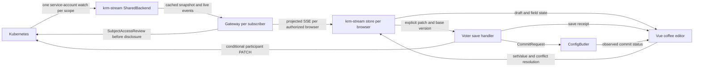

# Architecture

Voter is a coffee demo consuming public infrastructure components. Room Pass is an
independent enrollment service being prepared for extraction. krm-stream owns generic
live-resource behavior. This document separates the implementation at `2fecdd5`
(reviewed **2026-09-11**) from the target in [PLAN.md](PLAN.md). The first implementation
increment now preserves projected REST resources and fixes editor error/usage handling;
the store migration and shared streaming below remain target behavior.

## Ownership

| Component | Owns | Boundary |
| --- | --- | --- |
| Voter Vue app | Coffee screens, cart, field presentation, save intent | Uses library resource state; no custom reconciliation |
| Voter Go backend | Application OIDC session/CSRF, fixed resource scope, participant-token requests, coffee pricing/orders, commit-request orchestration | No fallback participant writes as a ServiceAccount; no generic stream engine |
| krm-stream | Kubernetes watch-to-SSE protocol, shared-watch cache/fan-out, projections, snapshots, reconciliation, draft/conflicts, patch generation, generic recovery and optional framework adapters | No coffee semantics, application credentials, login UI or Git commit workflow |
| Room Pass | Room lifecycle, rotating codes, browser enrollment, stable participant identity, bound handoff to Dex | No application grants or token signing; no Voter dependency |
| Dex | OAuth 2.0/OIDC authorization server and OpenID Provider, connectors, codes and signed tokens | Trusts Room Pass assertions only through a protected authproxy integration |
| Kubernetes | Resource storage, token authentication, RBAC, admission and audit | Identity does not itself grant permission |
| ConfigButler | Persisting accepted configuration changes to Git, commit status/history | Request acceptance is distinct from an observed commit |
| Platform GitOps repository | Installed versions, routes, CRDs, RBAC, issuer configuration and deployment | Live application changes arrive through Flux |

Generic recovery/framework APIs in this table are the target ownership, not a claim
that every necessary API is already released. Prefer existing public APIs; contribute
missing behavior upstream with a non-demo example rather than copying it into Voter.

## Identity flow and Room Pass's product boundary

```mermaid
sequenceDiagram
    participant B as Browser
    participant V as Voter OIDC client
    participant D as Dex
    participant R as Room Pass
    participant K as Kubernetes
    B->>V: Sign in
    V-->>B: Dex authorization request with PKCE
    B->>D: Authorization request
    D-->>B: Room Pass connector callback
    B->>R: Browser-bound room enrollment/handoff
    R->>K: Read Room and Participant; enroll if eligible
    R->>D: Trusted identity assertion on connector callback
    D-->>B: Authorization code for Voter
    B->>V: OIDC callback
    V->>D: Code exchange and token validation
    V->>K: SelfSubjectReview with participant token
    V-->>B: Encrypted HttpOnly application session cookie
    B->>V: REST read or mutation with session cookie
    V->>K: Request with participant's own ID token
```

Room Pass is currently an **authenticating proxy for Dex**, not an OAuth authorization
server or standalone OpenID Provider. Dex's authproxy connector consumes a trusted
upstream identity; Dex handles the application's OAuth/OIDC exchange. See
[Dex authproxy](https://dexidp.io/docs/connectors/authproxy/) and the distinction between
OAuth authorization and OIDC authentication in the
[OpenID Foundation introduction](https://openid.net/developers/how-connect-works/).

Keep the product name **Room Pass** with a description such as “room-code sign-in for
applications, powered by Dex.” The combination supports ordinary OIDC applications;
those applications need no CoffeeConfig or Kubernetes client. Room Pass itself still
uses Kubernetes storage. Naming it `room-oauth` would imply protocol responsibilities
it currently delegates to Dex. Native OIDC issuance would require a separate design
and a mature provider implementation; it is not part of extraction.

Room Pass already has a separate Go module, Docker build, controller, CRDs and tests.
Remaining coupling includes the module's Voter repository path, parent CI/tasks, the
new Voter browser fixture, and demo-specific group/email assumptions. Extraction
preserves the API group, object UIDs, cookie keys, connector ID and subject mapping;
a new repository must not unexpectedly create new identities.

## Trust boundaries

Voter owns `/auth/login`, `/auth/callback`, `/auth/session` and `/auth/logout`.
It uses established OIDC libraries. The signed/encrypted, Secure HttpOnly cookie
contains the ID token; JavaScript receives identity metadata and a CSRF token only.
Persistent keys preserve established sessions across restarts; pending logins are
process-local. Cookie custody does not make XSS harmless: same-origin script can
still perform actions as the user even though it cannot read the token.

Direct REST reads and writes use the session's token against a fixed API server with
TLS verification. The target shared watch uses a narrowly authorized service account;
`kube.SSARAuthorizer` asks Kubernetes whether each subscriber may list and watch the
fixed scope before serving cached data. Its identity mapping uses the authenticated
session's Kubernetes SelfSubjectReview result, including applicable UID/extras, not
browser headers or guessed prefixes. The host must enforce that verdict before disclosure.
The service account needs read and SubjectAccessReview creation permissions, not
impersonation or application write grants. Shared watch audit events identify the
service account; CoffeeConfig writes and CommitRequests retain participant attribution.
The stream policy fixes namespace and name as well as the resource type.

The deployed issuer combines `github`, `room-pass` and `linkedin`. Platform
containment derives usernames from Dex's `federated_claims.connector_id` and restricts
room identities to demo groups. Display names and synthetic email are attribution,
not verified personal identity. Voter obtains the Kubernetes username through
SelfSubjectReview. See [authorization.md](docs/authorization.md) for intended grants;
additive platform bindings, including `system:authenticated`, still need auditing.

Room Pass strips untrusted identity headers before proxying, accepts only configured
return URLs and uses a browser-bound single-use handoff. Every callback alias must
remain protected, with no bypass route to the authproxy assertion endpoint. The
standalone fixture routes issuer traffic through Room Pass; the shared platform also
routes other connectors through Traefik. Preserve each topology's header sanitization,
callback routing and network isolation instead of treating their manifests as interchangeable.
See [handoff.md](room-pass/docs/handoff.md) for the protocol and
[csp-form-action.md](room-pass/docs/csp-form-action.md) for browser redirect constraints.

Application mutations require CSRF proof. Logout clears the Voter session, not Room
Pass enrollment or an issued Dex token. Stopping a Room blocks new enrollment/assertions;
it does not revoke existing tokens. Open Kubernetes watches are not immediately
re-authorized on every event. The target bounds each subscription by session expiry
and checks its authorization at snapshot cycles and at most 60-second intervals.
This bounds revocation delay without claiming immediate withdrawal. Tests must prove
that expiry or denial ends the affected subscription and rejects reconnects while
other authorized viewers continue. The shared upstream stops when its last subscriber
leaves, not when the first attendee's session expires.

## Live editing: implementation versus target

Today `/public/stream` mounts krm-stream gateway/kube 0.2.1. The browser uses npm
`@configbutler/krm-stream` 0.2.1 through `useLiveCoffeeConfig`. Each caller gets an
upstream backend using their token; **there is no shared-watch coalescing in Voter**.
For the **200-attendee demo**, the target explicitly enables the library's documented
[SharedBackend integration](https://github.com/ConfigButler/krm-stream/blob/main/docs/auth.md#two-things-that-are-easy-to-confuse).
One process-wide backend instance maintains one upstream watch per scope. The first
subscriber opens it; later authorized subscribers receive a snapshot from its cache
and subsequent events. Bounded live-event queues isolate slow viewers and trigger
library resynchronization. No custom fan-out/cache is added to Voter.

With one replica and one CoffeeConfig scope, 200 subscriptions therefore share one
steady-state Kubernetes watch while retaining 200 browser SSE connections and individual
access reviews. Sharing is process-local; more replicas mean more upstream watches.
Per-browser drafts remain independent. This integration is required alongside the editor
refactor, in a separate reviewable change. A 200-session rehearsal must verify actual
watch count, convergence, resource usage, reconnect bursts, expiry and isolation;
sharing support alone is not evidence that the deployed system meets the capacity goal.

The storefront renders live objects, but AdminScreen takes `live.server` into its old
`reconcileValue` and maintains a separate draft/dirty/conflict state. This is the main
architectural defect. The seven passing browser tests prove delivery and one benign
merge case; they do not prove safe concurrent editing. The new blank-draft guard is
not a substitute for a typed resource contract or a tested merge.

The target has one state owner and one write path:

```mermaid
flowchart LR
    K[Kubernetes] -->|one service-account watch per scope| B[krm-stream SharedBackend]
    B -->|cached snapshot and live events| G[Gateway per subscriber]
    G -->|SubjectAccessReview before disclosure| K
    G -->|projected SSE per authorized browser| S[krm-stream store per browser]
    S -->|draft and field state| U[Vue coffee editor]
    U -->|setValue and conflict resolution| S
    S -->|explicit patch and base version| H[Voter save handler]
    H -->|conditional participant PATCH| K
    H -->|save receipt| U
    H -->|CommitRequest| C[ConfigButler]
    C -->|observed commit status| U
```

The generic Vue binding synchronizes library state with rendering and owns subscription
cleanup. An optional upstream conditional-edit helper captures save intent and
reconciles conflict rereads using host-provided read/save callbacks. It does not own
HTTP endpoints, credentials or navigation. Voter supplies the CoffeeConfig type/scope,
editable fields, labels and business actions. No parallel server copy, dirty registry or handwritten merge exists
in the component. Path addresses use arrays of segments, including numeric indices,
so arbitrary object keys remain unambiguous.

A stream snapshot, a manual reread and conflict recovery must all enter the same store
with one projected KRM contract. Preserve GVK, UID, resourceVersion and JSON semantics.
Use the library's projection for HTTP reads as well; display defaults never mutate the
merge base. REST editor reads now use `gateway.Project(ProjectionFull)` directly,
preserving UID, resourceVersion, unknown fields and explicit zero/false values. The
existing save response temporarily returns the same projected object until the
receipt-only migration. Coffee business DTOs no longer define this editor transport. Render withheld values from
`store.redactions()` as presentation only; never place masks in draft data. Secret
references contain a name/key, not the referenced credential. The built-in projection
redacts Secret payloads, not arbitrary CRD fields with secret-looking names. Voter must
not fetch those Secret values to populate the editor.

Arrays are atomic unless an authoritative structural schema declares associative
keys. Optional keyed behavior uses `withOpenAPIKeyedLists`; Voter does not invent its
own positional reconciliation. Products/vouchers require schema uniqueness and key
semantics before enabling it. Keep existing SKU/code fields read-only initially;
create/delete are explicit actions. A future rename must explain replacement identity
and handle references. Even with keyed merging, RFC 7386 writes arrays whole.

## Save consistency

Three-way merge compares previous server state, local draft and incoming server state.
It protects typing from incoming events. It cannot prevent an unseen concurrent write
between the last event and a save. Optimistic concurrency closes that separate race.

The target captures explicit patch, resourceVersion and UID from the same base. The
host validates scope, editable paths and projection (`gateway.ValidateMergePatch`),
then submits a conditional PATCH using the participant token. A stale version produces
409. Reread and reconcile through the library, preserve edits, and ask the user to
resolve overlaps before another save. Never attach a newly fetched version to the old
patch: that would bypass the protection. A deleted/recreated resource is a new identity.

Use `ProjectionFull` for this integration. Projection may suppress invisible changes,
so an observed version can legitimately be stale: handle that as a conflict/rebase,
not a reason to remove the precondition. A narrow patch alone does not prevent lost
updates to the same field or atomic array. Current library guidance leaves optimistic
concurrency to the host. The target moves generic client-side save/conflict mechanics
into an optional upstream helper while retaining mandatory precondition enforcement
and actual Kubernetes mutation in Voter's backend. A client helper cannot enforce
policy against callers that bypass it.

The save response is HTTP 200 with a receipt containing Kubernetes-save and
commit-request status, **without a resource object**. This preserves partial-success
reporting that a bare 204 cannot express. The normal watch echo updates the store;
a missing echo recovers through a projected read. Remove Voter's save-object adoption
path. Library synchronization must preserve edits made during the request and prevent
a delayed read from regressing newer state. Save failure leaves the form and draft visible. Session expiry, disconnect, forbidden access and
resource deletion are explicit states; a failed stream never masquerades as live.

## Coffee and Git responsibilities

Voter serves the SPA and backend in one image. Current coffee endpoints are
`GET /public/storefront`, `POST /public/orders`, `GET /public/vouchers`,
`GET,PATCH /public/coffeeconfig` and `GET /public/stream`. Pricing and voucher enforcement
remain server-authoritative. Changing maximumUsage affects subsequent orders.

Redemptions are currently in process memory: a restart resets counts and a second
replica would enforce a different tally. Keep one replica until shared atomic
persistence exists. A resource watch is neither order storage nor change history.
The quiz path still contains retired ForwardAuth assumptions; unsupported flows are
candidates for removal, not automatic restoration work.

ConfigButler should own durable Git history and commit completion. The UI needs three
separate facts: Kubernetes saved, CommitRequest accepted, Git commit observed. Current
`committed: true` means only request creation. The demo cluster still lacks the
CommitRequest CRD as of this review, so the commit payoff is not implemented there.

## Release and deployment boundaries

Room Pass will publish its own versioned image/manifests and maintain its own minimal
OIDC fixture. Voter will test against those releases. Voter-specific CoffeeConfig and
live-editor tests move out of Room Pass before its extraction is complete. Generic
merge/transport regression suites live in krm-stream; application tests prove the
integration, authorization and user-visible race handling. Establish the contract
first, then delete the old editor using existing APIs while upstream gaps are developed.
The contributor owns dependency tracking and a tagged prerelease handoff for each
increment. Exact recorded development artifacts are temporary; main consumes published
packages, and production consumes validated releases. An optional adapter must not
become a prerequisite for deleting code that existing library APIs already replace.

The live deployment is owned by Flux in the private `ConfigButler/k8s` repository:
`external/k8s/k8s.koudijs.dev/2-gitops/voter-demo/`. Publish tested artifacts, update
image references in Git, wait for Flux, then verify deployed digests and the browser
journey. Roll back by reverting the Git change. Do not mutate live application
workloads with kubectl; disposable fixtures use explicit local kubeconfigs.

At the 2026-09-11 check, Flux was Ready at `2cb475d`, running Voter `sha-ee001d6`
and Room Pass `sha-2a90ef2`. Source `2fecdd5` and the target architecture above are
not deployed. [PLAN.md](PLAN.md) holds the remaining acceptance criteria and retained
platform follow-up; design history belongs in Git.
