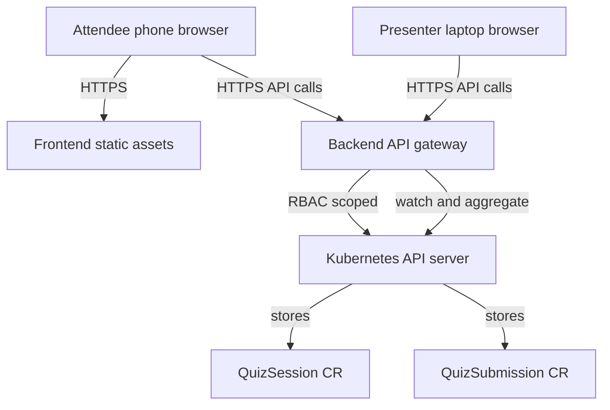

# Alternative: backend gateway architecture (not chosen)

Source context: [`README.md`](../../README.md:1) and talk positioning in [`talk-outline.md`](../../talk-outline.md:1).

## Status

This document describes an alternative approach where the browser talks to a purpose-built backend gateway, and the gateway talks to Kubernetes.

This is a common safer pattern, but it is not the chosen path for this repo. The chosen path is described in [`ARCHITECTURE.md`](../../ARCHITECTURE.md:1).

## 1. Problem statement

Build a mobile-friendly web application used live during a conference talk as an audience quiz tool. The unusual constraint is that the system of record is a Kubernetes API server: answers are stored as Custom Resources (CRs) via a CustomResourceDefinition (CRD), not in a traditional database.

Authentication is intentionally minimal: attendees scan a QR code that contains a session secret code in the URL. No personal data is collected beyond what attendees voluntarily type.

## 2. Goals and non-goals

### Goals

- Mobile-first attendee UX: answer questions quickly and reliably on phone networks.
- Presenter UX: show live aggregates during the talk.
- Store submissions as Kubernetes custom resources.
- Minimal operational footprint for a live demo.
- Strong default security posture even though the Kubernetes API endpoint is publicly reachable.
- Support simple question types first: single choice, multi choice, numeric range, numeric input, free text.

### Non-goals (initially)

- Long-term identity, accounts, or attendee profiles.
- Perfect one-person-one-vote enforcement.
- Cross-session analytics and reporting.
- Complex branching logic or multi-page surveys.

## 3. Backend gateway deployment model

Use a small backend API service as a gatekeeper between the public internet and the Kubernetes API server.

- The frontend never talks directly to Kubernetes.
- The backend holds Kubernetes credentials (ServiceAccount) and enforces:
  - per-session access
  - request validation
  - rate limiting
  - CORS
  - payload size limits
  - write shaping (avoid thundering-herd writes to the API server)

This matches a public demo setting: it reduces the blast radius of mistakes, avoids distributing Kubernetes credentials in QR codes, and allows guardrails that are difficult to do from a pure browser-to-Kubernetes model.

Reason this was considered: strong safety properties and easier abuse protection.

## 4. High-level component model

### Runtime components

1. Frontend web app
   - Single Page App optimized for mobile.
   - Two modes:
     - Attendee mode: submit answers.
     - Presenter mode: show live results.

2. Backend API gateway
   - Stateless HTTP service.
   - Talks to Kubernetes API server using a narrowly scoped ServiceAccount.
   - Implements session-code exchange to an ephemeral token for the browser.
   - Optionally provides Server-Sent Events for live updates.

3. Kubernetes API server
   - Hosts CRDs and CRs representing sessions and submissions.
   - Provides watch semantics and strong audit trail.

4. Optional in-cluster controller
   - Maintains aggregates in CR status fields or separate Aggregate resources.
   - Runs cleanup for demo data retention.

### Data plane vs control plane

- Control plane for this app is the Kubernetes API server.
- Data plane is the webapp runtime serving and collecting attendee interactions.

## 5. Proposed Kubernetes API model (CRDs)

Keep the API surface intentionally small.

### 5.1 QuizSession

- Represents a single talk instance.
- Contains question definitions.
- Stores allowed access code hash and session state.

Suggested shape:

- spec
  - title
  - startTime
  - endTime
  - state: draft | live | closed
  - questions: list
  - access
    - codeHash
    - codeSalt
- status
  - counts
  - lastActivityTime

### 5.2 QuizSubmission

- One submission per device per submit action.
- Includes answers for all questions.
- Uses generateName to avoid client-side id coordination.

Suggested shape:

- spec
  - sessionRef
  - submittedAt
  - answers: list
  - client
    - userAgentHash optional
    - locale optional

Rationale: one resource per submission scales better than one resource per answer, and is easier to validate.

### 5.3 Optional QuizAggregate

- Precomputed aggregates for presenter views.
- Can be computed by:
  - backend in-memory and served directly, or
  - controller writing aggregates into a CR for persistence.

Recommendation: start with backend-computed aggregates for simplicity, add a controller later if you want deterministic recovery after restarts.

## 6. Primary flows

### 6.1 Join session via QR

1. Attendee scans QR.
2. Browser loads frontend with a session code in the URL.
3. Frontend calls backend to exchange code for an ephemeral session token.
4. Backend validates code and returns token scoped to one session.
5. Frontend fetches session questions via backend.

### 6.2 Submit answers

1. Frontend posts answers to backend with the ephemeral token.
2. Backend validates payload against session schema.
3. Backend creates a QuizSubmission CR in Kubernetes.
4. Presenter views update via polling or Server-Sent Events.

### 6.3 Presenter live results

1. Presenter opens presenter view.
2. Backend watches submissions for the session.
3. Backend computes aggregates and streams to presenter.

## 7. Mermaid overview

## 8. Security and abuse-resistance

### 8.1 Why not talk directly to Kubernetes from the browser

Direct browser-to-Kubernetes creates multiple risks:

- CORS and credential distribution complexity.
- Attendees can extract tokens from the QR URL or local storage.
- Hard to enforce rate limits, payload validation, and per-session scoping.
- Harder incident response during a live demo.

### 8.2 Recommended guardrails

- Backend only allows CRUD for the quiz CRDs within one namespace.
- Backend enforces session state:
  - only allow submissions when live
  - no writes when closed
- Strict validation:
  - reject unknown question ids
  - enforce per-question type constraints
  - limit free text length
- Rate limiting per IP and per session.
- Namespace per event or per talk to isolate resources.
- Short data retention:
  - a cleanup job deletes submissions after the talk.
- Audit logs enabled on the Kubernetes API server.

## 9. Scalability and performance considerations

- Estimate load: hundreds of attendees submitting within a few minutes.
- Use backend write shaping:
  - small queue and retry with jitter on API server errors.
- Use watch rather than frequent list polling for presenter live view.
- Keep aggregates in memory and emit deltas to browsers.

## 10. Operational model

- Deploy as a small Helm release:
  - backend deployment
  - ingress
  - service account and RBAC
  - CRDs
  - optional cleanup CronJob
- Provide a session bootstrapping command or minimal admin UI to create a QuizSession.

## 11. Suggested technology choices

- Frontend: a lightweight SPA with excellent mobile performance.
- Backend: simple HTTP service with Kubernetes client.
- Transport for live updates: Server-Sent Events.

This proposal intentionally avoids locking into a specific language or framework until implementation constraints are confirmed.
