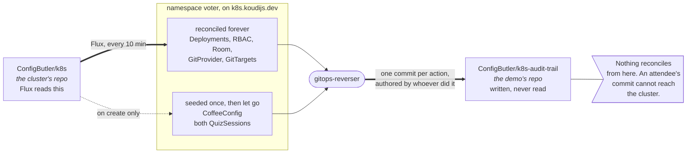

# Demo runbook

Swiss Cloud Native Day, 17 September. What to do, in order, and the commands
behind each step. This is the stage copy.

Namespace is `voter` everywhere. Rounds are `demo1` and `evaluation` and they
keep those names.

---

## The day before

- [ ] Deploy the questions from `demo-questions.yaml` in the platform repo, at
      `k8s.koudijs.dev/2-gitops/voter-demo/`. Four questions in `demo1`, five in
      `evaluation`.
- [ ] Delete the sessions so Flux reseeds them. A push alone does nothing: they
      are `ssa: IfNotPresent`, so Flux will not apply over an object that
      exists. This is the only way to change a question.

      ```bash
      kubectl -n voter delete quizsession demo1 evaluation
      flux reconcile kustomization voter-demo
      kubectl -n voter get quizsessions
      ```

- [ ] Confirm `demo1` is `live` and `evaluation` is `closed`. Never `draft`: a
      draft is filtered out of the room page and there is no button to press.

      ```bash
      kubectl -n voter patch quizsession evaluation --type=merge -p '{"spec":{"state":"closed"}}'
      ```

- [ ] Delete every ballot. Submissions are not owned by their round and the
      names carry no date, so nothing expires on its own.

      ```bash
      kubectl -n voter delete quizsubmissions --all
      ```

      Use `--all`, never a label selector. A ballot is selected by
      `spec.sessionRef`, so one with no round label still counts and a scoped
      delete would leave it for the next room. The tally follows within a second
      or two; `kubectl -n voter get quizsessions` should show VOTES 0.
- [ ] If you changed the coffee menu, delete it too, then reconcile.

      ```bash
      kubectl -n voter delete coffeeconfig demo-coffee
      ```

- [ ] Check the audit trail repo is reachable and last talk's folders are clean.
      `prune: Always` means the deletes above reach Git, so expect commits.
- [ ] **Rehearse the close, then reset.** It is the least rehearsed part of the
      talk and the only one with a question that collects an address. Open
      `evaluation`, answer every question from a phone, and confirm three
      things: that a free text answer is legible on the projected screen from
      the back of the room, that the ballot reaches both `demo1/submissions.yaml`
      and `demo2/results/<name>.yaml`, and that the harvest command in "The
      close" returns what you just typed. Then run "Reset between runs", because
      the rehearsal has left ballots and left the round open.
- [ ] **Reach the cluster from somewhere that is not your LAN.** Tether to a
      phone and run `kubectl -n voter get quizsessions`. Tomorrow you are on
      conference wifi, and a kubeconfig whose CA went stale in a PKI rebuild
      fails as "unknown authority", which is five minutes tonight and a dead
      demo on stage.

### The three checks that 2026-09-17 cost us

Each takes under a minute, and between them they would have found every defect
in [post-demo-2026-09-17.md](post-demo-2026-09-17.md). Two of the three were
never reported by anybody in the room — the audience has no way to tell a broken
demo from a demo that is refusing them on purpose, because refusing them on
purpose is what this one does.

- [ ] **Put a phone in dark mode and walk the whole thing.** Settings → Display →
      Dark, then join, vote, order, and open `/admin`. Every defect here was
      invisible in light mode and none of them were subtle: the answer options
      were blank rectangles. `task frontend:theme` checks the same surfaces
      without a phone, but it only knows about the surfaces it was told about.
- [ ] **Two phones, one round, thirty seconds apart.** Open the questions on
      both. Vote on the first. Wait thirty seconds, then vote on the second. It
      must be accepted. This is the check for a ballot that went stale because
      something else wrote to the round — which cost most of the room its vote,
      silently, while the demo appeared to work.
- [ ] **Two browsers saving the menu in the same second.** Edit a different field
      in each and press Save together. Both must land, with no refusal shown to
      either. Then edit the *same* field in both and save again: that one must
      stop and show the conflict, because that is the beat the demo is for.

## Thirty minutes before

- [ ] Pods ready, one replica each. One replica is load bearing: voucher counts
      and the order feed are per process.

      ```bash
      kubectl -n voter get pods
      ```

- [ ] Open the operator door on the presenter machine. It lands you on `/room`
      with the rotating QR.

      `https://demo.koudijs.dev/auth/login?connector=github&return=%2Froom`
- [ ] Join from your own phone, vote in `demo1`, confirm the file arrived in
      both places:
      `clusters/k8s.koudijs.dev/demo1/submissions.yaml` and
      `clusters/k8s.koudijs.dev/demo2/results/<your name>.yaml`.

      ```bash
      git -C <audit-trail> pull
      ```

- [ ] Delete that test vote and confirm VOTES is back to 0.

      ```bash
      kubectl -n voter delete quizsubmissions --all
      kubectl -n voter get quizsessions
      ```

- [ ] Confirm the audience grant is off. Demo 1's coffee refusal depends on it,
      and when it is wrongly on nothing warns you.

      ```bash
      kubectl -n voter get rolebinding voter-audience-coffee-admin   # want NotFound
      ```

- [ ] Open `/me` on your phone and confirm the permission grid renders.
- [ ] Nothing the audience can read may mention Git. The CoffeeConfig is seeded
      and not reconciled, so a fix in the platform repo does not reach the live
      object.

      ```bash
      kubectl -n voter get coffeeconfig demo-coffee -o jsonpath='{.spec.bannerText}{"\n"}'
      kubectl -n voter get room demo -o jsonpath='{.spec.title}: {.spec.attributionNote}{"\n"}'
      ```

      If the banner says Git, patch it back:

      ```bash
      kubectl -n voter patch coffeeconfig demo-coffee --type=merge \
        -p '{"spec":{"bannerText":"Edit this menu. Every phone in the room sees your change."}}'
      ```

- [ ] Audit trail repo open in a browser tab on the `demo1` folder, not yet
      shown. Check every other tab too: a stray `git log` on screen spoils
      demo 2.

## Two minutes before

- [ ] `/room` projected, QR visible, code rotating.
- [ ] Terminal on the demo cluster context, font size up.
- [ ] Phone on the lectern, signed in.
- [ ] Last look at both silent failures:

      ```bash
      kubectl -n voter get rolebinding voter-audience-coffee-admin   # NotFound
      kubectl -n voter get quizsessions                             # demo1 live, evaluation closed
      ```

---

## Demo 1: identity, authorization, and what a vote is

Git is not mentioned once.

1. **Get them in.** Project `/room`. They scan, type a name, land on the quizzes
      page. Say what happened: the QR carries a room code, not a credential;
      Room Pass writes a `Participant` and is the only caller Dex's header
      trusting connector accepts; the API server derives the username from
      `federated_claims.connector_id`. Everyone is now `demo:<subject>` in group
      `demo:voter-audience`.

2. **Let them vote.** Project the results screen. There is nothing to press: the
      tally is a field on the round, written by a controller watching the API,
      and the bars fill while you talk. If the "as of" timestamp stops moving
      while people are still voting, the count is frozen, not zero. Reload and
      the page falls back to reading on demand.

      Two callbacks to bank: whichever of Argo or Flux they picked, nothing here
      changes it; and remember Helm's number for the limits slide.

      Then, while the bars are fresh:

      ```bash
      kubectl -n voter get quizsubmissions
      kubectl -n voter get quizsubmission demo1-<somebody> -o yaml
      kubectl -n voter get coffeeconfig demo-coffee
      ```

      Every answer is a Kubernetes object named after the person who gave it.
      The coffee menu next to it is another one. Let that sit unresolved.

3. **Show what they cannot do.** Every refusal is a real 403 rendered verbatim:
      vote twice, open or close a round, edit the coffee menu, edit their own
      vote. Send them to `/me`, where the missing `patch` on `coffeeconfigs` is
      a gap in the grid before anyone presses anything. Then from the terminal:

      ```bash
      A="--as=demo:some-subject --as-group=demo:voter-audience --as-group=system:authenticated"

      kubectl -n voter auth can-i create quizsubmissions $A   # yes
      kubectl -n voter auth can-i patch  quizsessions   $A    # no
      kubectl -n voter auth can-i patch  coffeeconfigs  $A    # no, not yet
      kubectl -n voter auth can-i delete coffeeconfigs  $A    # no, not ever
      ```

      If line three says `yes`, a previous run left the grant bound and the best
      refusal is gone.

4. **The interloper is cut.** If you walk on early and want it back: sign in
      with GitHub, become `github:<email>`, try to vote, get refused. Say out
      loud that this refusal is the app's, not RBAC's, and that the same write
      with `kubectl` succeeds because you are cluster admin. There is no slide
      for it, so decide before you go on.

## Demo 2: the same actions in Git

The room is still signed in. Do not make them join again.

1. **The reveal.** Open `clusters/k8s.koudijs.dev/demo1/submissions.yaml` and
      scroll it. Let them find their own name. Then open a commit:

      ```bash
      git show --format=fuller <sha>
      ```

      Author is the participant, recovered from the audit event. Committer is
      `ConfigButler Bot <bot@configbutler.ai>`, signed. Say the containment
      line: `k8s-audit-trail` is not a Flux source, so an attendee's commit can
      never travel back into the cluster.

2. **Filed two ways.** Open `clusters/k8s.koudijs.dev/demo2/results/`. One file
      per person. Same objects, both folders, because both WatchRules claim
      `quizsubmissions`. The only difference is one template string:

      ```yaml
      # demo1
      examples.configbutler.ai/v1alpha1/quizsubmissions: "submissions.yaml"

      # demo2
      examples.configbutler.ai/v1alpha1/quizsubmissions: "results/{label:voter.configbutler.ai/submitter|_anonymous}.yaml"
      ```

      Tell this one, do not walk it.

3. **Grant the room the admin page.** On `/room`, tick *Let the room edit the
      coffee menu*. A `RoleBinding` is created by your token. Every phone's
      `/me` grid grows a `patch` column within seconds, no reload, no new sign
      in. Their admin page stops refusing. No feature flag, no deploy: each
      phone asked Kubernetes and got a different answer.

      Show the commit. `demo1/authorization.yaml` gains eighteen lines:

      ```bash
      git -C <audit-trail> pull
      git -C <audit-trail> log --format=fuller -1 \
        -- clusters/k8s.koudijs.dev/demo1/authorization.yaml
      git -C <audit-trail> show --format=fuller HEAD
      ```

4. **Two people, one menu.** The bug: `TESTNET` fails at submit with "This
      voucher has been used the maximum number of times." Open the menu editor,
      raise `maximumUsage`, and do not save. Then have a volunteer change the
      same field, or do it yourself:

      ```bash
      kubectl -n voter get coffeeconfig demo-coffee \
        -o jsonpath='{range .spec.vouchers[*]}{.code}{"\n"}{end}'

      kubectl -n voter patch coffeeconfig demo-coffee --type=json \
        -p '[{"op":"replace","path":"/spec/vouchers/0/maximumUsage","value":99}]'
      ```

      Use `--type=json`. A merge patch replaces the whole list and would delete
      every voucher you did not retype, live. Check the index first; `TESTNET`
      is at `0` today and that is not guaranteed after an edit.

      Your field turns red, Save is disabled, and both values are offered with
      Take Theirs and Keep Mine. Three things to say:

      - The red dot is the browser, but the save carries the `resourceVersion`
        the draft was built on, so the API server would refuse it with a 409
        anyway. The UI is a courtesy; the guarantee is Kubernetes'.
      - Only the collision is a conflict. Change a different field from the
        terminal and it arrives as an ordinary update while your draft survives.
      - So the API is the source of truth and the repository is the record.

      Resolve it, say which you chose, fill in the reason box (it becomes
      `CommitRequest.spec.message`), Save, then **save now**. Kubernetes saved it
      immediately; the receipt says `commitRequested`, not `committed`. Do not
      claim more than the UI claims. Then show `demo2/coffee-config.yaml` and
      reorder the coffee.

      Optional flourish: set the banner to *"Edit this menu, your change becomes
      a Git commit in your name"* from the editor. A banner announcing the commit
      that is itself a commit.

5. **The boundary.** Switch to the Orders tab. Live feed, none of it in Git,
      none of it a Kubernetes object, an array in the pod's memory, last 100,
      gone on restart, and the page says so. The menu is configuration; the
      orders are events. Knowing which is which is the skill.

## The close

- [ ] On the "One last round" slide, go to `/room` and press **Open** on
      `evaluation`. Every phone updates without a refresh, and
      `demo1/quiz-configs.yaml` flips `state: closed` to `state: live` in place,
      authored by you. Show that diff.
- [ ] It lands in `demo1/quiz-configs.yaml`, not `demo2/`. The demo2 GitTarget
      does not claim `quizsessions`.
- [ ] Leave the results projected for questions. The `adopt` average moves on
      its own. Do not touch the laptop.
- [ ] Read two or three `missing` answers out loud.
- [ ] `contact` is the last question and asks for an email address. Say it is
      optional. Keep the results screen off the projector while it is open, and
      drop the line about every identity in the repo being synthetic, because
      after this question it is not.
- [ ] Before you leave the stage, revoke the grant and let them watch. It is a
      clean `+0/-18` commit.

      ```bash
      kubectl -n voter delete rolebinding voter-audience-coffee-admin
      ```

- [ ] **Harvest the addresses before you reset anything.** The reset deletes
      every ballot, and that is where the addresses live. Read them from the
      submissions, not from the round: `status.questions[].text` keeps only the
      most recent 25, so a good turnout silently loses the earlier ones.

      ```bash
      kubectl -n voter get quizsubmissions -o json | jq -r '
        .items[]
        | select(.spec.sessionRef.name == "evaluation")
        | (.metadata.labels["voter.configbutler.ai/submitter"] // "anonymous") as $who
        | .spec.answers[]
        | select(.questionId == "contact" and ((.freeText // "") | length > 0))
        | "\($who)\t\(.freeText)"'
      ```

If a rehearsal left `evaluation` already live there is no button: skip the diff,
let them vote, say the sentence.

---

## Optional: cast your own ballots

Point at the projector, not the terminal. The tally controller watches the API,
so a pasted ballot moves the bars exactly as a phone does, and nothing in the
application knew it happened.

```yaml
apiVersion: examples.configbutler.ai/v1alpha1
kind: QuizSubmission
metadata:
  name: demo1-ada-lovelace
  namespace: voter
  labels:
    # Neither label decides whether this counts. spec.sessionRef does. They
    # decide where gitops-reverser FILES it.
    voter.configbutler.ai/round: demo1
    voter.configbutler.ai/submitter: Ada-Lovelace
spec:
  sessionRef:
    group: examples.configbutler.ai
    kind: QuizSession
    name: demo1
  submittedAt: "2026-09-17T10:00:00Z"
  answers:
    - questionId: stack
      singleChoice: Flux
    - questionId: packaging
      singleChoice: Plain YAML
    # approach is multiChoice: a LIST. A bare singleChoice here is rejected by
    # CEL, live, in front of the room.
    - questionId: approach
      multiChoice:
        - A pull request to a GitOps repo
        - kubectl apply
    - questionId: wish
      freeText: I would like the cluster to write this down for me.
```

Ids and types must match `demo-questions.yaml`. Three moved
when the questions were finalised: the round is `demo1`, `feedback` became
`wish`, and `approach` became `multiChoice`.

Keep the names visibly invented. Say out loud that the Git author on these is
you, because the trail records who actually did it.

```bash
kubectl -n voter get quizsubmissions \
  -l voter.configbutler.ai/round=demo1 \
  --sort-by=.metadata.creationTimestamp

kubectl -n voter get quizsessions
```

Three ballots applied within five seconds land in one commit. That is the
commit window batching, not the `CommitRequest`. The `CommitRequest` is created
only by the coffee **save now**, and all it does is close the open window early.
Voting never creates one.

---

## Reset between runs

Run all four between every run, including between a rehearsal and the real talk.
Nothing resets itself.

```bash
# 1. Drop every ballot. Harvest the contact addresses first: this is what
#    deletes them. prune: Always means it reaches Git, so expect delete
#    commits, and the addresses stay in that history either way.
kubectl -n voter delete quizsubmissions --all

# 2. Reseed both sessions. A push does NOT do this.
kubectl -n voter delete quizsession demo1 evaluation
flux reconcile kustomization voter-demo

# 3. Confirm.
kubectl -n voter get quizsessions   # demo1 live, evaluation closed

# 4. Revoke the coffee grant.
kubectl -n voter delete rolebinding voter-audience-coffee-admin
```

Smaller version of step 2 if you would rather not delete the sessions, though it
leaves question edits unapplied:

```bash
kubectl -n voter patch quizsession evaluation --type=merge -p '{"spec":{"state":"closed"}}'
```

The order feed needs no reset. Restarting the pod empties it.

---

## If something breaks

| Symptom | Do this |
|---|---|
| Nobody can join | `kubectl -n voter get room demo -o yaml`, check `endsAt` and `enrollment` |
| Join works, voting 403s | `kubectl -n voter get rolebinding voter-audience` |
| Results bars do not move | Check the "as of" timestamp. If stuck, reload; the page falls back to reading on demand and a Refresh results button appears |
| Nothing reaching Git | `kubectl -n gitops-reverser logs deploy/gitops-reverser`, check the GitProvider secret. The reverser runs in its own namespace, not `voter` |
| A commit names nobody | The name is in the Author header. `git show --format=fuller`. Do not debug on stage |
| `evaluation` will not open | You are signed in as a participant. Reenter through the GitHub door |
| The grant switch is missing from `/room` | Same cause: reading it needs `rolebindings` |
| Switch says the Role does not exist | `kubectl -n voter get role voter-audience-coffee-admin` |
| Grant on but a phone still refuses | Wait about five seconds. Nothing to press |
| A pushed menu or round edit changed nothing | That object is seeded, not reconciled. Delete it and let Flux recreate it |
| Voucher still depleted after raising the limit | Reorder. The limit is read fresh every order |
| A voucher vanished after a terminal patch | A merge patch replaced the list. Use `--type=json` with an index. Reseed the CoffeeConfig |
| Save greyed out in the editor | An unresolved conflict, by design. Resolve every red field |
| No conflict appears in demo 2 step 4 | The second editor changed a different field, which is not a conflict and is the point of beat 2. If the banner says reconnecting, press Refresh from cluster and redo it |
| "Live updates overtook the read" | Press Refresh from cluster again. Your draft is kept |

If anything looks odd with authentication: nothing may reach Dex's `room`
connector callback except Room Pass. Do not port forward to Dex on a conference
network.

---

## Do not promise

- Not "the commit is observed end to end." The receipt says accepted.
- Not "this scales to your production write path." One replica, in memory
  voucher counts, a five second window.
- Not "the audit trail is tamper proof." It is signed, and nothing reconciles
  from it. Those are the two claims it can back.

---

## Appendix: two repositories, and only one of them is a source

Worth rereading before you walk on. The whole containment argument rests on it
and it is the one thing an audience question can catch you on.



`ConfigButler/k8s` is the ordinary one: the cluster's GitOps repo, Flux's only
source, everything under `k8s.koudijs.dev/2-gitops/voter-demo/`. You change it by
pull request and Flux reconciles it, like any cluster.

`ConfigButler/k8s-audit-trail` is the one the talk is about. It holds
`clusters/k8s.koudijs.dev/demo1/`, `demo2/` and `gitops-reverser-config/`, and
only `gitops-reverser` ever writes to it. No Flux source points at it and no
controller reads it. That is the answer to the security question demo 2 always
gets. The cluster is not committing to its own source of truth; it is keeping a
record in a place that cannot feed back.

### The three objects Git seeds and then lets go

`CoffeeConfig/demo-coffee` and both `QuizSession`s carry
`kustomize.toolkit.fluxcd.io/ssa: IfNotPresent`, so Flux creates them and never
applies them again.

They have to. Flux applies server side and owns every field it declares,
including `maximumUsage` and `state`. Without the annotation the demo is quietly
bidirectional and loses both ways: the room raises the voucher limit and the next
reconcile reverts it, or you press Open on `evaluation` at the close and Flux
closes it again while the room is still voting. The reconcile interval is 10
minutes, comfortably inside a 45 minute slot.

Two consequences, both of which bite the day before rather than on stage:

- **Editing those specs in Git does not change a cluster where the object already
  exists.** Changing a price in `app.yaml` and pushing does nothing. To reseed,
  delete the object and let Flux recreate it.
- **The round names are stable**, so the rename trick is gone, and it used to do
  three jobs at once: reset `state`, drop the previous room's ballots, and let a
  returning audience vote again. Every one of those is a manual step now. The one
  that bites is the rehearsal: open `evaluation` this afternoon and it is still
  `live` tomorrow morning. See "The day before" and "Reset between runs".

**Do not verify this by looking for the annotation on the live object.** Flux
reads it from the manifest it is about to apply, sees the object exists, and
skips, so it never writes it. `kubectl -n voter get coffeeconfig demo-coffee -o
yaml` shows no annotation, and that absence is the proof it is working. Verify by
behaviour instead: patch a field, run `flux reconcile kustomization voter-demo`,
and check the value survived.
