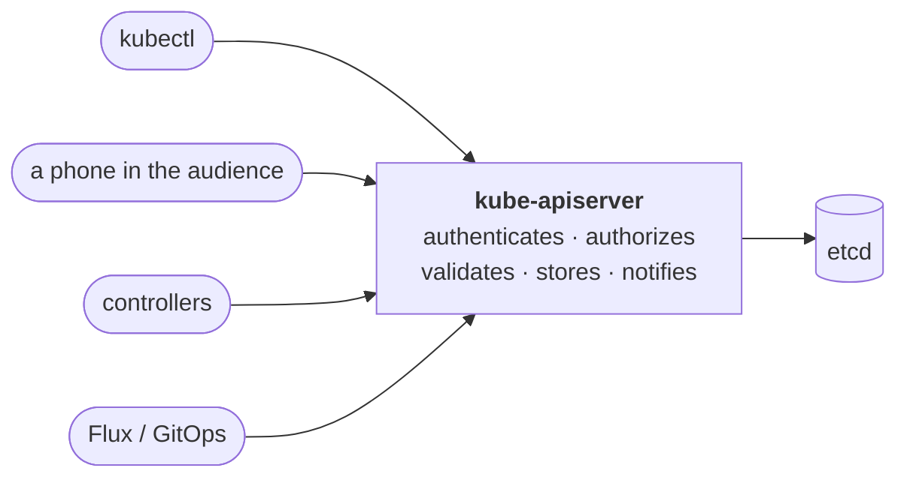
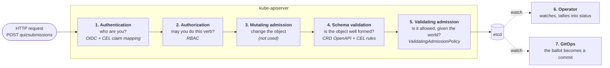

# Kubernetes as your backend: one vote, every stage of the API server

## Kubernetes is an operating system for your datacenter

On your laptop, programs don't write to the disk directly. They ask the kernel through
system calls, and the kernel checks permissions, keeps the file system consistent, and
tells anyone who is watching. Kubernetes is the same idea, one level up: an operating
system for a datacenter. **Its kernel is the `kube-apiserver`.**

### Everything is a resource

Kubernetes keeps one kind of thing: **resources**. A resource is a typed, named
document with the same shape every time. `apiVersion` and `kind` say what it is,
`metadata` says which one, `spec` is what someone wants, and `status` is what is true
right now. Here is a real one: the first quiz round from the 2026-09-17 demo, as it is
still stored in the cluster (shortened to one question):

```yaml
apiVersion: examples.configbutler.ai/v1alpha1   # what it is...
kind: QuizSession
metadata:                                       # ...which one...
  name: demo1
  namespace: voter
  uid: 3019ea95-8997-46ca-875b-93b357639c05
  generation: 4                                 # moves when spec changes
spec:                                           # ...what the presenter wants...
  title: How do you change Kubernetes configuration today?
  state: closed
  questions:
    - id: stack
      title: Argo CD or Flux?
      type: singleChoice
      choices: [Argo CD, Flux, Both, Neither yet]
status:                                         # ...and what is true now.
  observedGeneration: 4                         # written by a controller, not a person
  filed: 38
  counted: 38
  questions:
    - id: stack
      count: 38
      choices: {Argo CD: 28, Flux: 5, Both: 2, Neither yet: 3}
```

People and Git write `spec`. A controller writes `status`. That split runs through the
whole talk.

`QuizSession` is not built into Kubernetes. Voter added it, and the section after next
shows how.

Every resource gets the same REST API, with the same verbs: `get`, `list`, `watch`,
`create`, `update`, `patch`, `delete`.

```text
GET    /apis/examples.configbutler.ai/v1alpha1/namespaces/voter/quizsessions/demo1
POST   /apis/examples.configbutler.ai/v1alpha1/namespaces/voter/quizsubmissions
GET    /apis/examples.configbutler.ai/v1alpha1/namespaces/voter/quizsessions?watch=true
```

`watch` is the one to notice. Instead of asking again and again, a client asks once
and the API server pushes every change as it happens. That is why a vote shows up on
the projector within a second, without anyone polling.

### The types are yours: CustomResourceDefinitions

The list of types is not fixed. A **CustomResourceDefinition** (CRD) adds a new one,
with its own schema. From then on it gets the whole API for free: the REST paths,
`kubectl`, RBAC, watches, validation and the audit log. No server code is involved.

```yaml
apiVersion: apiextensions.k8s.io/v1
kind: CustomResourceDefinition
metadata:
  name: quizsessions.examples.configbutler.ai
spec:
  group: examples.configbutler.ai
  scope: Namespaced
  names: {kind: QuizSession, plural: quizsessions}
  versions:
    - name: v1alpha1
      served: true
      storage: true
      subresources: {status: {}}    # spec for people, status for controllers
      schema:
        openAPIV3Schema:
          type: object
          properties:
            spec:
              type: object
              properties:
                state: {type: string, enum: [draft, live, closed]}
```

That is all it took for `demo1` above to exist. A quiz round is as much a Kubernetes
resource as a Pod or a ConfigMap is:

```console
$ kubectl -n voter get quizsessions
NAME         STATE    VOTES   TITLE                                               CREATED
demo1        closed   38      How do you change Kubernetes configuration today?   19d
evaluation   live     2       Now that you have seen it — would you run this?     19d
```

The STATE and VOTES columns are declared in the CRD (`additionalPrinterColumns`), and
VOTES reads the round's `status`.

Voter defines three types this way: `QuizSession` (a round), `QuizSubmission` (a
ballot) and `CoffeeConfig` (a menu). Its "database schema" is three CRDs.

### One door: the kube-apiserver

Every call goes through the kube-apiserver: from `kubectl`, from a browser, from
controllers, from Flux, and from Kubernetes's own components. **Nobody queries etcd
directly.** etcd is the storage behind the API server, the way a disk sits behind a
kernel.



Because there is only one door, every rule placed at it applies to every client, and
every write is in the same audit log. That is what makes the API server usable as a
backend.

### Today: only the API server

Kubernetes is famous for running containers: Pods, Deployments, Services, nodes and
networking. **None of that is in this talk.** The API server is useful on its own,
and all of the following happens there, before any container is involved.

---

## One vote, all the way through

A phone in the audience casts a vote. No application code decides **who** may vote,
**which name** the ballot carries, **whether the round is open**, or **whether these were
the questions on screen**. The Kubernetes API server decides all four, one stage at a
time, before anything is stored. After the ballot is stored, an operator counts it and
GitOps writes it down.

This page follows that one ballot through the API server's request pipeline. The
configuration below is either running in Voter today or was tested against a real API
server (k3s 1.31) on 2026-10-06. The example objects are shortened. The admission policy in [step 5](#5-validating-admission-the-rules-that-need-the-world)
is the new part: it is planned as phase 2 of [quiz-admission.md](quiz-admission.md) and
not deployed yet.

---

## The pipeline

Every write to Kubernetes takes the same path, whether it comes from `kubectl`, a
controller or a phone. This is the familiar picture from the Kubernetes blog's
[guide to admission controllers](https://kubernetes.io/blog/2019/03/21/a-guide-to-kubernetes-admission-controllers/),
with what Voter puts at each stage:



Each stage knows more than the one before it:

| Stage | Can see | Cannot see |
| --- | --- | --- |
| 1. Authentication | the token | the request's object |
| 2. Authorization | user, verb, resource, name | the object's contents |
| 4. Schema validation | the object | the user, or any other object |
| 5. Validating admission | the user, the object, **and objects you hand it** | nothing it is not given |

That last row is the point of this page. The rules we used to keep in a backend all need
the user, the object and **another object**: the round.

---

## 0. What the phone sends

```yaml
apiVersion: examples.configbutler.ai/v1alpha1
kind: QuizSubmission
metadata:
  name: demo1-ada-lovelace          # one ballot per person: the name IS the identity
  namespace: voter
  labels:
    voter.configbutler.ai/round: demo1
    voter.configbutler.ai/submitter: Ada-Lovelace
spec:
  sessionRef:
    name: demo1                     # the round
  roundUID: 58993f59-80a2-4a17-b1d1-e342d4540bc9      # ...this round, not a same-named predecessor
  questionsDigest: sha256:ea1fa28c5abff2389bbd0e41d27bade3a695a2d906343c566b1fefe6daf167ab  # ...these questions
  submittedAt: "2026-10-06T10:00:00Z"
  answers:
    - questionId: stack
      singleChoice: Flux
```

It is sent with the participant's **own** token. There is no service account in the
path and no backend that "knows better".

---

## 1. Authentication: OIDC, mapped with CEL

The API server trusts Dex directly, through a structured `AuthenticationConfiguration`.
CEL turns the token's claims into a Kubernetes identity. The **connector** the person
logged in with decides the username prefix, so a conference participant can never become
an operator:

```yaml
apiVersion: apiserver.config.k8s.io/v1
kind: AuthenticationConfiguration
jwt:
  - issuer:
      url: https://dex.k8s.koudijs.dev
      audiences: [kubernetes, voter]
      audienceMatchPolicy: MatchAny
    claimValidationRules:
      # A forged header at the room connector can only ever produce demo: groups.
      - expression: "!(claims.federated_claims.connector_id in ['room-pass', 'room']) || dyn(claims.groups).all(g, g.startsWith('demo:'))"
        message: "only demo: groups are accepted from the room-pass connector"
    claimMappings:
      username:
        expression: >-
          claims.federated_claims.connector_id in ['github'] ? 'github:' + claims.email
          : claims.federated_claims.connector_id in ['room-pass', 'room'] ? 'demo:' + claims.sub
          : 'unknown:' + claims.federated_claims.connector_id
      groups:
        claim: groups
        prefix: ""
      # Carried on every request as user.extra. Admission (step 5) and the
      # Git commit author (step 7) both read it.
      extra:
        - key: configbutler.ai/claims/display-name
          valueExpression: "claims.?name.orValue('')"
```

**Out of this stage:** user `demo:<id>`, group `demo:room`, and the extra
`configbutler.ai/claims/display-name: Ada-Lovelace`. Room Pass guarantees that display
name is unique in the room.

---

## 2. Authorization: RBAC says *what*, never *which*

```yaml
apiVersion: rbac.authorization.k8s.io/v1
kind: Role
metadata: {name: participant, namespace: voter}
rules:
  - apiGroups: [examples.configbutler.ai]
    resources: [quizsessions]
    verbs: [get, list, watch]
  - apiGroups: [examples.configbutler.ai]
    resources: [quizsubmissions]
    verbs: [get, list, watch, create]
```

RBAC answers "may a participant create a ballot?": yes. It cannot answer "only under
**your own** name", "only while the round is **live**", or "only for the questions you
**saw**". Those rules are why Voter kept a vote handler. The next stages remove that
reason.

## 3. Mutating admission

Not used. It is where defaults or labels would be stamped onto the object, by a
`MutatingAdmissionPolicy` or a webhook.

---

## 4. Schema validation: the CRD guards the shape

A CustomResourceDefinition is OpenAPI plus CEL. It rejects malformed ballots before any
policy runs:

```yaml
# voter/config/crd/quizsubmissions.yaml (excerpt)
questionsDigest:
  type: string
  pattern: ^sha256:[0-9a-f]{64}$
answers:
  type: array
  maxItems: 25
  x-kubernetes-list-type: map          # one answer per question, enforced by the API server
  x-kubernetes-list-map-keys: [questionId]
  items:
    x-kubernetes-validations:
      - rule: "(has(self.singleChoice) ? 1 : 0) + (has(self.multiChoice) ? 1 : 0) + (has(self.number) ? 1 : 0) + (has(self.freeText) ? 1 : 0) == 1"
        message: "exactly one answer field must be set"
```

A CRD rule sees **only the object**. It cannot know who sent it or what state the round
is in.

---

## 5. Validating admission: the rules that need the world

A `ValidatingAdmissionPolicy` is CEL that runs **inside** the API server. Unlike a
webhook, there is no service to run, no certificate to rotate, and no outage of your own
on the write path. It sees `request.userInfo` (step 1's identity, extras included) and
`object` (the ballot).

**The trick is `paramKind`.** A policy can take a Kubernetes object as a parameter. The
binding below hands it **every QuizSession in the namespace**. The API server evaluates
the policy once per round, and the request is denied if any evaluation fails. So every
rule about a round reads *"not my round, or ..."*: the other rounds pass trivially, and
the ballot's own round is checked for real.

```yaml
apiVersion: admissionregistration.k8s.io/v1
kind: ValidatingAdmissionPolicy
metadata:
  name: quiz-ballot
spec:
  failurePolicy: Fail
  paramKind:                              # the policy is handed a ROUND
    apiVersion: examples.configbutler.ai/v1alpha1
    kind: QuizSession
  matchConstraints:
    resourceRules:
      - apiGroups: [examples.configbutler.ai]
        apiVersions: [v1alpha1]
        resources: [quizsubmissions]
        operations: [CREATE]
  variables:
    - name: participant
      expression: "request.userInfo.username.startsWith('demo:')"
    - name: displayName
      expression: >-
        has(request.userInfo.extra)
        && 'configbutler.ai/claims/display-name' in request.userInfo.extra
        && size(request.userInfo.extra['configbutler.ai/claims/display-name']) == 1
        ? request.userInfo.extra['configbutler.ai/claims/display-name'][0] : ''
    - name: labels
      expression: "has(object.metadata.labels) ? object.metadata.labels : {}"
    - name: myRound                       # is THIS parameter the ballot's round?
      expression: "params.metadata.name == object.spec.sessionRef.name"
  validations:
    # WHO: a participant, or an operator who says so.
    - expression: >-
        variables.participant
        || variables.labels[?'voter.configbutler.ai/cast-by'].orValue('') == 'operator'
      message: >-
        Only participants vote. An operator's ballot has to declare itself:
        label it voter.configbutler.ai/cast-by=operator.
    # ONCE: the name is derived from the identity, so a second ballot collides.
    - expression: "!variables.participant || variables.displayName != ''"
      message: "No display name on this identity, so no ballot name to check."
    - expression: >-
        !variables.participant
        || object.metadata.name == object.spec.sessionRef.name + '-' + variables.displayName.lowerAscii()
      messageExpression: >-
        'A ballot is named after its voter: expected ' + object.spec.sessionRef.name
        + '-' + variables.displayName.lowerAscii() + ', got ' + object.metadata.name
    - expression: >-
        !variables.participant
        || (variables.labels[?'voter.configbutler.ai/submitter'].orValue('') == variables.displayName
            && variables.labels[?'voter.configbutler.ai/round'].orValue('') == object.spec.sessionRef.name)
      message: "The submitter and round labels must name you and this round."
    # WHEN: the round is live, right now.
    - expression: "!variables.myRound || params.spec.state == 'live'"
      messageExpression: "'Round ' + params.metadata.name + ' is ' + params.spec.state + ', not live.'"
    # WHAT: this round and these questions.
    - expression: >-
        !variables.myRound || !variables.participant
        || object.spec.?roundUID.orValue('') == params.metadata.uid
      message: "This ballot was cast for a round that has since been replaced. Reload."
    - expression: >-
        !variables.myRound || !variables.participant
        || object.spec.?questionsDigest.orValue('') == params.status.?questionsDigest.orValue('-')
      message: "The questions changed after you opened them. Reload."
---
apiVersion: admissionregistration.k8s.io/v1
kind: ValidatingAdmissionPolicyBinding
metadata:
  name: quiz-ballot
spec:
  policyName: quiz-ballot
  validationActions: [Deny]
  paramRef:
    selector: {}                          # every QuizSession in the ballot's namespace
    parameterNotFoundAction: Deny         # no rounds, no ballots
```

### What it answers, verbatim

Every row is the API server's own response on k3s 1.31 (2026-10-06). The requests were
made with `kubectl create --dry-run=server` while impersonating a participant (see
[Try it](#try-it)):

| # | Request | API server says |
| --- | --- | --- |
| 1 | Ada, live round, everything right | `created` |
| 2 | Ada, ballot named after Grace | `A ballot is named after its voter: expected demo1-ada-lovelace, got demo1-grace-hopper` |
| 3 | Ada, Grace in the submitter label | `The submitter and round labels must name you and this round.` |
| 4 | Ada, closed round | `Round demo0 is closed, not live.` |
| 5 | Ada, round deleted and recreated | `This ballot was cast for a round that has since been replaced. Reload.` |
| 6 | Ada, questions edited since | `The questions changed after you opened them. Reload.` |
| 7 | A token without a display name | `No display name on this identity, so no ballot name to check.` |
| 8 | The operator, undeclared | `Only participants vote. An operator's ballot has to declare itself: …` |
| 9 | The operator, labelled `cast-by: operator`, live round | `created` |
| 10 | The operator, labelled, closed round | `Round demo0 is closed, not live.` |
| 11 | Ada, a second time | `AlreadyExists` (from storage: the name collides) |
| 12 | No rounds exist at all | `no params found for policy binding with Deny parameterNotFoundAction` |

Row 9 keeps the talk's "Casting your own answers" interlude, where the presenter pastes
ballots with `kubectl`, and makes it honest: **"I can still stuff the ballot box, I just
cannot do it quietly."** The label lands in Git with the ballot.

### Webhook or policy?

| | ValidatingAdmissionPolicy | Validating webhook |
| --- | --- | --- |
| Runs | inside the API server (CEL) | your HTTPS service |
| To operate | nothing | a Deployment, TLS, availability |
| Can read other objects | the parameters it is bound to | anything, with your own client |
| Outage | none of your own | `Fail`: writes stop. `Ignore`: the rule is advisory |

Reach for the policy first. A webhook earns its place only when the rule needs something
CEL cannot express or a call outside the cluster.

---

## 6. The operator: stored, watched, counted

Once stored, the ballot is just an event on a watch. A controller in Voter recomputes the
round and writes the result to the round's **status subresource**. That is the only
thing its ServiceAccount may write, so it can publish a tally but cannot edit a round.
It does not matter who wrote the ballot (the app, `kubectl`, Flux): every writer moves
the bars on the projector.

```yaml
apiVersion: examples.configbutler.ai/v1alpha1
kind: QuizSession
metadata: {name: demo1, namespace: voter}
spec:
  state: live
  questions:
    - {id: stack, title: Which, type: singleChoice, choices: [Flux, Argo]}
status:                                   # written by the operator, never by people
  questionsDigest: sha256:ea1fa28c…        # what the next ballot copies
  openedAt: "2026-10-06T10:42:34Z"        # observed, for reading: not a counting rule
  filed: 2
  counted: 1                              # a ballot pinned to another round is filed, not counted
  questions:
    - {id: stack, count: 1, choices: {Flux: 1}}
```

**Why a digest and not `metadata.generation`.** It is tempting to pin a ballot to the
round's generation. But `state` lives in the round's spec, so **opening and closing move
the generation**. A pin checked when the round closes would then reject every ballot at
exactly the moment it is counted. The operator publishes a digest of the questions alone,
and the ballot copies it. That survives open, close and reopen, and still changes when a
question changes.

The operator could also stop counting ballots created after `closedAt`. It does not.
It only learns about a state change by watching, so after a restart mid-round (any
image bump) it would stamp `openedAt` late and drop real votes. **Time rules belong at
the moment of writing**, which is admission's job.

---

## 7. GitOps: the ballot becomes a commit

[gitops-reverser](https://github.com/ConfigButler/gitops-reverser) watches the same API
and commits each ballot to Git. The commit author comes from the `user.extra` that step 1
mapped, so the audit trail names Ada, not a service account. That is why the phone
writes with its own token: a backend writing on Ada's behalf would make every commit the
backend's.

Flux runs the other way: the rounds, the CRDs and this policy are deployed from Git, and
nothing reaches the cluster by `kubectl apply`.

---

## Try it

Impersonation lets you replay any row above without a token. You need a QuizSession,
the CRDs, the policy and a Role bound to group `demo:room`:

```console
$ kubectl create --dry-run=server -f ballot.yaml \
    --as demo:ada --as-group demo:room \
    --as-user-extra configbutler.ai/claims/display-name=Ada-Lovelace
quizsubmission.examples.configbutler.ai/demo1-ada-lovelace created (server dry run)

$ kubectl -n voter patch quizsession demo1 --type=merge -p '{"spec":{"state":"closed"}}'
$ kubectl create --dry-run=server -f ballot.yaml --as demo:ada --as-group demo:room \
    --as-user-extra configbutler.ai/claims/display-name=Ada-Lovelace
… denied request: Round demo1 is closed, not live.
```

---

## What it costs

- **One evaluation per round.** The binding hands the policy every round, so the cost
  grows with the number of rounds in the namespace. That is fine for a handful; for
  hundreds, narrow `paramRef.selector` with a label.
- **The round is read from a cache.** A ballot can land milliseconds after a close.
  Accepted here.
- **`failurePolicy: Fail`.** A CEL error refuses every vote in the room. Run the binding
  with `validationActions: [Audit]` once before switching to `Deny`.
- **A ballot naming a round that does not exist is allowed** (every parameter passes
  `!myRound`), and counted by nobody.

## Further reading

- [quiz-admission.md](quiz-admission.md): the plan this came out of, and its phases.
- [live-results-design.md](live-results-design.md): the operator and the status tally.
- [presentation-diagrams.md](presentation-diagrams.md): Room Pass, Dex and the token
  path in detail.
- [talk-checklist.md](talk-checklist.md): where the admission layer fits the talk.
