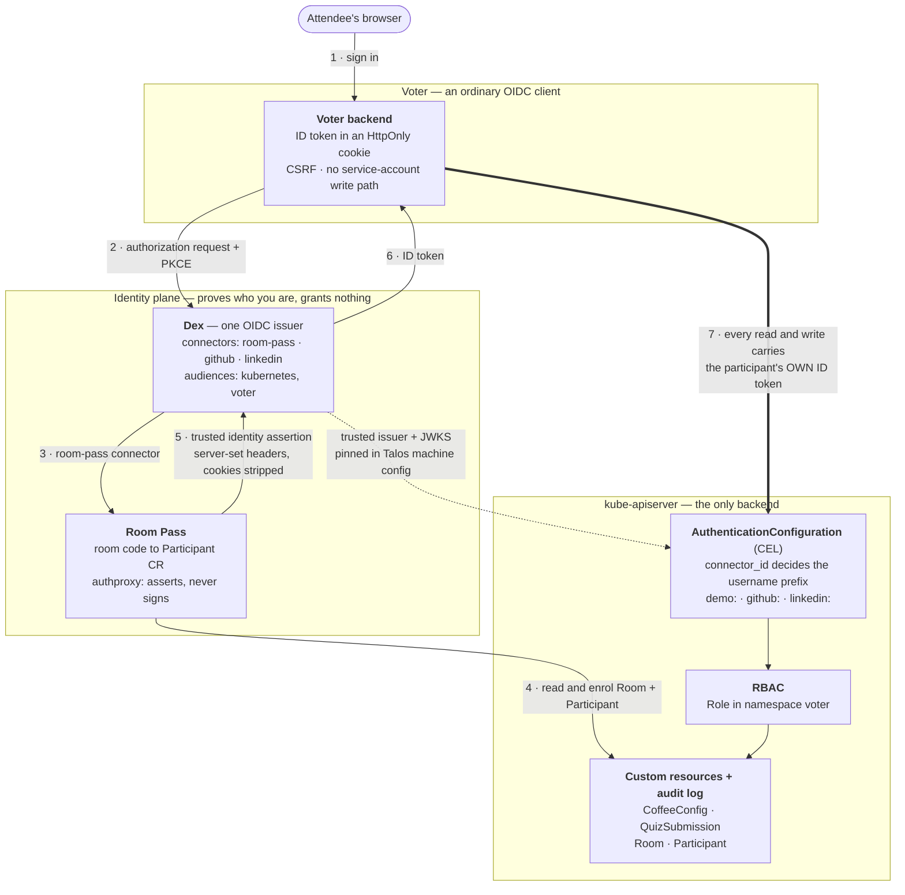
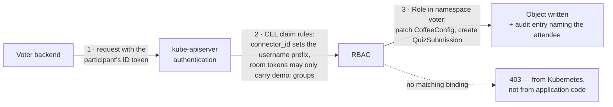
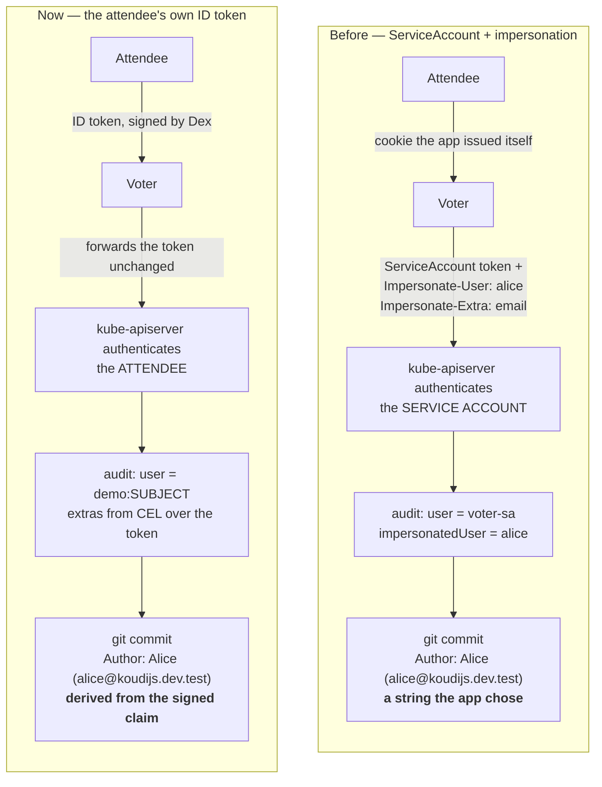
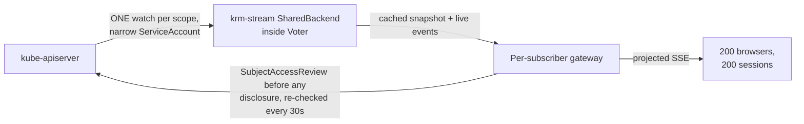

# Room Code to RBAC

How Voter, Dex, Room Pass and `kube-apiserver` fit together — drawn for people who will
ask about tokens, blast radius and what the audit log says.

Sources: [ARCHITECTURE.md](../ARCHITECTURE.md), [authorization.md](authorization.md),
[handoff.md](../room-pass/docs/handoff.md) and the platform's `_authentication-config.tpl`.
Platform rows last verified against the live cluster 2026-09-11.

## Three claims to open with

- **Kubernetes is the backend.** No application database and no password store. Custom
  resources are the schema, RBAC is the authorization layer, the audit log is the history.
- **The app never impersonates.** Voter forwards the attendee's own ID token. There is no
  service-account fallback for writes, so a missing grant is a `403` from Kubernetes, not a
  branch in application code.
- **One issuer, two populations.** The same Dex serves `kubectl oidc-login` and the demo.
  Connectors, not separate issuers, keep operators and conference attendees apart.

## Main slide: the whole picture

One authorization round trip, then every subsequent request carries a credential the API
server itself validates. Room Pass and Dex appear only in steps 2–6; after that they are out
of the request path entirely.

The thick arrow is the one that matters: after login, Voter is a proxy for a credential it
did not mint and cannot widen. The dotted arrow is why that works — the API server trusts the
same issuer the app logged into.

1. The attendee scans a QR code or types a room code. Voter owns `/auth/login` and nothing
   else about identity.
2. Voter behaves like any OIDC client — authorization code plus PKCE. **Nothing here is
   Kubernetes-specific.**
3. Dex hands the room connector to Room Pass, which is reachable only through it — no direct
   Ingress, enforced by NetworkPolicy.
4. Room Pass checks the code against a `Room` and creates or reuses a `Participant`.
   Enrollment state is a custom resource, like everything else.
5. Room Pass asserts the identity to Dex over server-set headers, with browser cookies and
   `Authorization` stripped. **It signs no tokens** — it is an authenticating proxy, not a
   second issuer.
6. Dex issues one ID token, audience `voter`. The backend keeps it in a Secure HttpOnly
   cookie; JavaScript sees a display name and a CSRF token, never the token itself.
7. Every read and write goes to the API server as the attendee. Voter holds no elevated
   credential it could fall back to.

## Backup slide: what happens to one request

The containment rule is the part worth dwelling on. Because the room connector authenticates
on trusted headers, a CEL rule in the API server's own config caps it: a token from that
connector may only ever carry `demo:` groups. A forged header cannot reach an operator group,
and the rule lives in the platform, not in Voter.

Three separate questions, three separate answers: can I log in, who does Kubernetes see, and
may I do this operation now. A successful Dex login still produces a `403`.

- The username is the **opaque Dex subject**, never the nickname the attendee typed — nothing
  a user controls becomes a Kubernetes username.
- The participant Role is deliberately small: `patch` on CoffeeConfigs, `create` on
  QuizSubmissions, reads on QuizSessions. No Secrets, no deletes, no impersonation.
- Voter learns its own Kubernetes identity by asking — `SelfSubjectReview` at login — rather
  than parsing claims itself and hoping the API server agreed.

## Backup slide: "why not just impersonate?"

The earlier version of this demo did exactly that. The browser asserted an identity, Voter
turned it into `Impersonate-User` headers on a ServiceAccount token, and Traefik was handed a
forward-auth decision derived from a cookie Voter had issued itself.

It is gone because of what it does to provenance. gitops-reverser builds the commit author
from the audit event, **preferring the impersonated user when one is present** — so the old
model still produces a commit authored by Alice. It names Alice because the application said
so.

Same commit, different provenance. Everything that separates them is upstream of Git:

| | ServiceAccount + impersonation | The attendee's own ID token |
| --- | --- | --- |
| **OIDC config in kube-apiserver** | None. The application is the identity layer | `AuthenticationConfiguration` with CEL claim rules; the issuer's JWKS must be reachable from the control plane |
| **Who runs the checks?** | Voter, against a cookie it issued itself | kube-apiserver: signature, issuer, audience, CEL rules, then RBAC |
| **What credential does Voter hold?** | One standing ServiceAccount token, always valid | Only the tokens of people currently signed in, each with its own expiry |
| **Could Voter act as anyone?** | **Yes** — anyone in the namespace, logged in or not | **No** — only as whoever handed it a token |
| **Where does the commit author come from?** | `Impersonate-Extra-` headers the application sets | CEL over the signed token; Voter never sees the value |
| **Who does the audit `user` field name?** | `voter-sa`; Alice appears only in `impersonatedUser` | `demo:SUBJECT` — the attendee |
| **Blast radius if the app is compromised** | Everyone in the namespace | Current sessions only, each already capped by its own RBAC |
| **Revoking one person** | Application logic; the ServiceAccount keeps working | Remove the RoleBinding, or wait for the token to expire |
| **Same identity works with `kubectl`?** | No | Yes — one issuer, `audiences: [kubernetes, voter]` |
| **What it costs you** | Nothing to configure in the cluster | Issuer reachable from the control plane, and a Talos machine-config change with a reboot |

Worth saying out loud so it does not sound like dogma: impersonation is the right tool when a
controller legitimately acts on a user's behalf and you accept that the controller is trusted.
It was wrong *here* because the entire point of the demo is that Kubernetes decides, not the
application — and an audit trail the application can author is not an audit trail.

## Backup slide: two hundred viewers, one watch

The one place a service account does appear — and the check that keeps it honest. Giving every
browser its own watch would not survive a full room, so the shared backend holds one upstream
watch per scope and asks Kubernetes, per subscriber, whether that person may see the cached
data.

Sharing is process-local: more replicas mean more upstream watches. The watch stops when its
last subscriber leaves, not when the first session expires.

- The service account may read and create SubjectAccessReviews. **It cannot impersonate and
  holds no application write grants** — config writes and commit requests still carry
  participant attribution in the audit log.
- The subject checked is the one the API server returned at stream open, including UID and
  extras — not a browser header and not a guessed prefix.
- Withdraw a RoleBinding and delivery to that subscriber ends within about 60 seconds. Other
  viewers keep streaming.

## Answers to the questions this crowd asks

**"Can you kill a session mid-talk?"**
Stopping a Room blocks new enrollment and new assertions. It does **not** revoke tokens
already issued — those stay valid until they expire. Say this plainly rather than implying a
kill switch.

**"What stops an attendee writing a million objects?"**
Right now, nothing: the `voter` namespace has no ResourceQuota, no LimitRange, and the cluster
has no ValidatingAdmissionPolicy. The Role is narrow, but it is not bounded in volume.

**"Is the email real?"**
For room participants it is synthetic — `<participant-id>@koudijs.dev.test` — and exists only so
commits get an author. Display names and emails are attribution, never identity.

**"Why one Dex instead of two issuers?"**
Because separation by connector is checkable in one place: the CEL rules in the API server's
`AuthenticationConfiguration`. Two issuers would move that boundary into deployment topology,
where it is harder to audit.
