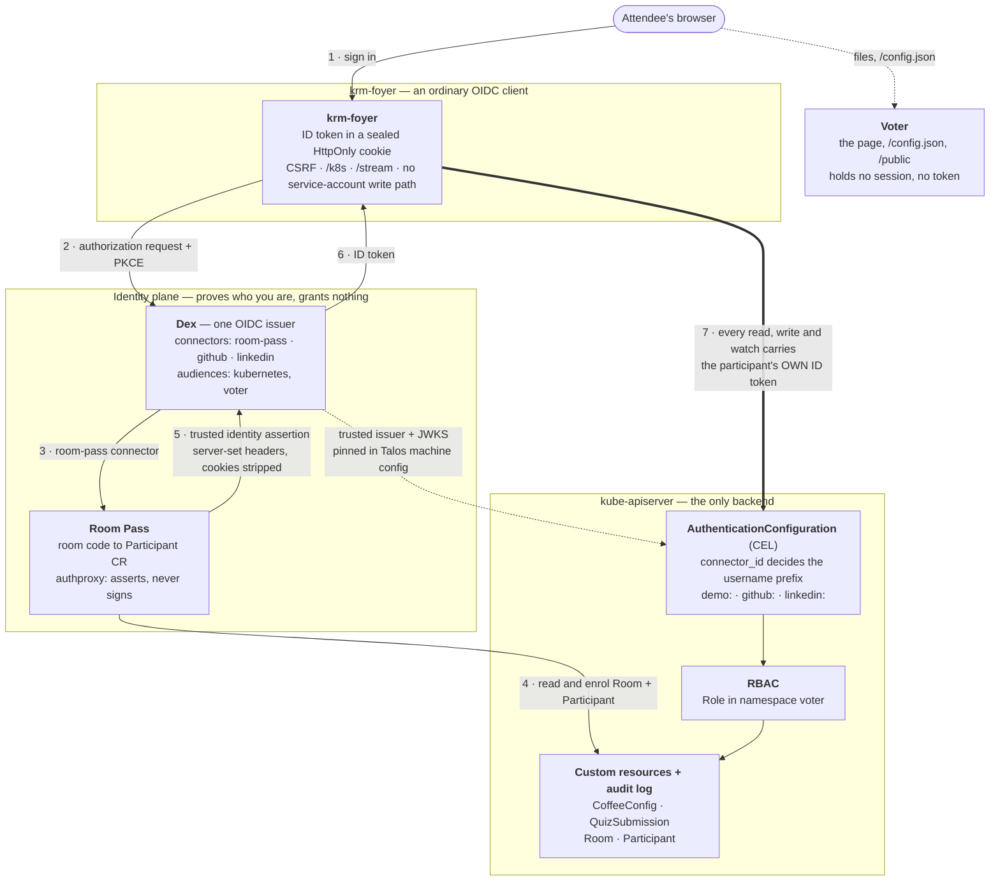
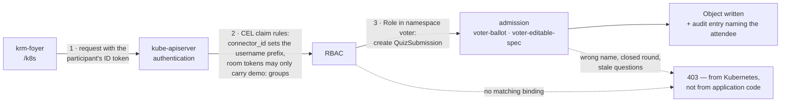
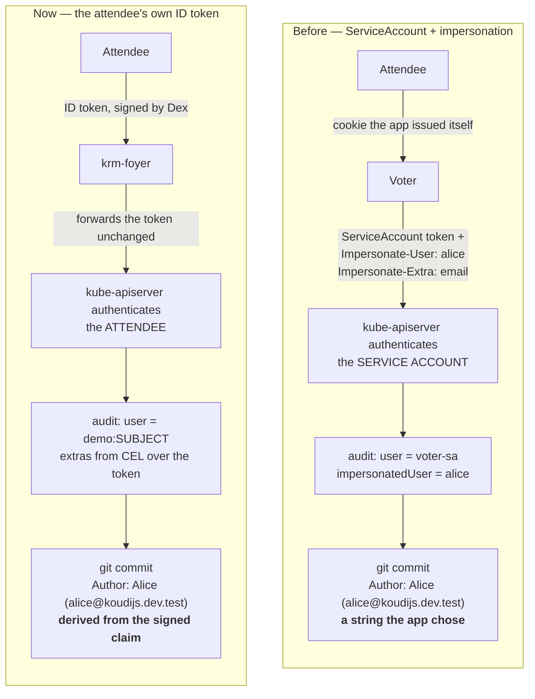
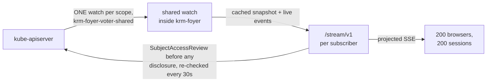

# Room Code to RBAC

How krm-foyer, Voter, Dex, Room Pass and `kube-apiserver` fit together — drawn for people who will
ask about tokens, blast radius and what the audit log says.

Sources: [ARCHITECTURE.md](../ARCHITECTURE.md), [authorization.md](authorization.md),
[handoff.md](https://github.com/sunib/room-pass/blob/main/docs/handoff.md) and the platform's `_authentication-config.tpl`.
Platform rows last verified against the live cluster 2026-09-11; the krm-foyer flow is
the one live since Voter 2.0.0 (2026-10-06).

## Three claims to open with

- **Kubernetes is the backend.** No application database and no password store. Custom
  resources are the schema, RBAC is the authorization layer, the audit log is the history.
- **Nothing impersonates.** The browser's writes reach the API server through krm-foyer
  with the attendee's own ID token. There is no service-account fallback for writes, so a
  missing grant is a `403` from Kubernetes, not a branch in application code.
- **One issuer, two populations.** The same Dex serves `kubectl oidc-login` and the demo.
  Connectors, not separate issuers, keep operators and conference attendees apart.

## Main slide: the whole picture

One authorization round trip, then every subsequent request carries a credential the API
server itself validates. Room Pass and Dex appear only in steps 2–6; after that they are out
of the request path entirely.

```mermaid
flowchart TB
    B(["Attendee's browser"])

    subgraph IDP["Identity plane — proves who you are, grants nothing"]
        RP["<b>Room Pass</b><br/>room code to Participant CR<br/>authproxy: asserts, never signs"]
        DEX["<b>Dex</b> — one OIDC issuer<br/>connectors: room-pass · github · linkedin<br/>audiences: kubernetes, voter"]
    end

    subgraph BFF["krm-foyer — an ordinary OIDC client"]
        FY["<b>krm-foyer</b><br/>ID token in a sealed HttpOnly cookie<br/>CSRF · /k8s · /stream · no service-account write path"]
    end

    V["<b>Voter</b><br/>the page, /config.json, /public<br/>holds no session, no token"]

    subgraph KUBE["kube-apiserver — the only backend"]
        AZ["<b>AuthenticationConfiguration</b> (CEL)<br/>connector_id decides the username prefix<br/>demo: · github: · linkedin:"]
        RB["<b>RBAC</b><br/>Role in namespace voter"]
        ST["<b>Custom resources + audit log</b><br/>CoffeeConfig · QuizSubmission<br/>Room · Participant"]
    end

    B -->|"1 · sign in"| FY
    B -.->|"files, /config.json"| V
    FY -->|"2 · authorization request + PKCE"| DEX
    DEX -->|"3 · room-pass connector"| RP
    RP -->|"4 · read and enrol Room + Participant"| ST
    RP -->|"5 · trusted identity assertion<br/>server-set headers, cookies stripped"| DEX
    DEX -->|"6 · ID token"| FY
    FY ==>|"7 · every read, write and watch carries<br/>the participant's OWN ID token"| AZ
    AZ --> RB
    RB --> ST
    DEX -.->|"trusted issuer + JWKS<br/>pinned in Talos machine config"| AZ
```

The thick arrow is the one that matters: after login, krm-foyer is a proxy for a credential
it did not mint and cannot widen. Voter is not on that path at all. The dotted arrow is why
that works — the API server trusts the same issuer krm-foyer logged into.

1. The attendee scans a QR code or types a room code. The QR code points at Voter's
   `/join-room`, which hands the code to Room Pass and sends the browser to krm-foyer's
   `/auth/login`. That redirect is all Voter does about identity.
2. krm-foyer behaves like any OIDC client — authorization code plus PKCE. **Nothing here is
   Kubernetes-specific.**
3. Dex hands the room connector to Room Pass. The edge exposes only its join pages
   (`/join`, `/bind`, `/logout` on the app's host); its assertion goes to Dex alone.
4. Room Pass checks the code against a `Room` and creates or reuses a `Participant`.
   Enrollment state is a custom resource, like everything else.
5. Room Pass asserts the identity to Dex over server-set headers, with browser cookies and
   `Authorization` stripped. **It signs no tokens** — it is an authenticating proxy, not a
   second issuer.
6. Dex issues one ID token, audience `voter`. krm-foyer seals it in a Secure HttpOnly
   cookie; JavaScript sees a display name and a CSRF token (`/auth/session`), never the
   token itself.
7. The browser's own reads, writes and watches go through `/k8s` and `/stream` to the API
   server as the attendee. A vote is the browser creating a QuizSubmission, not a call to
   Voter. Neither krm-foyer nor Voter holds an elevated credential to fall back to.

## Backup slide: what happens to one request

The containment rule is the part worth dwelling on. Because the room connector authenticates
on trusted headers, a CEL rule in the API server's own config caps it: a token from that
connector may only ever carry `demo:` groups. A forged header cannot reach an operator group,
and the rule lives in the platform, not in an application.

```mermaid
flowchart LR
    V["krm-foyer<br/>/k8s"] -->|"1 · request with the<br/>participant's ID token"| A["kube-apiserver<br/>authentication"]
    A -->|"2 · CEL claim rules:<br/>connector_id sets the username prefix,<br/>room tokens may only carry demo: groups"| R["RBAC"]
    R -->|"3 · Role in namespace voter:<br/>create QuizSubmission"| AD["admission<br/>voter-ballot · voter-editable-spec"]
    AD --> O["Object written<br/>+ audit entry naming the attendee"]
    R -.->|"no matching binding"| X["403 — from Kubernetes,<br/>not from application code"]
    AD -.->|"wrong name, closed round,<br/>stale questions"| X
```

Four separate questions, four separate answers: can I log in, who does Kubernetes see, may I
do this operation, and is this object acceptable right now. A successful Dex login still produces a `403`.

- The username is the **opaque Dex subject**, never the nickname the attendee typed — nothing
  a user controls becomes a Kubernetes username.
- The participant Role is deliberately small: `get` and `create` on QuizSubmissions (no
  list: nobody reads another's ballot), reads on QuizSessions and CoffeeConfigs. Editing
  the menu takes a RoleBinding the operator creates live. No Secrets, no deletes, no
  impersonation.
- Admission holds what RBAC cannot: one ballot per person, named after them, only while
  the round is live, pinned to the questions they saw. A person may change only a
  CoffeeConfig's `spec`.
- The page learns the attendee's Kubernetes identity by asking — krm-foyer's
  `/auth/whoami` spends a `SelfSubjectReview` — rather than parsing claims itself and
  hoping the API server agreed.

## Backup slide: "why not just impersonate?"

The earlier version of this demo did exactly that. The browser asserted an identity, Voter
turned it into `Impersonate-User` headers on a ServiceAccount token, and Traefik was handed a
forward-auth decision derived from a cookie Voter had issued itself.

It is gone because of what it does to provenance. gitops-reverser builds the commit author
from the audit event, **preferring the impersonated user when one is present** — so the old
model still produces a commit authored by Alice. It names Alice because the application said
so.

```mermaid
flowchart TB
    subgraph OLD["Before — ServiceAccount + impersonation"]
        direction TB
        A1["Attendee"] -->|"cookie the app issued itself"| A2["Voter"]
        A2 -->|"ServiceAccount token +<br/>Impersonate-User: alice<br/>Impersonate-Extra: email"| A3["kube-apiserver authenticates<br/>the SERVICE ACCOUNT"]
        A3 --> A4["audit: user = voter-sa<br/>impersonatedUser = alice"]
        A4 --> A5["git commit<br/>Author: Alice (alice@koudijs.dev.test)<br/><b>a string the app chose</b>"]
    end

    subgraph NEW["Now — the attendee's own ID token"]
        direction TB
        B1["Attendee"] -->|"ID token, signed by Dex"| B2["krm-foyer"]
        B2 -->|"forwards the token unchanged"| B3["kube-apiserver authenticates<br/>the ATTENDEE"]
        B3 --> B4["audit: user = demo:SUBJECT<br/>extras from CEL over the token"]
        B4 --> B5["git commit<br/>Author: Alice (alice@koudijs.dev.test)<br/><b>derived from the signed claim</b>"]
    end
```

Same commit, different provenance. Everything that separates them is upstream of Git:

| | ServiceAccount + impersonation | The attendee's own ID token |
| --- | --- | --- |
| **OIDC config in kube-apiserver** | None. The application is the identity layer | `AuthenticationConfiguration` with CEL claim rules; the issuer's JWKS must be reachable from the control plane |
| **Who runs the checks?** | Voter, against a cookie it issued itself | kube-apiserver: signature, issuer, audience, CEL rules, then RBAC |
| **What credential does the app hold?** | One standing ServiceAccount token, always valid | krm-foyer: only the tokens of people currently signed in, each with its own expiry. Voter: none of anyone's |
| **Could the app act as anyone?** | **Yes** — anyone in the namespace, logged in or not | **No** — only as whoever handed it a token |
| **Where does the commit author come from?** | `Impersonate-Extra-` headers the application sets | CEL over the signed token; no application sets it |
| **Who does the audit `user` field name?** | `voter-sa`; Alice appears only in `impersonatedUser` | `demo:SUBJECT` — the attendee |
| **Blast radius if the app is compromised** | Everyone in the namespace | Current sessions only, each already capped by its own RBAC |
| **Revoking one person** | Application logic; the ServiceAccount keeps working | Remove the RoleBinding, or wait for the token to expire |
| **Same identity works with `kubectl`?** | No | Yes — one issuer, `audiences: [kubernetes, voter]` |
| **What it costs you** | Nothing to configure in the cluster | Issuer reachable from the control plane, and a Talos machine-config change with a reboot |

Worth saying out loud so it does not sound like dogma: impersonation is the right tool when a
controller legitimately acts on a user's behalf and you accept that the controller is trusted.
It was wrong *here* because the entire point of the demo is that Kubernetes decides, not the
application — and an audit trail the application can author is not an audit trail.

## Backup slide: two hundred viewers, one watch

The one place a service account does appear — and the check that keeps it honest. Giving every
browser its own watch would not survive a full room, so the shared backend holds one upstream
watch per scope and asks Kubernetes, per subscriber, whether that person may see the cached
data.

```mermaid
flowchart LR
    K["kube-apiserver"] -->|"ONE watch per scope,<br/>krm-foyer-voter-shared"| SB["shared watch<br/>inside krm-foyer"]
    SB -->|"cached snapshot + live events"| G["/stream/v1<br/>per subscriber"]
    G -->|"SubjectAccessReview before any<br/>disclosure, re-checked every 30s"| K
    G -->|"projected SSE"| BR["200 browsers,<br/>200 sessions"]
```

Sharing is process-local: more replicas mean more upstream watches. The watch stops when its
last subscriber leaves, not when the first session expires.

- The shared-watch identity may list and watch the room's kinds and create
  SubjectAccessReviews. **It cannot impersonate and holds no write grants** — votes, config
  writes and commit requests carry the participant's own name in the audit log.
- The subject checked is the one the API server returned for the person's own token,
  including UID and extras — not a browser header and not a guessed prefix.
- Withdraw a RoleBinding and delivery to that subscriber ends within about 60 seconds. Other
  viewers keep streaming. On the fixture, 197 concurrent streams shared one watch.

## Answers to the questions this crowd asks

**"Can you kill a session mid-talk?"**
Stopping a Room blocks new enrollment and new assertions. It does **not** revoke tokens
already issued — those stay valid until they expire. Say this plainly rather than implying a
kill switch.

**"What stops an attendee writing a million objects?"**
Not much. Admission caps ballots at one per person per round, and a participant can
delete nothing. But Databases and CommitRequests have no such cap, and the `voter`
namespace has no ResourceQuota or LimitRange. The Role is narrow, but it is not bounded in
volume.

**"Is the email real?"**
For room participants it is synthetic — `<participant-id>@koudijs.dev.test` — and exists only so
commits get an author. Display names and emails are attribution, never identity.

**"Why one Dex instead of two issuers?"**
Because separation by connector is checkable in one place: the CEL rules in the API server's
`AuthenticationConfiguration`. Two issuers would move that boundary into deployment topology,
where it is harder to audit.
