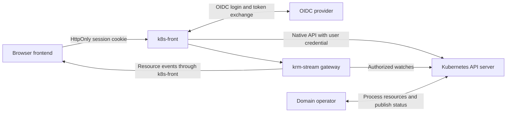

# k8s-front

**Browser login, Kubernetes API access and live resource streams.**

k8s-front is a proposed backend for frontend (BFF) for applications built on Kubernetes
APIs. It handles authentication, server-side credentials and resource transport so teams
can build browser interfaces without implementing those components for every application.

Its purpose is to **make well-designed Kubernetes Resource Model (KRM) domains usable
from the browser**. Teams define resources, lifecycles and domain rules; k8s-front connects
their frontends to those APIs. This document specifies the intended service contract;
it is not a claim of released functionality.

## Who it helps

A platform team can expose approved APIs through one maintained authentication and transport
service. A frontend developer can read resources, submit changes and observe progress using
Kubernetes objects and krm-stream. A domain team can support browsers, command-line clients
and automation through the same resource contract.

For example, a workspace portal could let a user create a `WorkspaceRequest`, observe its
provisioning status and open the resulting workspace. An equipment portal could expose
`ReservationRequest` resources and their acceptance outcomes. A configuration editor could
read and conditionally patch an existing resource while other browsers receive live updates.
These are illustrative domain models, not built-in k8s-front endpoints.

Adding a resource whose permissions and invariants are already enforced should require
configuration and frontend work, not another backend transport handler. The benefit is
reuse across applications. A separate service also adds deployment, session storage and
support costs; it does not guarantee less total code for a single application.

## Domain APIs built with KRM

CustomResourceDefinitions (CRDs) can express desired state or immutable requests. Admission
checks constraints before storage; domain controllers process resources and publish status.
The frontend creates or edits a resource and observes its outcome.

For a `WorkspaceRequest`, HTTP 201 acknowledges that the request was stored. It does not
mean the workspace is ready. The domain contract must distinguish pending work, acceptance,
rejection, processing failure and completion, and define which outcomes are terminal.
The frontend presents those distinctions; k8s-front transports them.

The domain backend lives in controllers and admission, commonly packaged as a Kubernetes
operator. Domain developers design and test its guarantees; the platform team operates it.
The [operator pattern](https://kubernetes.io/docs/concepts/extend-kubernetes/operator/)
supports this division of responsibility. A status field alone does not enforce correctness.

This approach suits durable intent, observable processing and reuse across clients. It
requires domain knowledge plus expertise in reconciliation, authorization, concurrency,
API evolution and failure recovery. Immediate transactions, complex private queries and
high-volume event storage may fit a conventional service better. The
[BFF decision guide](bff-choice.md) explains those tradeoffs and the different mechanisms
needed for one stored object, one accepted request and one external effect.

## Architecture and ownership

Deploy on the same origin as the frontend, serving its static files or routed alongside
them. The initial design uses one configured cluster per deployment and a configurable
OIDC provider. No particular identity provider or frontend framework is required.

| Component or team | Responsibility |
| --- | --- |
| k8s-front | OIDC client, sessions, CSRF protection, fixed upstream routing, API proxy and stream host configuration |
| krm-stream | Resource-stream protocol, recovery, projections, optional watch sharing and browser draft/reconciliation primitives |
| Kubernetes | Discovery, persistence, RBAC, admission execution, API validation and write concurrency |
| Domain team | Resource contracts, admission rules, controller processing, trusted status and domain guarantees |
| Frontend team | Forms, resource queries, save intent, navigation and presentation of domain outcomes |
| Platform team | Deployment, grants, exposure configuration, availability and upgrades |

Application-specific endpoints, DTO transformations, result aggregation and business plugins
are outside k8s-front's scope. Domain services and operators own those responsibilities.
Use the existing krm-stream implementation for streaming and reconciliation.

## API contract

| Proposed route | Behavior |
| --- | --- |
| `/auth/login` | Start OIDC authorization-code login with PKCE, state and nonce |
| `/auth/callback` | Validate the callback and establish a session |
| `/auth/session` | Return minimal identity/session state and CSRF information, never bearer tokens |
| `/auth/logout` | CSRF-protected POST that destroys the server session |
| `/k8s/api/...` | Proxy core Kubernetes APIs after stripping `/k8s` |
| `/k8s/apis/...` | Proxy grouped APIs, including CRDs and aggregated APIs |
| `/k8s/api`, `/k8s/apis`, `/k8s/version`, `/k8s/openapi/...` | Proxy explicitly permitted discovery/schema endpoints |
| `/stream` | Serve krm-stream with configured scopes and projections |

For example, POSTing to
`/k8s/apis/workspaces.example.com/v1/namespaces/team-a/workspacerequests` creates a
resource through Kubernetes. The response retains Kubernetes' status code and object shape.
The route is available only when explicitly permitted by exposure policy and authorized
by Kubernetes.

Preserve bodies, Kubernetes `Status` errors, content types, relevant headers and query
parameters. Support pagination, selectors, native watches, CRUD, patch types, dry-run and
Server-Side Apply using their [native semantics](https://kubernetes.io/docs/reference/using-api/api-concepts/).
Clients choose concurrency preconditions and field ownership. The proxy must not force
apply, convert PATCH to PUT or automatically replay mutations after authentication recovery.
A lost response may already have committed a write.

The service has no hardcoded resource catalogue. Its initial transport scope covers ordinary
HTTP APIs, streaming logs and native HTTP watches. Exec, attach and port-forward require
separate upgrade-protocol support and tests; return an explicit unsupported error until
implemented. Service/node/pod proxy subresources require explicit opt-in. The browser
cannot supply an arbitrary upstream URL.

## Access boundaries

An operator-configured allowlist is mandatory from the first release. Empty configuration
exposes no Kubernetes APIs or stream scopes. Explicitly configure groups, versions,
resources, namespaces, verbs, subresources and permitted non-resource URLs. Distinguish
get/list/watch and collection deletion, normalize paths before checks, and reject unknown
or ambiguous scopes. Discovery does not grant access.

Apply restrictions to raw APIs and streams. Kubernetes RBAC and admission remain authoritative;
the allowlist further limits which permissions browser clients can exercise through this service.
Never use a privileged service account as a fallback for a user's direct API request.

**Review exposure before enabling a route.** An existing application may enforce rules that
its users' Kubernetes grants do not express. A generic route can bypass those rules as soon
as it is available, even if the frontend still calls the old endpoint. Likewise, existing
list/watch grants may reveal records that an application previously returned only as aggregates.
Audit effective grants and deploy required admission/read boundaries before enabling access.

If a migration narrows raw reads, coordinate the replacement read path: an old result handler
using the user's token will also lose those permissions. Admission cannot filter ordinary
resource reads. If a product instead adopts asynchronous acceptance, explicitly redefine
what may be stored and what may be processed before exposing creates.

## Login and sessions

Tokens and session contents stay server-side. The browser holds only an opaque session ID
in a Secure, HttpOnly, host-scoped cookie with appropriate SameSite settings. Server-side
sessions support per-session revocation and refresh-token custody. They require shared
storage across replicas, bounded logout propagation and a defined failure policy.

An encrypted HttpOnly cookie can also keep tokens unreadable by JavaScript; the reason
for choosing opaque sessions is revocation and lifecycle control. Clearing a browser cookie
alone does not invalidate a copied stateless session. Revoking a server session does not
revoke independently issued Kubernetes credentials or undo accepted writes. The BFF pattern
is described in [OAuth 2.0 for Browser-Based Applications](https://www.rfc-editor.org/rfc/rfc10017.html).

Use a maintained OIDC library. Bind login transactions to the browser; validate issuer,
audience and callback state; accept only validated local return paths. Rotate session IDs
at login, enforce idle/absolute expiry and serialize supported refreshes per session. Reject
requests when session validity cannot be established. The configured issuer must provide a
credential accepted by the cluster; an arbitrary OIDC login or access token is insufficient.

Unauthenticated API requests return a documented 401 login-required response, not an HTML
redirect. An optional framework-independent helper handles login navigation and return paths.
Expose authentication-required state before navigation so an editor can offer draft copy-out
or an explicitly designed preservation flow. A 403 represents permission denial, not a login
loop. Bound refresh attempts and report persistent issuer/cluster configuration errors.

Require CSRF proof and same-origin checks for mutations and logout. Strip browser-supplied
Authorization, impersonation and untrusted forwarding headers; never forward the session
cookie to Kubernetes. Pin upstream destinations, verify TLS, bound request/stream resources
and avoid credential/body logging. HttpOnly does not prevent malicious same-origin JavaScript
from making requests as the user.

## Streams and editing

k8s-front supplies krm-stream's principal resolution, authorization, backend selection and
scope configuration. Start with user-authenticated watches. Optional shared watches use a
narrowly scoped service account, Kubernetes-resolved identities and per-subscriber
SubjectAccessReview checks. Bound reauthorization and session expiry; logout closes that
session's streams without disrupting others. Measure authorization load as well as watch
savings. Disable stream buffering and propagate cancellation through the proxy.

A stream projection is a view transformation. It cannot protect confidential fields if the
same user can GET the full resource through `/k8s`. Restrict raw routes or separate the
read models when disclosure differs; Kubernetes RBAC does not provide general field-level
permissions.

Keep draft capture and guarded reconciliation in the frontend. A raw GET used to reconcile
a projected editor must follow the same view contract and guards against late responses or
changed UID. Never manufacture redaction revisions from a raw GET. Verify the library APIs
support the chosen composition.

Use conditional PATCH with UID/resourceVersion checks where required. Do not replace a full
resource with its projected view or assume arrays merge safely. A write response must not
overwrite newer watch state or later typing: consume it as a receipt or through guarded
reconciliation. A restricted projected-write policy needs its own validation; transparent
proxying does not supply that policy. Multi-step domain workflows retain explicit handling
of partial success.

## Release criteria

| Capability | Required evidence |
| --- | --- |
| Reuse | Two frontends using different API groups without application-specific backend handlers |
| Authentication | Callback failure, expiry, refresh, restart and logout tests across replicas |
| Exposure | Empty policy denies access; paths, selectors, alternate versions and subresources cannot bypass restrictions |
| Proxy semantics | Kubernetes errors and patch types preserved; conflicting writes and ambiguous create outcomes handled without automatic replay |
| Streams | Cancellation, recovery, expiry, subscriber isolation and measured load under declared capacity targets |
| Editing | Conditional saves and guarded reconciliation preserve newer state and drafts |
| Example domain | Pending, accepted, rejected and failed processing demonstrated; protected status and restart/duplicate tests prove its declared guarantees |
| Operations | Owned session storage, deployment/upgrade procedures, telemetry and tested failure behavior |

The domain operator's tests establish domain guarantees; the gateway's tests establish
transport and access behavior. Publish the service with its own integration fixture,
versioned image and documented supported protocols.
