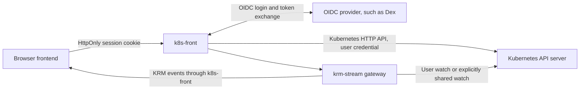

# Proposal: k8s-front — a Kubernetes BFF for browser applications

Status: proposed, 2026-09-11. This is a separate design proposal, not an approved
migration or a description of the deployed Voter application.

## Purpose

Build a reusable service that performs browser login, keeps credentials server-side,
proxies Kubernetes APIs without application-specific DTOs, and hosts krm-stream.
A frontend should work with Kubernetes objects and semantics while the service owns
sessions and transport. Adding another CRD should require configuration and frontend
work, not a new backend handler.

Product name: **k8s-front**. Description: **a Kubernetes BFF for browser applications**.
It provides browser login, Kubernetes API access and live resource streams.
The [naming discussion and decision](name.md) records the alternatives and URL rationale.

It remains a backend for frontend in the authentication/proxy sense. Its contract
is generic Kubernetes access, rather than a separate REST model for each application.
This follows the BFF pattern described in [OAuth 2.0 for Browser-Based Applications](https://www.ietf.org/ietf-ftp/rfc/rfc10017.html).

## Shape

Deploy on the same origin as the frontend, either serving its static files or routed
alongside them. Start with one configured cluster per deployment. Keep Room Pass
independent: Dex can use it as a connector, but k8s-front must also work with an
ordinary OIDC provider without room enrollment.

| Boundary | Responsibility |
| --- | --- |
| k8s-front | OIDC client, server-side sessions, CSRF protection, fixed upstream routing, generic HTTP proxy, stream host wiring |
| krm-stream | Snapshot/event protocol, recovery, optional watch sharing, projection, browser draft/reconciliation primitives |
| Kubernetes | Discovery, object persistence, RBAC, admission, API validation and write concurrency |
| Frontend | Resource queries, form presentation, draft/save intent, application navigation and result presentation |
| Application controllers/admission | Domain invariants or trusted computation that cannot be delegated to an untrusted browser |

Do not add quiz endpoints, coffee DTOs, result aggregation, a generic business-plugin
system, a new merge algorithm or a second API discovery model to this service.

## Browser and API contract

Proposed paths, not existing endpoints:

| Route | Behavior |
| --- | --- |
| `/auth/login` | Start an OIDC authorization-code flow with PKCE, state and nonce |
| `/auth/callback` | Validate callback and establish the session |
| `/auth/session` | Return minimal identity/session state and CSRF information, never bearer tokens |
| `/auth/logout` | CSRF-protected POST that destroys the server session |
| `/k8s/api/...` | Forward core Kubernetes API requests after stripping `/k8s` |
| `/k8s/apis/...` | Forward grouped APIs, including CRDs and aggregated APIs |
| `/k8s/api`, `/k8s/apis`, `/k8s/version`, `/k8s/openapi/...` | Forward configured discovery/schema endpoints |
| `/stream` | Host the krm-stream protocol with configured scopes and projections |

For example, fetching `/k8s/apis/<group>/<version>/namespaces/demo/quizsessions`
returns a Kubernetes list, and POSTing a QuizSubmission to its collection returns
the Kubernetes create response. No `/public/rounds` translation is required.

Preserve resource bodies, response status, Kubernetes `Status` errors, content types,
relevant headers and query parameters. Support pagination, selectors, native watch,
ordinary CRUD, patch types, dry-run and Server-Side Apply without inventing new save
semantics. The frontend chooses explicit concurrency preconditions and field ownership;
the proxy must not silently add retries, force apply or turn PATCH into PUT.
Kubernetes describes these contracts in its [API concepts](https://kubernetes.io/docs/reference/using-api/api-concepts/).

“All Kubernetes APIs” means no baked-in resource catalogue. It does not mean every
user gets every permission, or that every wire protocol is implemented in the first
release. Kubernetes RBAC and admission remain authoritative. An operator can further
restrict resources, namespaces, verbs and subresources. Discovery must not automatically
grant access or open service-account-backed streams for everything it finds.

Initial scope includes ordinary HTTP requests, streaming logs and native HTTP watches.
Exec, attach and port-forward require explicit WebSocket/upgrade protocol support and
separate acceptance tests. Mark these unsupported initially with a clear error;
do not advertise complete kubectl transport compatibility. Service/node/pod proxy
subresources also require explicit opt-in because they reach destinations beyond
ordinary resource storage. Broad resource support must not become an arbitrary URL proxy.

## Login and credential custody

The browser still stores and sends a cookie. **The credential tokens and session
contents stay server-side; the cookie contains only an opaque, random session ID.**
Use a Secure, HttpOnly, host-scoped cookie with appropriate SameSite settings. The
current Voter encrypted cookie contains an ID token: moving to an opaque session is
a deliberate change in storage and operations, not just extracting existing handlers.

Use a maintained OIDC library. Bind pending login transactions to the browser; validate
issuer, audience and callback state; allow only validated local return paths. Keep
refresh credentials server-side where the provider supports them, serialize refreshes
per session, rotate session IDs at login and expire idle/absolute sessions. Production
replicas need a shared session store and a defined failure policy; do not fall back to
accepting sessions when that store is unavailable.

The configured provider must issue a credential that the target API server actually
accepts. In the current Dex setup this is the participant's ID token. An arbitrary OIDC
login or access token is not automatically a Kubernetes credential. Preserve the user's
identity; never fall back to a privileged service account for direct API requests.

Unauthenticated fetches return 401 with a documented login-required signal, rather than
redirecting fetch to an HTML login page. A small optional frontend helper initiates
navigation to login and restores a validated application route. Stream expiry reaches
the same helper through terminal authentication state. A Kubernetes 403 is permission
denial, not a reason to repeat login indefinitely.

Avoid logging out on every upstream 401: distinguish an expired session from a rejected
upstream credential, attempt only bounded supported refresh, and report persistent
cluster/issuer configuration failures clearly. Do not automatically replay mutations
after refresh, reconnect or login: a lost response may already have committed a write.

Require CSRF proof and same-origin checks for mutations and logout. Strip browser-supplied
Authorization, impersonation and untrusted forwarding headers before adding the session
credential; never forward the browser cookie to Kubernetes. Pin upstream destinations
and verify TLS. Bound request sizes and stream resources, disable proxy buffering for
streams, and avoid token/body logging. Credential secrecy does not prevent same-origin
malicious JavaScript from issuing requests as the user.

Login navigation can discard an in-memory draft. The helper must expose an auth-required
state so the frontend can offer copy-out or an explicitly designed draft preservation
flow before navigating. This is separate from krm-stream transport recovery.

## Composing krm-stream with direct access

Use the released krm-stream gateway and browser library. k8s-front supplies the host
seams documented in the [gateway README](../external/krm-stream/gateway/README.md):
principal resolution, authorization, backend selection and scope policy. Its scope
configuration can be generic without accepting an API-server URL from the browser.

Start with watches authenticated as the user. Optional shared watches use an explicitly
configured, narrowly scoped service account, Kubernetes-resolved user identities and
per-subscriber SubjectAccessReview checks. Bound reauthorization and session expiry;
logout must close that session's streams without disrupting others. Account for both
shared-watch savings and authorization-check load before claiming 200-user capacity.

The Kubernetes proxy returns the full authorized API response. A krm-stream projection
is a view transformation and cannot be a confidentiality boundary if the same user
can GET the full object through `/k8s`. Where projection redaction is intended as an
actual access restriction, deny the corresponding raw routes or provide a separately
restricted deployment. Kubernetes RBAC does not supply general field-level authorization.

For an editor using a projected stream, keep capture/reconciliation on the frontend.
A raw GET used to reconcile must be transformed using the same view contract before
entering that store; preserve its guard against late responses and changed UID. Verify
that the chosen library APIs support this composition before removing the current save
handler. Never invent redaction revisions from a raw GET.

Prefer direct conditional PATCH for resources the user is authorized to edit in full.
Preserve UID/resourceVersion checks and explicit conflict resolution. Do not PUT a
projected object over the complete resource or treat arrays as inherently safe to merge.
A Kubernetes write response may contain the object; it must not unconditionally replace
newer watched state or a later draft. Consume it as a receipt or through guarded
reconciliation. A narrow projected-write policy, if needed, is a separate generic
capability requiring validation; it is not provided by a transparent proxy.

This preserves the host/library split in upstream [proposal 0005](../external/krm-stream/docs/proposals/0005-kubernetes-stream-and-save-semantics.md):
krm-stream owns the view and draft; the host owns credentials and the API server owns
write enforcement. k8s-front becomes that reusable host. It does not require a new
writer inside krm-stream or assume unreleased upstream features.

## What this changes for Voter

CoffeeConfig can use generic resource GET/PATCH and a configured stream, removing
application-specific resource transport handlers once equivalent race tests pass.
Coffee ordering, voucher redemption and Git workflow are separate domain operations;
they do not disappear merely because configuration uses Kubernetes directly.

QuizSession reads and QuizSubmission creates can use native Kubernetes endpoints.
The frontend can construct submission objects, but it cannot be trusted to enforce
ownership, round state, eligibility, question validity or one submission per person.
Before removing current server checks, map each invariant to RBAC, CRD validation,
admission or a domain controller. Cross-object checks and identity-bound uniqueness
need particular design; moving an existing check into the browser is not equivalent.
Create-only RBAC also needs review of all additive grants and intended administrator access.

Direct results aggregation in the browser is suitable only when participants may read
all underlying submissions. The current result endpoint omits identity metadata. If
that boundary must remain, expose a controller-maintained aggregate resource with its
own read grants, or keep a small domain service. Do not broaden access to individual
submissions just to delete an endpoint.

## Delivery and acceptance

1. Build an independent service/module with configurable OIDC, a fixed cluster, opaque
   sessions and the generic HTTP API proxy. Prove it with an unrelated CRD and no Voter
   imports or handlers.
2. Add the released krm-stream host integration and a framework-independent auth helper.
   Test native API reads/writes alongside managed stream recovery and editor races.
3. Pilot CoffeeConfig; retain the existing route until projected reconciliation and
   conditional saves pass end-to-end tests. Define quiz admission and results access
   before migrating QuizSubmission creation.
4. Evaluate shared streams under the intended load, then extract and publish the service
   with its own fixture, documentation and versioned image.

Acceptance must cover OIDC callback failures, session expiry/logout across replicas,
CSRF refusal, header/path bypass attempts, unchanged Kubernetes errors and patch types,
watch cancellation, stream isolation and bounded denial. Include a real conflicting
write, an ambiguous create response, and prevention of automatic duplicate writes.
A second frontend must be able to use another API group without a backend code change.

This proposal does not change Voter, its deployment or the accepted implementation plan.
The main decision is whether to adopt this generic authentication-and-transport boundary;
quiz policy placement, session-store choice and upgrade-protocol scope follow from it.
