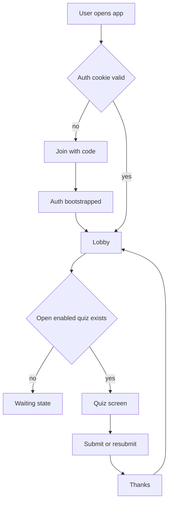
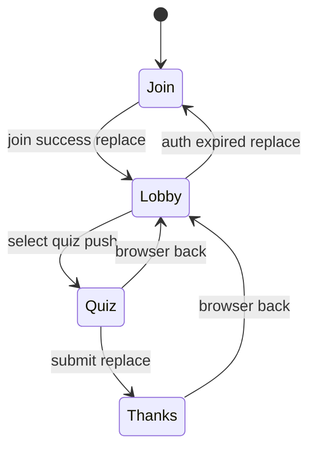

# Back navigation and multi quiz session architecture

## Current baseline

- Routes are join, answer, thanks in [`frontend/src/router.ts`](../frontend/src/router.ts)
- Join auto attempts by code entry in [`frontend/src/screens/JoinScreen.vue`](../frontend/src/screens/JoinScreen.vue)
- Answer loads session and posts one submission object in [`frontend/src/screens/AnswerScreen.vue`](../frontend/src/screens/AnswerScreen.vue)
- Submission objects are append only with `generateName` in [`frontend/src/api/kube.ts`](../frontend/src/api/kube.ts)

## Product decisions locked in

- Returning user with previous submission can edit until quiz is closed
- Returning user lands on previous answers and sees a Resubmit action

## Architectural goals

1. Back button never leaks join code or creates dead end loops
2. Join screen becomes session lobby when active device session exists
3. Session supports multiple quizzes over one talk lifecycle
4. Host can enable disable and open close quizzes during talk
5. Listener identity stays device scoped for continuity across quizzes

## Navigation model

### Route model

- Keep `/join` as entry and recovery route
- Introduce `/s/:session/lobby` as session home
- Replace single answer route with quiz scoped route `/s/:session/q/:quizId`
- Keep `/s/:session/q/:quizId/thanks` as post submit confirmation

### Back button policy

- From join success use `replace` to lobby so browser back does not return to join with code
- From lobby to quiz use `push` so back returns to lobby
- From quiz submit to thanks use `replace` so back returns to lobby not stale editable form
- From thanks back goes to lobby
- If quiz is closed while user is on quiz route, redirect with `replace` to lobby plus banner

### Guard behavior

- Global guard fetches session context when entering session routes
- If auth cookie missing route guard redirects to `/join` with `replace`
- If quiz not enabled route guard redirects to lobby with reason code

## Join screen behavior for active session

Join screen becomes context aware with three states:

1. No active auth and no code: show code input
2. Active auth and active session: show Continue active session card with session title
3. Active auth and prior quiz progress: show Resume card per open quiz

### Join screen CTA rules

- Primary CTA: Continue active session
- Secondary CTA: Enter another code
- If previous answers exist for current open quiz, CTA label is Continue and edit answers
- If no open quizzes, CTA is View session status and wait for next quiz

## Submission and edit semantics

Use one logical submission record per listener per quiz with updates until close.

### Recommended storage semantics

- Add stable key fields to submission spec: listenerRef and quizRef
- Enforce uniqueness for active attempt key at backend layer
- Submit endpoint becomes upsert for open quizzes
- Closed quiz rejects update with conflict style error

This avoids many append only submissions and simplifies resume behavior.

## Move from one quiz per session to many quizzes per session

## CRD shape evolution concept

In [`k8s/crds/quizsessions.yaml`](../k8s/crds/quizsessions.yaml), evolve `spec.questions` into `spec.quizzes[]` where each quiz has:

- `id`
- `title`
- `state` draft live closed
- `enabled` boolean
- `order` integer
- `questions[]`
- optional timing fields such as opensAt closesAt

Session level state remains for talk lifecycle, but quiz level state drives listener UI.

### Why this split

- Session maps to talk and listener identity continuity
- Quiz maps to engagement moments
- Host can prepare many quizzes and activate one at a time

## API evolution

In [`frontend/src/api/types.ts`](../frontend/src/api/types.ts) and [`frontend/src/api/kube.ts`](../frontend/src/api/kube.ts):

- Add session context endpoint that returns
  - session metadata
  - active quiz id
  - quiz list with enabled state and listener progress flags
- Add get submission by listener and quiz endpoint for resume hydration
- Change create submission to upsert submission for a specific quiz

## UX flow

## Back navigation state machine

## Host controls model

Host panel should manage quiz engagement by toggling:

- enabled true false
- state draft live closed
- active quiz pointer for audience spotlight

Listener app uses these fields to decide visibility and mutability.

## Validation and policy notes

- Keep schema first and CEL for cross field rules in CRD
- Add CEL rule that closed quiz cannot be enabled for edits
- Add CEL rule that only one quiz can be active spotlight if spotlight model is used

## Implementation checklist for code mode

1. Introduce lobby and quiz scoped routes in [`frontend/src/router.ts`](../frontend/src/router.ts)
2. Add route guards for auth, session, quiz availability
3. Refactor join screen to show active session continue card
4. Add lobby screen with quiz list and per quiz progress chips
5. Refactor answer screen into quiz scoped component and hydrate previous answers
6. Replace submit API with upsert semantics and closed quiz handling
7. Evolve CRDs for multi quiz session and submission identity keys
8. Update backend auth and session info response to include listener progress
9. Add migration handling from legacy single quiz sessions
10. Add integration tests for back navigation and resume resubmit behavior

## Kubernetes API design for listener identity and latest only submissions

### Listener identity model

Use two listener identity fields with clear responsibility:

- `listenerSessionId` short stable id for one device during one talk session
- `displayName` optional user chosen name for personalization

#### Source of truth and trust boundary

- Auth service continues to own device identity via signed cookie in [`auth-service/session_cookie.go`](../auth-service/session_cookie.go)
- Add a server generated short public id derived from internal cookie key mapping in backend layer, never trusted from frontend input
- Frontend may submit display name, but backend binds it to authenticated listener session

### Recommended CRD contract changes for submissions

In [`k8s/crds/quizsubmissions.yaml`](../k8s/crds/quizsubmissions.yaml), evolve submission schema to represent one canonical object per listener plus quiz:

- Add `spec.listenerRef.sessionId` string
- Add `spec.listenerRef.displayName` string optional
- Add `spec.quizRef.id` string
- Keep `spec.sessionRef.name`
- Keep `spec.answers`
- Keep `spec.submittedAt`

Add deterministic naming for uniqueness:

- Use `metadata.name` pattern like `{sessionName}-{quizId}-{listenerSessionId}`
- Stop using `generateName` for listener submissions in [`frontend/src/api/kube.ts`](../frontend/src/api/kube.ts)

This enforces latest only semantics by object replacement update, not append history.

### API semantics latest and greatest only

Replace create only endpoint behavior with upsert behavior:

- `PUT` preferred to deterministic resource path
- fallback `POST` allowed only for host tooling, not listener flow

Listener submit flow:

1. Build deterministic submission object name from session plus quiz plus listenerSessionId
2. Read existing object by name
3. If not found create
4. If found update same object with new answers and submittedAt

No historical copies are stored.

### Retrieval semantics for resume

Use a single endpoint that returns only current listener submission:

- `GET /public/my-submission?session=<session>&quiz=<quiz>`
- Backend resolves listener from cookie, not request provided listener id
- Backend performs server side lookup by deterministic object name
- Response includes only this listener current answers

No list endpoint for listeners.

### Isolation and access control

Hard rule: listeners can only read and write their own submission object.

Enforcement layers:

1. Auth service injects trusted listener session context headers for backend use
2. Backend ignores client supplied listener identifiers
3. Backend only serves `my` endpoints for listeners
4. Kubernetes RBAC for listener traffic should not allow arbitrary list of quizsubmissions
5. Optional validating admission policy rejects create update if `spec.listenerRef.sessionId` mismatches authenticated identity context passed by trusted proxy

### Can Kubernetes API and RBAC do this directly

Short answer: partially.

What Kubernetes RBAC can enforce well:

- Restrict a ServiceAccount to specific resources such as `quizsessions` and `quizsubmissions`
- Restrict verbs per resource such as allow `get` and `update` but deny `list` and `watch`
- Restrict by object name using `resourceNames` for `get`, `update`, `patch`, `delete`

What Kubernetes RBAC cannot enforce for this use case:

- Dynamic per listener ownership from cookie identity
- Row level filtering of list results by label value
- Label based authorization such as only objects with `voter/listener=<id>`

Implication for this app:

- You can and should deny `list` for listener facing ServiceAccounts
- You cannot rely on Kubernetes RBAC alone to ensure listener A cannot read listener B unless each request uses a distinct identity with prebound object names, which is not practical here
- Keep `my-submission` backend endpoint as policy enforcement point and give that backend a narrowly scoped ServiceAccount

### Recommended RBAC split

- Frontend never talks to Kubernetes directly
- Auth backend ServiceAccount
  - allow read session objects required for join and lobby
- Submission backend ServiceAccount
  - allow `get`, `create`, `update`, `patch` on `quizsubmissions`
  - deny `list`, deny `watch` for listener path
- Host admin ServiceAccount
  - allow list and analytics endpoints

This keeps Kubernetes as storage and coarse authorization, while app backend enforces per listener ownership semantics.

### Name and label strategy

Use labels for query and ops ergonomics only, not trust:

- `voter/session`: session name
- `voter/quiz`: quiz id
- `voter/listener`: listenerSessionId

Use CEL constraints to keep label and spec alignment where possible.

### Personalization behavior

Display name handling model:

- Ask for name once in join lobby
- Store as listener profile scoped to session in backend or dedicated CRD
- Copy snapshot of displayName into submission on each upsert for analytics convenience
- Allow listener to rename; updates apply to future writes and optionally current canonical submission

### Minimal API surface recommendation

- `GET /auth/session-info` include `listenerSessionId` and `displayName`
- `PUT /public/my-submission/{session}/{quiz}` upsert current listener submission
- `GET /public/my-submission/{session}/{quiz}` return current answers only
- `PATCH /public/my-profile/{session}` update displayName

### Compatibility and migration approach

From current append only model in [`k8s/crds/quizsubmissions.yaml`](../k8s/crds/quizsubmissions.yaml):

1. Add new fields `listenerRef` and `quizRef`
2. Deploy backend that writes deterministic names for new submissions
3. Keep reading legacy objects during migration window
4. Run one time consolidation job per listener plus quiz to keep newest and delete older duplicates
5. Remove legacy read path after cleanup

### Risks to manage

1. Deterministic name collisions if listenerSessionId format not normalized
2. Migration dedupe correctness when multiple legacy rows exist
3. Privacy leakage if display name is indexed in broad list APIs
4. Admission policy complexity if identity context is not reliably propagated
5. Browser cache stale reads after upsert unless ETag or cache control is explicit

## Risks to manage

1. Data migration from legacy `spec.questions` to `spec.quizzes`
2. Uniqueness enforcement for listener plus quiz submissions
3. Browser history edge cases after redirects
4. Race conditions when host closes quiz during answer editing
5. Deterministic name upsert correctness across concurrent submits
6. Strict isolation in API layer to prevent cross listener reads
