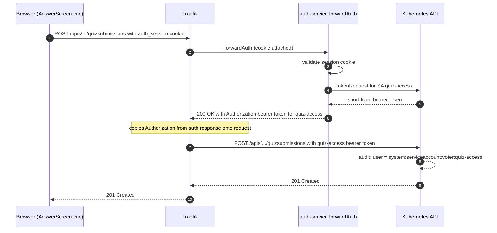
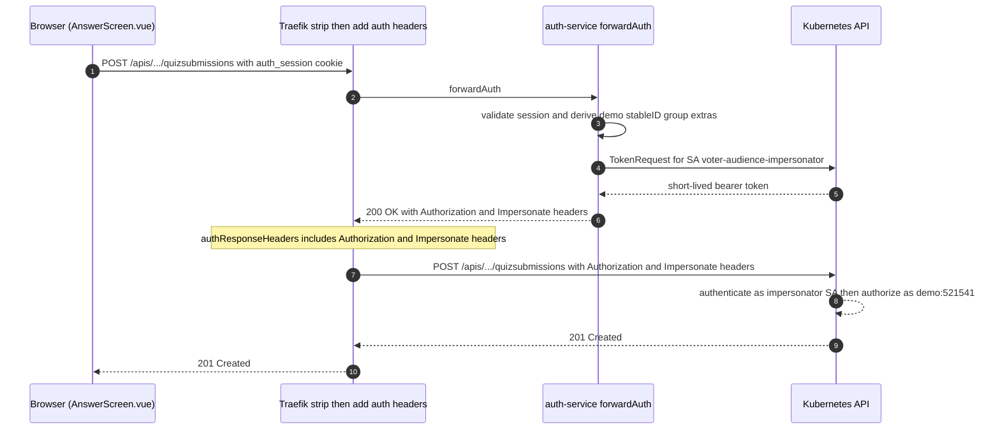

# Quiz Submission Impersonation Plan

## Purpose

`POST /apis/examples.configbutler.ai/v1alpha1/namespaces/voter/quizsubmissions`
is the only audience-facing write that does **not** currently flow under the
participant's impersonated identity. The Kubernetes audit event for every
submission shows `system:serviceaccount:voter:quiz-access` rather than
`demo:<stableID>` in group `voter-audience`.

That is the last hold-out from the pre-hardening era. The coffee config write
path was reworked to impersonate ([`auth-service/kube_client.go:366`](../auth-service/kube_client.go#L366)),
but quiz submissions still ride the original shared-token forwardAuth flow.

This document covers two ways to fix that, with a strong recommendation for the
one that **keeps the frontend talking directly to the Kubernetes API**.

## Current State



Audit identity is wrong: the participant disappears into a shared SA.

## Two Ways Forward

### Option A — Proxy the write through auth-service

Add `POST /public/quizsubmissions` to auth-service. The handler validates the
session, builds an `audienceIdentity` (same path as
[`coffee_handlers.go:141`](../auth-service/coffee_handlers.go#L141)), and uses
`impersonatedDynamic(identity)` to `Create()` the `QuizSubmission`. Frontend
calls the new auth endpoint instead of the K8s API.

This is the safest and shortest path. It is also a step away from the talk's
core narrative ("Kubernetes is the API"), because now there is one
audience-write endpoint that isn't a K8s endpoint.

### Option B — Keep the direct K8s call, add impersonation in forwardAuth

This is the option to prefer if we can land it cleanly. The frontend keeps
talking to the real Kubernetes API. forwardAuth still mints the bearer token,
but it now **also** emits `Impersonate-*` headers derived from the session
cookie, and Traefik copies those headers onto the upstream request alongside
`Authorization`.



#### Why this works

Kubernetes impersonation is purely header-driven
([k8s.io/authentication](https://kubernetes.io/docs/reference/access-authn-authz/authentication/#user-impersonation)):

1. The API server authenticates the bearer token (the impersonator SA).
2. If `Impersonate-User`/`Impersonate-Group`/`Impersonate-Extra-*` are present,
   the API server checks that the authenticated principal has `impersonate`
   RBAC for each one.
3. The request is then **authorized** as the impersonated user against
   the impersonated groups — which is exactly the `voter-audience` group
   binding already in [`k8s/auth-service-rbac.yaml:106`](../k8s/auth-service-rbac.yaml#L106).
4. Audit logs record the impersonated user as the actor, with the impersonator
   on the side.

So the "direct" call shape is preserved end to end — Vue still POSTs to
`/apis/.../quizsubmissions`, and the API server still treats the request as a
first-class Kubernetes write. The only difference vs. today is that the headers
carry richer identity.

#### What it requires

1. **A dedicated impersonator SA** (`voter-audience-impersonator`, namespace
   `voter`) with **only** impersonate permissions — none of the CRUD verbs the
   `voter-audience` group already has via its RoleBinding. Mirrors the safety
   property the coffee path already enforces: the SA cannot write the resource
   directly, only via impersonation.

2. **Forward-auth-decision emits the headers.** In
   [`http_handlers.go:212`](../auth-service/http_handlers.go#L212), the browser
   branch already pulls the session and mints a token. After
   `audienceIdentityFromSession` succeeds, set:
   - `Impersonate-User: <identity.Username>`
   - `Impersonate-Group: voter-audience`
   - `Impersonate-Extra-configbutler.ai%2Fclaims%2Fdisplay-name: <identity.DisplayName>`
     (only when `cfg.ConfigButlerIdentityExtrasEnabled` is true)
   - `Impersonate-Extra-configbutler.ai%2Fclaims%2Femail: <identity.Email>` (same gate)

3. **Traefik forwards the headers.** Extend `authResponseHeaders` in
   [`k8s/ingress-kubeapi.yaml:10`](../k8s/ingress-kubeapi.yaml#L10):
   ```yaml
   authResponseHeaders:
     - Authorization
     - Impersonate-User
     - Impersonate-Group
     - Impersonate-Extra-configbutler.ai%2Fclaims%2Fdisplay-name
     - Impersonate-Extra-configbutler.ai%2Fclaims%2Femail
   ```

4. **Traefik strips client-supplied `Impersonate-*` on ingress.** This is the
   single most important security step (see "Security notes" below). Add a
   `headers` middleware chained **before** `auth-forwarder` that removes any
   incoming `Impersonate-*` request header, so the only way these headers can
   reach the API server is via the auth response.

5. **Leave kubectl pass-through alone.** The "Path 1" branch of
   `forward-auth-decision` (bearer token already on the request) should keep
   working unchanged. kubectl users who already authenticate as a real K8s
   identity should *not* get auto-impersonation layered on top. If
   `/public/kubeconfig` still issues demo kubeconfigs, keep that token source
   separate from `FORWARD_SA`; Traefik strips inbound `Impersonate-*`, so a
   kubeconfig containing only the impersonator SA token will not authorize.

#### Side benefits

- Reads (`GET .../quizsessions/<name>`) get impersonation for free. Today they
  authorize against the shared `quiz-access` SA. After this change they
  authorize against `voter-audience`, which already has `get/list/watch` on
  quizsessions ([rbac:104](../k8s/auth-service-rbac.yaml#L104)). One less
  identity in the picture.
- `quiz-access` SA + its RoleBinding become unused for the browser flow. Keep
  it only if `/public/kubeconfig` or some other out-of-band kubectl convenience
  still needs a direct bearer token.
- The runtime-namespace plumbing added in
  [`frontend/src/api/kube.ts:18`](../frontend/src/api/kube.ts#L18) keeps
  doing its job — the frontend still chooses the namespace in the URL path.

## Comparison

| Property                                  | Option A (proxy) | Option B (direct + headers) |
| ----------------------------------------- | ---------------- | --------------------------- |
| Frontend POSTs to literal K8s API URL     | No               | **Yes**                     |
| Code surface to add                       | New Go handler + new frontend client | forwardAuth diff + Traefik middleware |
| Reads also get impersonated identity      | No (unchanged)   | **Yes** (bonus)             |
| New attack surface                        | One new HTTP endpoint | Traefik header hygiene must be right |
| Talk narrative ("K8s is the API")         | Diluted          | **Preserved**               |
| Easy to revert                            | Yes              | Yes (drop headers)          |

Recommendation: **Option B**, with Option A as the fallback if Traefik can't be
made to strip client-supplied `Impersonate-*` headers reliably (which would
make B unsafe to ship).

## Implementation Steps — Option B

1. **k8s/quiz-rbac.yaml** — add `voter-audience-impersonator` ServiceAccount in
   namespace `voter`. Create a ClusterRole granting impersonate on `users`,
   on `groups` with `resourceNames: ["voter-audience"]`, and on the two
   `userextras/configbutler.ai/claims/...` resources. Bind it to that SA only.
   No CRUD verbs on quizsubmissions/quizsessions — those come from the
   `voter-audience` RoleBinding already in place.

2. **auth-service/config.go** — point browser forwardAuth token minting at the
   new impersonator SA. If `/public/kubeconfig` remains supported, use a
   separate kubeconfig SA setting for `quiz-access`; do not let the kubeconfig
   endpoint accidentally inherit the impersonator-only browser SA.

3. **auth-service/http_handlers.go** — in the browser branch of
   `/private/forward-auth-decision`:
   - After the existing `getOrRequestToken(...)` call, read the session via
     `getBrowserSession(r)` and call `audienceIdentityFromSession(...)`.
   - On error → 401, do not set Impersonate-* headers (and ideally do not
     return the bearer token either — fail closed).
   - On success, set the four `Impersonate-*` response headers as listed
     above. Gate the two `Impersonate-Extra-*` headers on
     `cfg.ConfigButlerIdentityExtrasEnabled` so we keep the existing kill
     switch.

4. **k8s/ingress-kubeapi.yaml** — extend `authResponseHeaders` and add a
   `headers` middleware that strips `Impersonate-*` request headers, chained
   ahead of `auth-forwarder`. Verify with
   `curl -H 'Impersonate-User: system:admin'` that the upstream request shows
   the server-supplied user, not the attacker-supplied one.

5. **k8s/auth-service-rbac.yaml** — move the existing impersonate verbs off
   the `auth-service` ClusterRole if they are no longer needed there. The
   coffee handler still uses them (it impersonates from in-process, not via
   forwardAuth), so likely keep them on `auth-service` and only add a new
   ClusterRole for the impersonator SA. Document the split clearly in
   comments.

6. **Frontend** — no change to `createQuizSubmission` or `AnswerScreen.vue`.
   This is the whole point of Option B.

7. **Cleanup** — remove `quiz-access` from
   [`k8s/quiz-rbac.yaml`](../k8s/quiz-rbac.yaml) only after confirming the
   kubeconfig flow no longer depends on it. Do this in a separate commit so
   it's trivial to revert independently.

8. **Verification** — submit a quiz answer, then:
   ```
   kubectl get events -n voter --sort-by=.lastTimestamp | tail
   # and on the audit log side:
   #   user.username == "demo:<stableID>"
   #   user.groups contains "voter-audience"
   #   impersonatedBy.username == "system:serviceaccount:voter:voter-audience-impersonator"
   ```

## Security notes

1. **Stripping client `Impersonate-*` is non-negotiable.** Traefik
   `authResponseHeaders` adds headers from the auth response, but does not by
   itself remove headers the client may have set. If a participant sends
   `Impersonate-User: system:admin` directly to the public endpoint, and the
   impersonator SA has unrestricted `impersonate users` (which it does, by
   design — see the existing rationale at
   [`auth-service-rbac.yaml:70`](../k8s/auth-service-rbac.yaml#L70)), the API
   server **will** accept it unless Traefik dropped the inbound header first.
   The plan therefore depends on a `headers` middleware that explicitly
   removes any `Impersonate-*` from inbound requests before forwardAuth runs.
   This must be tested end-to-end.

2. **Defense in depth via username prefix.** Even with header stripping in
   place, the auth-service always derives `demo:<stableID>` from the session.
   We could add a ValidatingAdmissionPolicy that rejects any request whose
   `Impersonate-User` does not match `demo:[1-9][0-9]{5}` — small belt-and-
   braces step if we want to be extra paranoid.

3. **Impersonator SA is impersonate-only.** No CRUD verbs. If the impersonator
   SA token ever leaks, the holder can impersonate audience users (which can
   create quizsubmissions and patch coffee configs), but cannot do anything
   *as the SA itself*. Same blast radius as the current `auth-service` SA.

4. **Kubectl pass-through is unaffected.** The existing Path 1 branch in
   `forward-auth-decision` returns the client's own bearer token; we should
   not stack Impersonate-* on top of it. Add an explicit guard / test.

## Open questions

- **Header capitalization.** Kubernetes accepts `Impersonate-Extra-` with
  any case in the suffix, but Traefik's `authResponseHeaders` matcher is
  case-sensitive in some 2.x versions. Worth verifying on the deployed
  Traefik version before rollout — falling back to listing both casings is
  acceptable.
- **Watch path.** Streaming watches go through the same Traefik route. Header
  forwarding should work identically since forwardAuth runs once per request.
  Worth one quick check with `kubectl get --watch` via the audience
  kubeconfig flow.
- **`detectNamespace()` fallback.** auth-service reads its namespace from the
  in-pod token file. If that ever returns empty, today the handler defaults to
  `"default"`. With impersonation in the loop, an empty namespace plus a
  cluster-scoped CRD path could surface odd errors. Worth a defensive
  assertion at startup.
