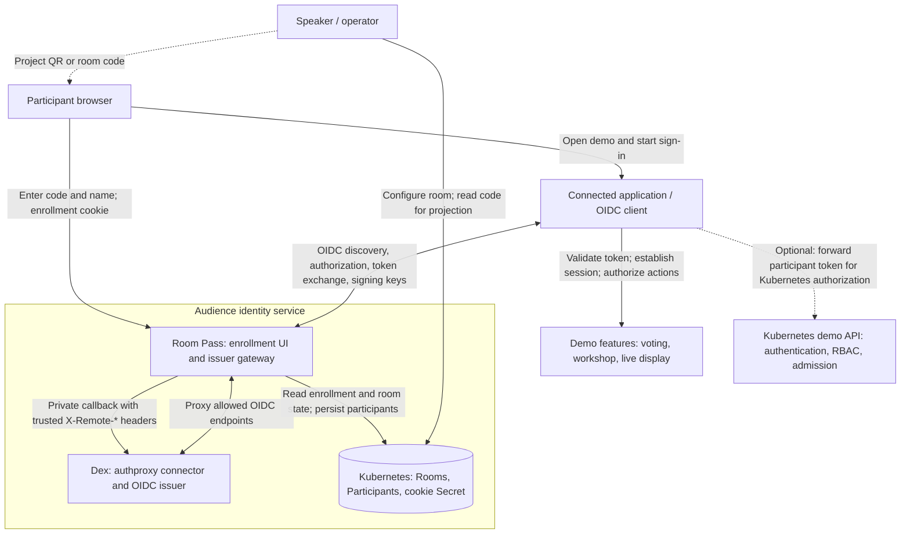

# Room Pass product vision

Status: proposed direction, 2026-09-21. This describes an ambition, not shipped
capabilities or a commitment to operate a hosted service. See the
[extraction plan](OPEN-SOURCE-PLAN.md) for the proposed next steps and
[README](README.md) for the current implementation.

## Purpose

**Room-code sign-in for interactive demos and workshops. Connect your application
through OIDC.**

A speaker should be able to invite a room full of people into an interactive
demo without asking them to create an account or bring a personal developer
identity. Participants scan a QR code or enter a short code, choose a display
name, and join the application with an identity that lasts for the session.

Room Pass turns audience enrollment into an identity applications can use. Its
value is the small distance between “try this with me” and someone participating
on their phone.

## What that identity means

The claim is: **this browser enrolled in this room under this chosen label**.
It does not establish a person's real identity, physical presence, ticket
ownership, or uniqueness across browsers. A shared or photographed code can
travel outside the venue. A nickname is not a verified name.

That can be sufficient for a bounded demo. The application still decides what
participants may do and must account for repeated enrollment and misuse. Room
Pass is not an attendance certification system or a one-person-one-vote system.

The enrollment and identity service must distinguish room closure from access
revocation. Stopping a room prevents new identity assertions; it does not
automatically invalidate tokens already issued or sessions held by applications.

## Product boundary

| Layer | Responsibility |
|---|---|
| Room Pass | Room lifecycle, codes, enrollment, browser continuity, participant labels, and eligibility to sign in |
| Dex | OIDC discovery, login protocol, signing keys, and signed tokens |
| Connected application | Trust the configured issuer, validate tokens, manage its sessions, and authorize actions |
| Kubernetes today | Store Room and Participant resources and run the service; optionally authorize demo actions through RBAC |

Room Pass alone is not currently an OIDC provider. Room Pass and Dex together
provide an OIDC identity service for temporary audiences. The intended public
offering includes a documented, working combination of the two; it does not
require implementing another OIDC server.

Kubernetes is the current deployment and storage prerequisite. A connected
application need not itself use Kubernetes as its backend. Keep that distinction
clear in examples and descriptions. Removing the Kubernetes prerequisite is a
future question, not a condition for the first release.

The application integration has two levels: ordinary OIDC sign-in with manual
room-code entry, and an optional QR prefill/deep-link integration. Today the
prefill contract requires the application's login endpoint to share the join
host. A remote hosted service cannot promise the same experience for arbitrary
application domains without further design.

## How the current components fit together

This diagram shows responsibilities and trust boundaries; the OIDC connection
includes browser redirects and application-to-issuer requests.

The storage and demo API boxes can refer to the same Kubernetes cluster; they
represent different responsibilities. Only applications that use Kubernetes as
their demo backend need the optional bottom connection.

### Where the Dex coupling lives

**Yes: the current implementation specifically depends on Dex's `authproxy`
connector.** Its application-facing interface is OIDC, but the connection
between Room Pass and Dex is a trusted-header integration, not OIDC federation
between two independent identity providers.

In the browser login flow:

1. The application starts an OIDC authorization request. Public issuer traffic
   passes through Room Pass to Dex.
2. Dex's authproxy flow sends the browser to `/callback/<connector-id>`.
   Room Pass intercepts that path and runs its browser-bound enrollment handoff.
3. Once the browser is eligible, Room Pass rechecks the Room and Participant,
   then forwards the saved Dex callback state to the private Dex upstream with
   server-derived `X-Remote-*` identity headers.
4. Dex completes authorization. The application exchanges the authorization
   code through the issuer gateway, receives Dex-issued tokens, and validates
   them before establishing its own session.

Room Pass knows Dex's callback convention, identity-header contract, and allowed
protocol routes. `CONNECTOR_ID` configures the connector name, not the provider
implementation. Changing `DEX_UPSTREAM` to another OIDC provider would not make
that provider compatible.

The trusted-header boundary is essential: public callers cannot supply identity
headers, and Dex must not be directly reachable through an alternative public
route. Room Pass strips incoming identity headers and constructs the assertion
itself. See the [handoff protocol](docs/handoff.md) and
[fixture connector configuration](test/e2e/dex.yaml) for the implemented details.

For the initial product, make this dependency explicit and ship the tested
Room Pass + Dex combination. Supporting another issuer would require a separate
integration and equivalent trust-boundary tests. Having Room Pass implement an
OIDC provider itself would be a substantially different scope; neither is needed
to extract the current component.

The [Dex decision record](docs/To-dex-or-not-to-dex.md) compares those alternatives
and records another reason to keep Dex: attendees can use room enrollment while
the presenter chooses GitHub or another configured identity source for explicitly
granted operator permissions, as demonstrated in the demo.

A separate [OIDC integration proposal](docs/oidc-integration-proposal.md)
explores keeping Dex as the broker while replacing authproxy with a standard
OIDC upstream. This is a future prototype; the architecture above remains current.

## Who it serves

- **Participants:** join quickly, use a chosen label, and understand where it
  will appear without handing over an unrelated personal account.
- **Speakers:** rehearse a complete experience, open enrollment, project a code,
  and end the demo with predictable cleanup and access controls.
- **Application developers:** connect an OIDC client and receive a documented
  identity contract without implementing audience enrollment themselves.
- **Conference organizers, eventually:** offer shared infrastructure so every
  speaker does not have to solve enrollment and identity independently.

The first adopters are technically comfortable speakers running demos or
workshops who can operate the supplied Kubernetes deployment. The project should
say this plainly rather than imply that any speaker can use it immediately.

## Personal accounts should be a deliberate choice

For a short, low-stakes audience interaction, requiring a GitHub account should
need a reason. It introduces an account prerequisite and asks people to connect
their personal identity to an activity that may only need a temporary label.

Personal-account sign-in remains appropriate when the exercise actually needs
that account, repository access, or continuity with an existing developer
workflow. Room Pass does not establish a blanket rule that GitHub sign-in is
unacceptable. The principle is proportionality: ask for the identity and access
the activity needs, and make participation optional.

Likewise, “no real email required” does not mean anonymous or untraceable.
Chosen names can identify people, and application logs, audit trails, or Git
commits can outlive the room. Explain those destinations before enrollment.

## Distribution and hosting

### First: a self-hosted open-source release

Ship a complete example, reproducible installation, and a clear operating
contract. Speakers can run it under their own domain and control the issuer,
participant records, and event lifecycle. Voter remains a real consumer and
integration example, not a prerequisite.

Self-hosting is the reference deployment. It must remain usable independently of
any future service run by the maintainer.

### Next possibility: conference-operated infrastructure

A technical conference could offer audience identity alongside Wi-Fi and AV:
an event-owned issuer, isolated speaker rooms, a rehearsal window, published
retention rules, and someone responsible for incident response during sessions.

This is an attractive experiment because the organizer already owns the event
schedule and support relationship. Those responsibilities still need an explicit
owner; conference hosting does not make them disappear.

A conference could require interactive demos to offer an account-free
participation route while allowing speakers to choose the implementation.
Requiring Room Pass itself is not the ambition.

### Optional experiment: free hosting for fellow speakers

A small, invitation-based service could lower the barrier to trying Room Pass.
Free access is a possible community contribution, not a business model or an
availability promise. Do not make the project's success depend on monetization.

The maintainer should not promise a service they would not trust for their own
talk. Start with explicit support windows, bounded event sizes and costs, and a
self-hosted fallback prepared before the event. Changing issuers during a live
talk is not a reliable fallback: clients and existing sessions trust the original
issuer.

Any hosted pilot needs isolated room administration and identities, client and
redirect registration, a cross-domain joining design, persistent signing keys,
tested recovery, abuse limits, and clear retention and shutdown behavior. The
current single-room deployment does not supply a multi-tenant service merely by
adding a room creation page.

## Future idea: one QR code per seat

Give each seat its own printed QR code. A participant scans the code on their
chair or desk, joins the current session, and confirms a seat such as B12. The
presenter projects a grid matching the room's layout: empty seats become named
tiles as people join, and tiles update live as people vote.

That makes the audience part of the visual demo. The speaker can see which
parts of the room have responded, wait for remaining participants, and reveal
what people chose in the same spatial arrangement as the audience itself.

Possible presentation modes:

- **Participation:** show the chosen display name and whether that seat has
  submitted a vote, keeping answers hidden.
- **Live answers:** show each participating seat's choice as votes arrive, for
  activities where seeing one another's answers is part of the interaction.
- **Reveal together:** show submission progress first, then reveal answers when
  the speaker closes the round, so early answers do not influence later votes.

The join flow should explain whether names, participation, and individual
answers will be projected. Keep an ordinary join route for people without a
seat code or who do not want to appear in the seating grid.

A seat scan establishes a claimed seat, not verified physical location. People
can move, share a photo of a code, or scan the wrong chair. Let participants
confirm or change seats, and give the presenter a way to resolve conflicting
claims without silently replacing another participant.

Printed seat codes identify a seat and its joining route; they must not become
permanent enrollment credentials. A future design needs to resolve the active
session and apply its admission rules separately, resetting seat associations
between sessions. This differs from today's rotating room-code QR flow.

Keep the product boundary explicit: Room Pass could associate an enrollment
with a room-scoped seat reference. The connected voting application owns votes,
answer visibility, and the live seating-grid display. Seat claims must not grant
extra permissions or imply one-person-one-vote guarantees.

This is an exploratory extension after the standalone release. A small pilot
with a printed seating layout and several phones would let us try the on-screen
experience, seat changes, duplicate scans, and resetting between talks before
designing a conference-wide seating system.

## Principles and limits

- Optimize the participant's first minute and the speaker's rehearsal.
- Collect only what the interaction needs; support chosen labels.
- Explain attribution and retention where participants make their choice.
- Keep application permissions explicit and bounded.
- Make open, closed, ended, and access-withdrawn states understandable.
- Prefer a small dependable deployment over expanding the feature list.
- Publish observed limits and supported configurations without presenting a
  local load test as a conference reliability guarantee.

The initial product is not a ticketing service, verified identity provider,
general-purpose account directory, workshop provisioning platform, or hosted
demo application. Multi-room hosting, billing, and replacing Dex are outside
the first release.

## What would validate the idea

The strongest evidence is another speaker using Room Pass without the author
operating it for them, followed by a second use at a later event.

Observe time to first successful rehearsal, completion of the phone join flow,
where setup needs help, and whether participants understand the identity they
are sharing. Collect this through consenting pilots and feedback; mandatory
participant analytics are not a prerequisite.

A credible launch story is: “The joining experience got positive feedback, so
I extracted it for other speakers. Here is a runnable example.” A hosted service
can follow evidence of demand and operational confidence. It need not precede
the open-source release.
