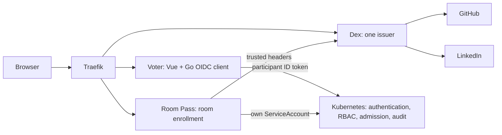

# Voter and Room Pass architecture

Reconciled 2026-09-10 against source and the [deployment handoff](state-2026-09-10.md).
This review inspected local files, not the running cluster.

## Components

Voter owns `/auth/login`, `/auth/callback`, `/auth/session` and `/auth/logout`.
Room Pass owns `/bind`, `/join`, `/logout` and its connector handoff paths.
Traefik must route the Room Pass paths before the SPA fallback. Dex uses the
`room-pass`, `github` and `linkedin` connectors; there is no dedicated demo issuer.

The application uses authorization code flow with PKCE, state, nonce and a
browser binding. Its encrypted, signed HttpOnly cookie contains the ID token.
JavaScript receives display metadata and a CSRF token, never the ID token.
The application session ends no later than the token expires. Persistent cookie
keys allow established sessions to survive a backend restart; pending login
transactions remain in process memory.

## Identity is distinct from permission

The platform authenticator derives the username prefix from Dex's
`federated_claims.connector_id`: `demo:`, `github:<email>` or
`linkedin:<email>`. Clients whose tokens reach Kubernetes must request
`federated:id`. Unknown or absent connectors are rejected. Room connector groups
must start with `demo:`; system usernames and groups are rejected.

A name typed into the room form is display attribution, not an operator identity.
The room email is synthetic. Conversely, named GitHub and LinkedIn email subjects
are used in operator RBAC, so those provider email claims do carry authorization
weight. Voter displays the username returned by Kubernetes SelfSubjectReview;
it does not construct that username itself.

[Authorization and tests](../docs/authorization.md) records grants, denial behavior
and proposed open GitHub login. Do not add a second application permission system
based on a connector name or a frontend admin screen.

## Boundaries that must hold

- Only Traefik and Room Pass may reach Dex under the platform NetworkPolicy.
  Public routes must not expose the trusted-header connector directly.
- Participant Kubernetes clients use only the session's token and a fixed API
  destination with TLS verification. They never impersonate or retry as the server.
  Voter no longer constructs an unused ServiceAccount/kubeconfig client at startup.
- Cookie-authenticated mutations need CSRF proof. Voter accepts absent Origin with
  a matching token, rejects `null` and foreign origins. Room Pass accepts absent or
  `null` Origin only with its valid signed CSRF cookie and matching form token.
- Room closure prevents new enrollment and Room Pass identity handoff. It does not
  revoke an already-issued Dex token. Application logout clears only the app cookie.
- Kubernetes RBAC is additive. All matching grants, including platform grants to
  authenticated users, contribute to effective access.

## Application surface and deployment

Only `/public/coffeeconfig` has been ported to participant Kubernetes credentials:
GET reads the configured object; PATCH updates it and optionally creates a
`configbutler.ai/v1alpha3` CommitRequest. A failed second operation returns a
saved configuration with `committed: false` and an explanation. Even
`committed: true` currently means the CommitRequest was created, not that a Git
commit was observed; the UI contract needs clarification before this is presented
as Git confirmation.

Storefront, orders, editor watches/history and quiz forwarding remain incomplete.
The frontend still references removed routes. Successful login is not proof of a
working coffee or quiz demo.

The deployed configuration described in the handoff belongs to the external
platform checkout. The old root `k8s/` deployment and `k8s-examples/` overlay have been deleted,
including their duplicate demo CRDs. The platform owns those deployment resources. The local Room Pass e2e fixture has its
own static authenticator and small demo client; it does not prove the platform
Helm template or the real Voter browser flow.

## Verification scope

Fast handler tests cover session/CSRF gates, credential isolation and preservation
of Kubernetes denial responses. Room Pass tests cover enrollment lifecycle and
handoff. CI also runs envtest API tests. Still required: rendered platform
connector-mapping tests, real RBAC denial tests across all connectors, browser
login/expiry coverage, and audit-to-Git acceptance. See the
[implementation plan](implementation_plan.md).
