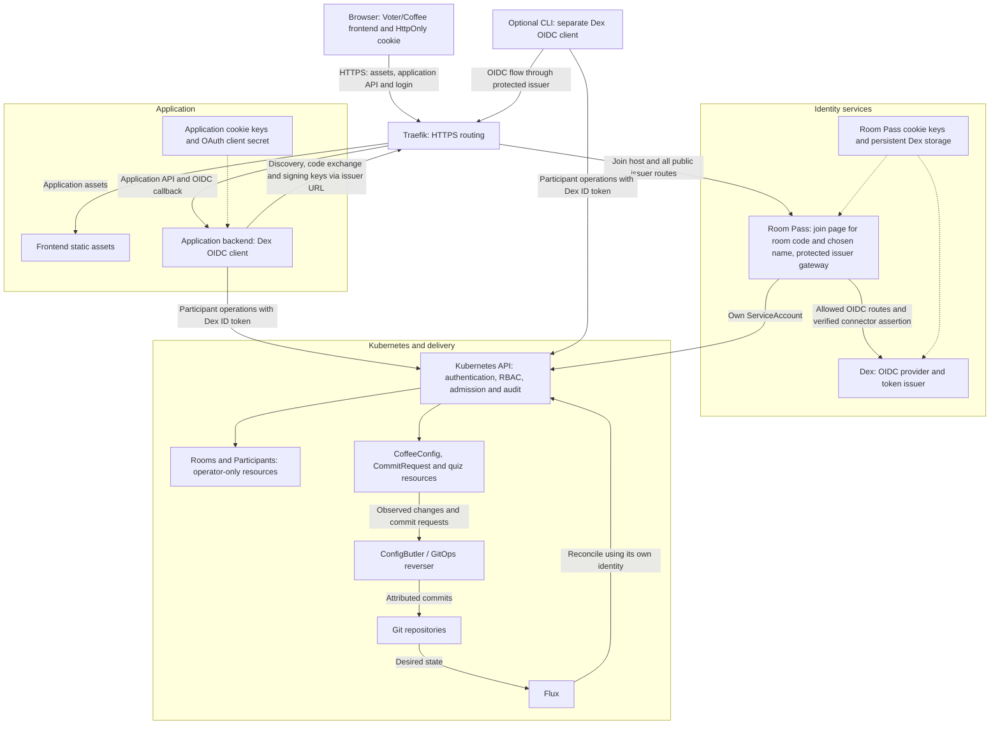
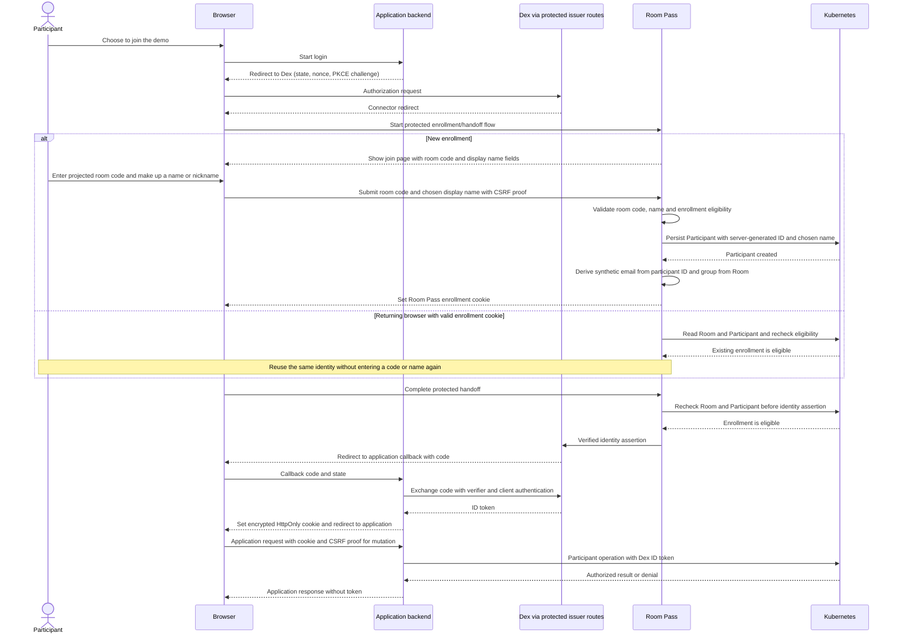

# Advised application architecture

Status: agreed direction, not yet implemented. Written 2026-09-09.

Follow-up 2026-09-10: [oauth2-proxy as an investigated alternative](login-explained.md#investigated-alternative-delegate-oidc-to-oauth2-proxy)
can own OIDC login/cookies and forward the participant ID token. The backend-owned
design below remains the implementation baseline; excluding a proxy is a design
choice, not an OIDC limitation. The alternative has not been tested or selected.
See the [risk comparison and latest advice](login-explained.md#pros-cons-and-final-advice):
evaluate the proxy locally while retaining a dedicated demo issuer initially.

This document describes how Voter/Coffee should consume Room Pass identity through
Dex. It belongs here as integration advice; it does not move application ownership
into Room Pass. See the [implementation plan](implementation_plan.md), the
[Room Pass contract](requirements.md), and the [handoff protocol](docs/handoff.md).

## Decision

Use the existing application backend as a confidential OIDC client of Dex. It owns
authorization-code login with PKCE, validates Dex ID tokens, and stores the token in
a signed, encrypted HttpOnly cookie. For participant Kubernetes operations, it
forwards that participant's ID token as the bearer credential.

Do not add oauth2-proxy, a session database, or an application token issuer for this
improvement. Dex remains the issuer. Room Pass remains the enrollment authority.

The platform's existing Dex/oauth2-proxy integration in
`external/k8s/k8s.koudijs.dev/2-gitops/auth/oauth2-proxy/` demonstrates cookie-based
OIDC sessions for dashboards. The application already has a backend that needs the
token for Kubernetes orchestration, so implementing the client there avoids another
component and proxy-to-backend identity boundary. Follow the established protocol
and secret-management approach, rather than copying that dashboard deployment.

## Responsibilities

| Component | Responsibility |
| --- | --- |
| Room Pass | Enrollment, participant identity, eligibility checks, protected Dex connector handoff |
| Dex | OIDC authorization, token issuance, discovery and signing keys |
| Application backend | OIDC client, application cookie, CSRF protection, participant-token forwarding and application orchestration |
| Frontend | Login navigation, display of server-provided identity, application requests with cookies |
| Traefik | HTTPS entry point, same-origin application routing, protected join and issuer routing |
| Kubernetes | Token authentication, audience checks, RBAC, admission and audit identity |
| ConfigButler / GitOps reverser | Downstream processing of application changes and CommitRequests into Git attribution |
| Flux | Reconciliation of platform and application desired state from Git |

The backend does not accept a browser-selected subject, email or group as identity.
It does not read Room or Participant resources, collect room codes, or expose a
second enrollment path. Its ServiceAccount is reserved for explicitly inventoried
server operations and has no impersonation or participant-token minting authority.

## Component overview

This is the advised deployment, not a statement that application integration is
already complete. Arrows show requests or data movement; login redirects are
expanded in the sequence diagram below.

The frontend and backend share an application origin. The browser automatically
sends the application cookie to that origin; frontend JavaScript cannot read the
token. Room Pass has its own separate enrollment and handoff cookies.

All public issuer requests, including backend discovery and code exchange, reach
Dex through the existing Room Pass gateway. Traefik must not expose a second direct
Dex route. The backend never reads Room or Participant records. Operator tooling
manages those resources through Kubernetes; the audience cannot read them.

Application keys, Room Pass keys and Dex credentials/storage are independent even
where grouped for readability. Dashed arrows show secret/storage dependencies.
The optional CLI stores and uses its own credentials rather than the application
cookie. ConfigButler and Flux are downstream delivery components, not login steps;
their Git behavior requires separate integration verification.

## Login and request flow

The participant chooses a first name or nickname on Room Pass's join page. This is
an unverified display label, not an authorization key. There is no email field:
Room Pass derives `<participant-id>@demo.invalid` for attribution. The diagram shows
successful enrollment and returning-session paths; invalid codes, names or
ineligible enrollments do not proceed to identity assertion. The cross-host cookie
binding and one-time handoff steps are detailed in the [handoff protocol](docs/handoff.md).

Register the backend as a confidential Dex client with an exact configured callback
URI and a separate client secret. Request `openid profile email groups`. Use
established Go OIDC/OAuth libraries for discovery, code exchange and token
verification; application code still owns transaction binding and CSRF checks.

Use S256 PKCE, cryptographically random state and nonce, and a short-lived,
browser-bound, single-use login transaction. Bound pending transactions and expire
them. Bounded process memory is sufficient initially: a restart may require
restarting unfinished login, while established cookies remain valid. Route an
entire transaction to its owner if multiple replicas are introduced later.

Validate state before exchanging the code and verify signature, exact issuer,
client audience, expiry and nonce before creating the application session. Apply
OIDC authorized-party checks where required. Allow only configured local return
paths; never derive issuer, callback or external return destinations from untrusted
forwarding headers. The callback and token exchange must preserve the existing
Room Pass issuer routing boundary, without direct access to an exposed Dex alias.

## Cookie and lifecycle

The token is physically stored in a browser cookie, but JavaScript cannot read it
and only the backend has its decryption keys. This is a stateless encrypted session,
not a cookie containing a database session identifier.

- Reuse `voter/session_cookie.go` and its established `securecookie` library
  where suitable. The current code already signs and encrypts; the identity source
  is what must change. Version the new payload so legacy identity cookies fail closed.
- Store the ID token and only necessary session metadata. Use a host-only cookie
  with `Secure`, `HttpOnly`, explicit `SameSite=Lax`, and `Path=/`; prefer a
  `__Host-` name for HTTPS deployments. Keep frontend and backend on one origin.
- Generate independent signing/encryption keys with cryptographic randomness using
  the library's required lengths. Persist them in a pre-created application Secret,
  separate from Room Pass keys and the Dex OAuth client secret. Grant access only
  to the required named Secret, or mount it without granting API Secret reads.
- Limit application session validity to the earlier of configured session lifetime
  and ID-token expiry. Check validity on each authenticated request; an intact
  cookie must not extend an expired token's authority.
- Measure the complete encoded cookie against browser and ingress limits with the
  real Dex token. Fail clearly on oversize data. Do not add silent truncation or
  custom cookie splitting; revisit storage explicitly if the measured token cannot fit.
- Protect all state-changing cookie-authenticated endpoints, including logout, with
  explicit CSRF validation and expected-origin checks. SameSite alone is insufficient.
- Never return tokens through frontend identity APIs, HTML, URLs, logs, errors or
  tracing. Redact callback codes and Cookie/Authorization headers from request logs.

The current Dex authproxy connector does not issue refresh tokens. On expiry,
return an authentication-required response to API calls; the frontend initiates a
top-level login redirect. Room Pass reuses eligible enrollment, preserving the Dex
subject without another join code. Preserve unsaved edits, but do not automatically
replay a mutation whose outcome is uncertain.

Application logout clears the application cookie. It does not revoke the Room Pass
participant, clear Room Pass enrollment, or revoke an already-issued Dex token.
Replacing application cookie keys invalidates application sessions; document this
as an intentional sign-out operation rather than promising seamless key rotation.
An encrypted cookie remains a replayable credential if stolen.

Stopping a Room prevents new authorization but does not invalidate existing Dex
tokens. Immediate platform shutdown still requires withdrawing grants and draining
existing connections as described in the Room Pass contract. The application must
not claim that logout or Room shutdown instantly revokes Kubernetes access.

## Kubernetes identity and authorization

Kubernetes receives the Dex **ID token**, not an OAuth access token, an application
JWT, or an impersonator ServiceAccount token. Configure its authenticator to accept
the backend client's audience. A CLI can retain a separate registered client and
accepted audience; Kubernetes itself is a token validator, not an OAuth flow client.

Use the verified opaque Dex `sub` as the subject, with the authenticator's configured
`demo:` prefix for the Kubernetes username. Never substitute Room Pass participant
names or display names. The `name` claim is presentation only; synthetic `email`
supports Git attribution, not verified mailbox identity. Groups come from Dex claims
derived from Room configuration. Admission enforces ownership and field restrictions
that RBAC cannot express.

Build participant clients from the configured Kubernetes endpoint and TLS trust,
with only the participant token as credentials. Do not inherit ServiceAccount token
files, client certificates, exec/auth providers or impersonation settings. Never
mutate shared client credentials or fall back to ServiceAccount access after denial.
Do not allow a caller to choose the destination API server.

CoffeeConfig writes and their CommitRequests use the same participant token. They
are separate Kubernetes operations, so partial success must be reported honestly.
Inventory quiz submission, reads, watches, in-memory mutations and background work
as well. Any retained server operation must have a documented reason and minimal
permissions; it must not turn the backend into a way around participant RBAC.
Authenticated streams need expiry and disconnect behavior, including reconnection
after login, because opening a stream does not reauthenticate each event.

## Relationship to the alignment brief

This advice resolves the cookie-storage choice in
[the alignment brief](../plans/room-pass-alignment-prompt.md) and selects backend
participant-token forwarding as the implementation direction. Its phrase "the SPA
obtains a token through PKCE" should be read as "the backend OIDC client completes
PKCE". There is no frontend bearer-token store and no oauth2-proxy requirement.

The brief's remaining application gaps still matter, but this document does not
claim they have been fixed. Room Pass runtime behavior, enrollment ownership and
its protected Dex handoff stay within their existing contract.
