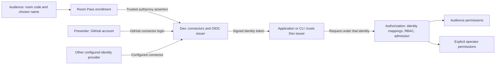
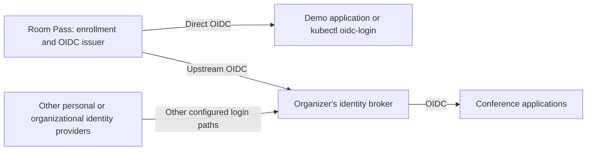

# To Dex or not to Dex?

Decision: **keep Dex for the standalone Room Pass release.** Revisit replacing
it when a concrete integration or deployment need justifies owning the OIDC
provider responsibilities. Recorded 2026-09-21.

Related: [product vision](../PRODUCT-VISION.md),
[extraction plan](../OPEN-SOURCE-PLAN.md), and
[current authorization model](../../docs/authorization.md).

## Keep Dex and reconsider the integration separately

Keeping Dex does not require keeping authproxy forever. The proposed follow-up
is to investigate Room Pass as an OIDC upstream while retaining Dex for provider
selection, CLI flows, and the shared application-facing issuer. See the
[OIDC integration proposal](oidc-integration-proposal.md) for current and proposed
architecture diagrams, trust-boundary tradeoffs, and prototype acceptance checks.
This is an investigation, not an implemented migration or an extraction gate.

## What Dex contributes today

Room Pass admits a browser to a room and supplies its enrollment identity. Dex
turns that assertion into a standards-based login that applications can consume.
The current Room Pass-to-Dex connection uses Dex's `authproxy` connector;
Room Pass itself is not an OIDC provider.

| Responsibility | What removing Dex would require |
|---|---|
| OIDC discovery and public signing keys | Expose and maintain compatible discovery and key endpoints |
| Authorization-code flow and PKCE | Implement the protocol through a suitable server library or replacement service |
| Signed tokens, claims, expiry, and signing-key lifecycle | Own claim construction, persistent keys, rotation, and compatibility |
| Client configuration and redirect validation | Provide client management and enforce allowed redirects |
| Device authorization | Preserve this flow for terminal clients that cannot receive a local browser callback |
| Multiple upstream identity sources | Implement or delegate connections to GitHub, other OIDC providers, and other supported identity systems |

These responsibilities are described in Dex's
[documentation](https://dexidp.io/docs/) and
[OAuth configuration](https://dexidp.io/docs/configuration/oauth2/).
Replacing Dex with a library can reduce the number of deployed services, but
the product still owns the resulting protocol integration and operation.

## A concrete reason to keep it: audience and operator identities

The demo already used this distinction: attendees joined through Room Pass,
while the presenter signed in through GitHub and received additional rights
through the platform's explicit authorization configuration.

Dex can offer different login connectors behind one issuer. Room Pass supplies
the temporary audience path; GitHub or another configured provider supplies an
existing personal or organizational identity. Applications can use that shared
issuer while authorization distinguishes the resulting identities.

This is a logical identity diagram. Public issuer requests still pass through
the Room Pass gateway in the current deployment; Dex is not directly exposed.
See the [current architecture](../PRODUCT-VISION.md#how-the-current-components-fit-together).

Choosing GitHub does not itself grant extra rights. The presenter's particular
identity has matching grants. Another GitHub user does not automatically receive
them, and a room participant choosing the presenter's display name does not
become that operator. Preserve distinct identity mappings and explicit grants
when packaging this as a reusable example.

The browser's provider choice is therefore useful: attendees can participate
without a personal account, while operators can use an established identity for
privileged actions. This is a product benefit, not just an implementation detail.

Terminology: the demo's GitHub sign-in uses Dex's GitHub connector, with Dex
issuing OIDC tokens to the application. That is distinct from GitHub Actions
OIDC workload tokens. Dex also supports connecting to upstream OIDC providers;
the available integrations are listed in its
[connector documentation](https://dexidp.io/docs/connectors/).

## Does kubectl oidc-login require Dex?

No. `kubectl oidc-login` (int128/kubelogin) requires a compatible OIDC provider,
not Dex specifically. It supports authorization-code and device authorization
flows. A replacement issuer could retain CLI access by supporting the relevant
flows, claims, client configuration, and Kubernetes issuer/audience trust setup.
See [kubelogin setup](https://github.com/int128/kubelogin/blob/master/docs/setup.md).

The existing [end-to-end suite](../test/e2e/e2e_test.go) exercises device
authorization through Room Pass and Dex using a Go OAuth client. It does not
invoke the kubectl plugin itself. Direct plugin interoperability should be an
explicit check when promising support for a release or evaluating a replacement.

One limitation matters: Dex's current
[authproxy connector](https://dexidp.io/docs/connectors/authproxy/) does not
support refresh tokens. Returning through login can reuse the browser's Room
Pass enrollment, but that is not silent token refresh. Refresh-token behavior
must be evaluated per connector rather than assumed for every Dex login path.

## Arguments for keeping Dex

- It already supplies the protocol machinery that browser and CLI clients need.
- Multiple identity sources let the same demo serve temporary attendees and
  established operators under a shared issuer, with distinct permissions.
- Existing tests exercise the real integration, including device authorization,
  browser handoff, stable identity, and Kubernetes access.
- Extraction can focus on a usable installation, documentation, and independent
  release rather than simultaneously changing the authentication architecture.
- Packaging Room Pass and Dex together may address installation friction without
  transferring all issuer responsibilities into Room Pass.

## Arguments for replacing Dex eventually

- A Room Pass service with an embedded OIDC server implementation could reduce
  deployment components and configuration boundaries.
- It could control room-specific identity and session behavior directly instead
  of adapting it to authproxy and its refresh-token limitations.
- Exposing Room Pass itself as an OIDC issuer would create a standard federation
  boundary: applications could connect directly, or an organizer could connect
  it as an upstream identity source to a compatible broker.
- That could remove the current dependency on Dex callback conventions,
  trusted identity headers, and allowed proxy routes.

These are potential benefits, not demonstrated improvements. Removing Dex does
not automatically remove Kubernetes, solve cross-domain QR prefill, provide
multi-tenancy, or simplify safe operation. Nor does it automatically preserve
the alternative login choices currently supplied by Dex.

## Alternatives

| Direction | Benefit | Tradeoff |
|---|---|---|
| Package Room Pass + Dex | Preserve proven flows and multiple login choices; improve installation | Keep the Dex-specific internal integration |
| Room Pass becomes an OIDC provider using an established server library | Potentially one service and direct lifecycle control | Own provider integration, key/client management, and compatibility; replace other login paths if needed |
| Room Pass becomes an OIDC provider usable directly or behind a broker | Standard integration with applications and organizer identity infrastructure | Requires the provider work plus broker interoperability testing |

The third direction would look like this; it is a future design, not the current
implementation:

## Would Dex need to include Room Pass upstream?

No. If Room Pass becomes an OIDC provider, an operator could use Dex's existing
[generic OpenID Connect connector](https://dexidp.io/docs/connectors/oidc/)
(`type: oidc`). Configure the issuer URL, client credentials, and registered
callback; no Room Pass-specific connector or upstream approval is required.
Interoperability still needs testing, including claims and session behavior.

This is different from Dex's
[generic OAuth 2.0 connector](https://dexidp.io/docs/connectors/oauth/)
(`type: oauth`). That connector takes explicit authorization, token, and user
information endpoints plus identity-field mappings. The OIDC connector uses
the provider's OIDC discovery and identity protocol. For the proposed Room Pass
OIDC-provider architecture, `type: oidc` is the intended integration. Today's
implementation continues to use `type: authproxy`.

There are two possible upstream contributions:

- **A tested integration guide or example:** demonstrate Room Pass with an
  existing connector. This could start with today's authproxy design and later
  cover an OIDC-provider version. Inclusion depends on maintainer interest, but
  users do not need it merged to configure the integration themselves.
- **A dedicated Room Pass connector:** propose new Dex integration code if
  useful behavior cannot be covered by the generic connectors. This needs
  maintainer agreement and an ongoing maintenance commitment; it is not a
  prerequisite for OIDC interoperability.

A practical open-source progression is to publish the existing combination,
demonstrate independent adoption, and offer a tested example upstream. Consider
a standalone OIDC interface when a concrete need emerges. Contributing to Dex
is a collaboration opportunity, separate from the decision to replace it.

## When to reconsider

Keep Dex until experience shows that its deployment burden or integration
constraints prevent a valuable use case. Collect that evidence from independent
speaker rehearsals and organizer integrations.

Before committing to a replacement, prototype the complete browser and CLI
journeys, including actual kubelogin use, persistence and key rotation, client
configuration, identity stability, and room-stop versus issued-token behavior.
Decide explicitly how presenter login through other providers will remain
available. Compare the operating and maintenance burden, not only container
count.

For now, Dex's combination of audience login, established operator identities,
and protocol support is useful enough to keep. The next step is a well-packaged,
documented Room Pass + Dex release.
