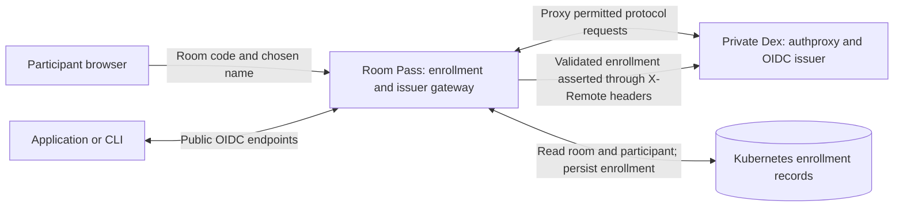
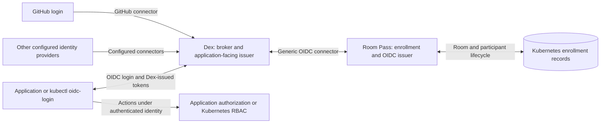
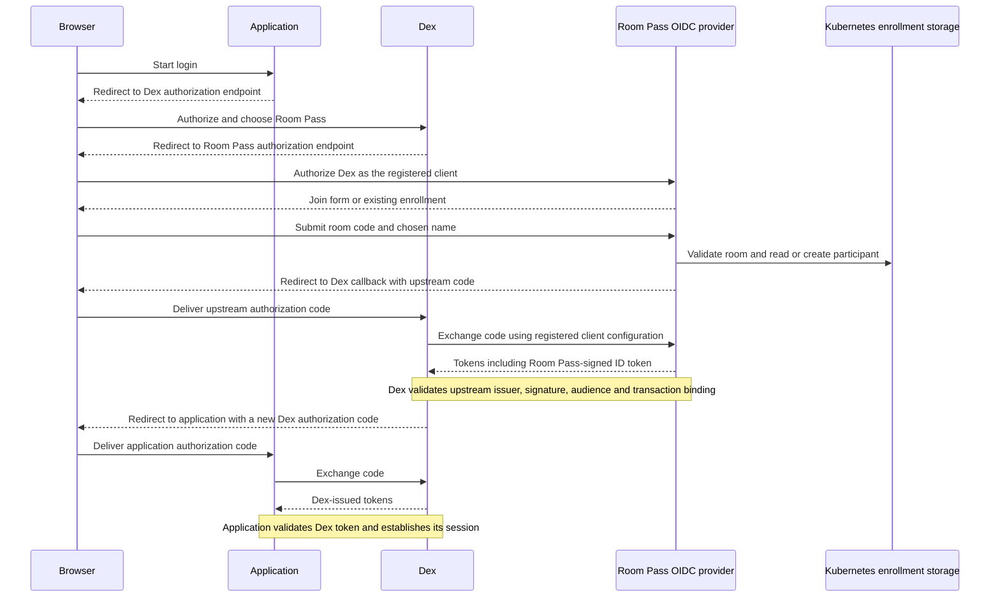

# Keep Dex, investigate replacing authproxy with OIDC

Status: architecture proposal, 2026-09-21. No implementation or migration is
implied. The current supported integration remains Room Pass + Dex authproxy.
This is a bounded follow-up investigation, not a prerequisite for extraction.

The [Dex decision record](To-dex-or-not-to-dex.md) explains why keeping Dex is
useful. This proposal separates two decisions: retaining Dex as the shared
issuer and replacing the proprietary integration boundary used for enrollment.

## Current architecture: trusted headers

This is a responsibility diagram; browser redirects are abbreviated. Room Pass
intercepts Dex's connector callback, runs a browser-bound handoff, and supplies
server-derived identity headers to the private upstream. See the implemented
[handoff protocol](handoff.md).

The design requires incoming identity headers to be stripped and direct access
to Dex to be blocked. Those controls exist and have test coverage. This proposal
does not claim a discovered bypass. The concern is that routing and network
configuration are essential to protecting a trusted-header authentication path,
which adds obligations for each independent deployment.

Dex's [authproxy connector](https://dexidp.io/docs/connectors/authproxy/) also
does not support refresh tokens. That is a concrete limitation, rather than a
claim that every authproxy integration is incomplete or unsafe.

## Proposed architecture: an OIDC upstream, with Dex retained

Room Pass would become an upstream OIDC provider. Dex would be its client,
using the existing [generic OIDC connector](https://dexidp.io/docs/connectors/oidc/)
(`type: oidc`), not the separate generic OAuth2 connector. No new connector
needs to be merged into Dex for this architecture.

Room Pass would no longer need to intercept Dex callbacks or proxy all of its
public issuer traffic. Dex would have its own normal issuer ingress, while
Room Pass would expose its own enrollment and OIDC endpoints. This routing
change belongs to the proposed migration only: exposing the current authproxy
upstream directly would bypass the intended boundary.

Dex retains provider selection and its shared issuer. Attendees use room
enrollment; the presenter can choose GitHub and receive explicitly granted
operator permissions. Provider choice alone still grants no privileges.

## Proposed browser login sequence

There are two separate authorization transactions and two issuers. Applications
continue to trust Dex; they do not receive the upstream Room Pass ID token as
their own login credential. Direct application access to Room Pass could become
possible later but is outside this first broker-integration prototype.

## Benefits and responsibilities

| Potential benefit | Responsibility that remains or moves into Room Pass |
|---|---|
| Remove the trusted-header assertion boundary | Implement secure OIDC transactions, client authentication, redirect validation, and code handling |
| Standard integration with Dex and other compatible brokers | Test discovery, claims, token validation, and broker interoperability |
| Less Dex-specific routing and callback interception | Operate a separate issuer with persistent signing keys, publication, rotation, and recovery |
| More control over enrollment and session behavior | Specify authorization, refresh, revocation, and room-end behavior explicitly |
| Keep other provider choices and a shared issuer | Preserve identity separation, subject mappings, and explicit operator grants |

An established OIDC server library should provide the protocol implementation.
Library reuse still leaves integration, configuration, key management, and
security maintenance with the project. The result is not automatically safer
merely because it uses OIDC; it replaces one trust boundary with another.

Kubernetes storage, multi-tenancy, and cross-domain QR prefill remain separate
design questions. In particular, the existing join-host cookie shortcut cannot
be assumed to survive the new redirect topology unchanged.

## Room lifecycle and CLI behavior need explicit decisions

Refresh support is optional. A first prototype can preserve reauthentication
without issuing refresh tokens. If refresh is added, define when it rechecks
room expiry, stop, and participant revocation. Test the broker's own session
and refresh behavior too: an upstream refusal does not erase tokens or sessions
already held by Dex or an application. Do not promise immediate access withdrawal
without an enforcement mechanism at the resource/application layer.

With Dex retained, CLI clients can continue using Dex's device authorization
endpoint. Room Pass needs to support the browser authorization journey Dex
starts upstream; it does not necessarily need its own device endpoint for this
topology. Direct CLI access to Room Pass would require its own supported flow.
Verify actual [kubelogin](https://github.com/int128/kubelogin/blob/master/docs/setup.md)
behavior rather than relying only on the existing Go OAuth-client tests.

## Bounded prototype and migration criteria

1. Build an isolated provider prototype using a reviewed server library and the
   existing enrollment rules. Register Dex as its client; use disposable test
   identities and explicit callback URLs.
2. Demonstrate browser login through Dex, returning enrollment, QR joining,
   and the actual kubectl plugin, including Dex device authorization.
3. Exercise issuer/audience/signature validation, redirect restrictions, state
   and nonce binding, code replay and expiry, and relevant PKCE behavior.
4. Test closed, stopped, expired, and recreated rooms; participant revocation;
   browser/session loss; and any supported refresh path through the broker.
5. Prove persistent signing keys, rotation, restart recovery, and the GitHub
   operator path with its distinct permissions.
6. Compare deployment and maintenance effort with the existing integration.
   Document whether the benefit justifies adopting the prototype.

Before a real migration, compare resulting Dex subjects, connector claims,
groups, and authorization mappings. Keeping Dex's issuer URL alone does not
guarantee stable identities when changing connector types. Plan any required
re-enrollment, grant updates, and session expiry, and rehearse rollback before
an event. Deploy the routing and connector changes together; do not weaken the
current authproxy boundary during transition.

The desired outcome is a standard enrollment-to-broker interface while keeping
Dex's useful role. The current release can proceed independently of this work.
