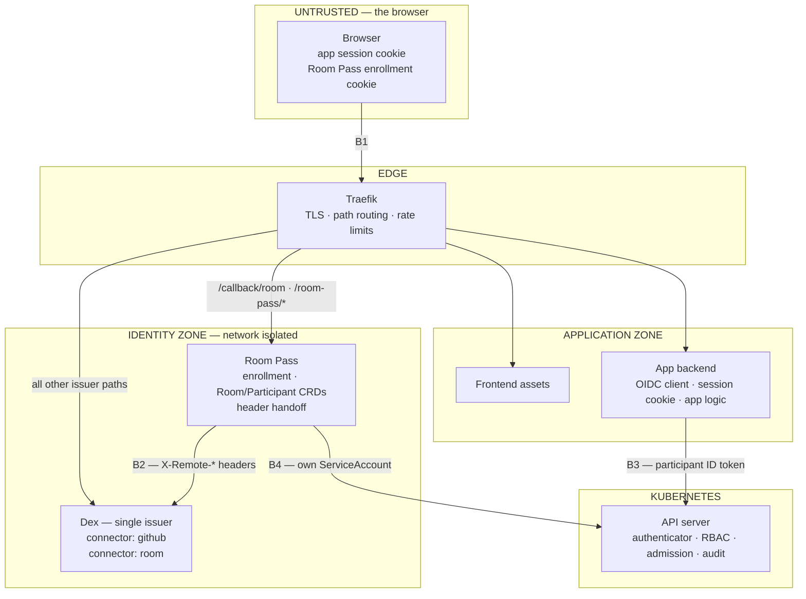
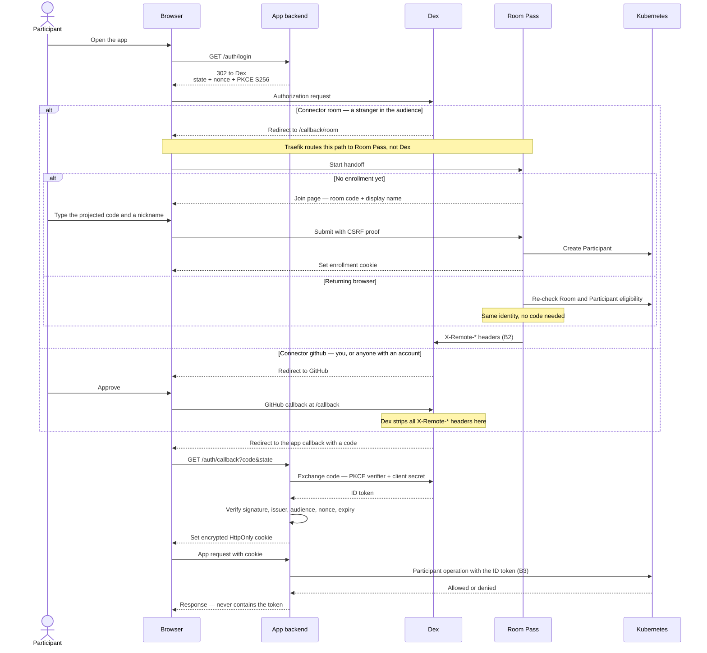
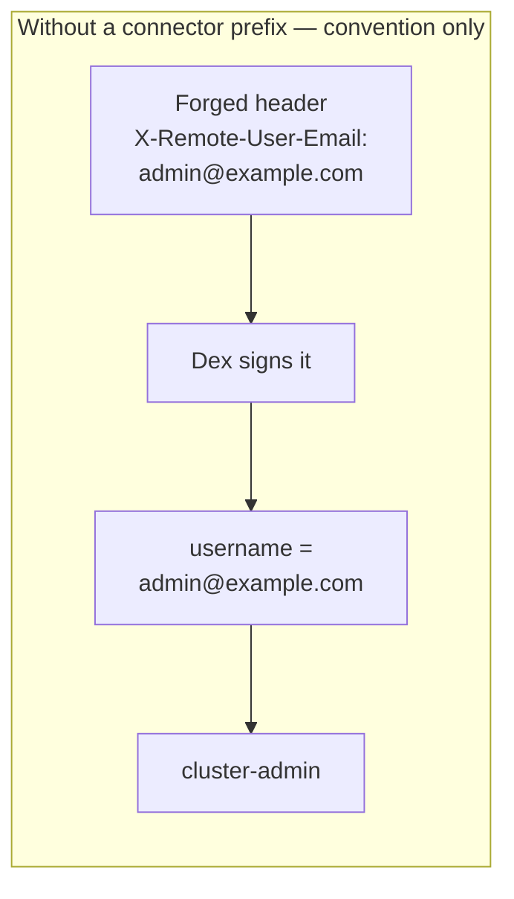
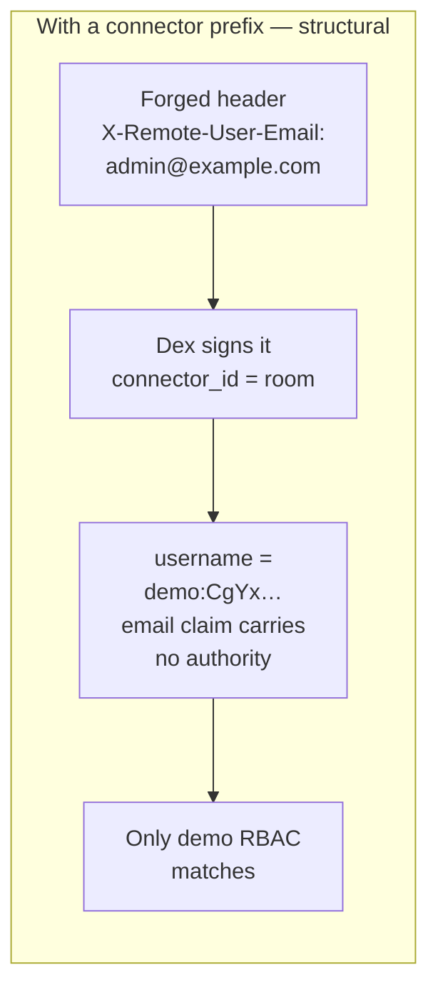
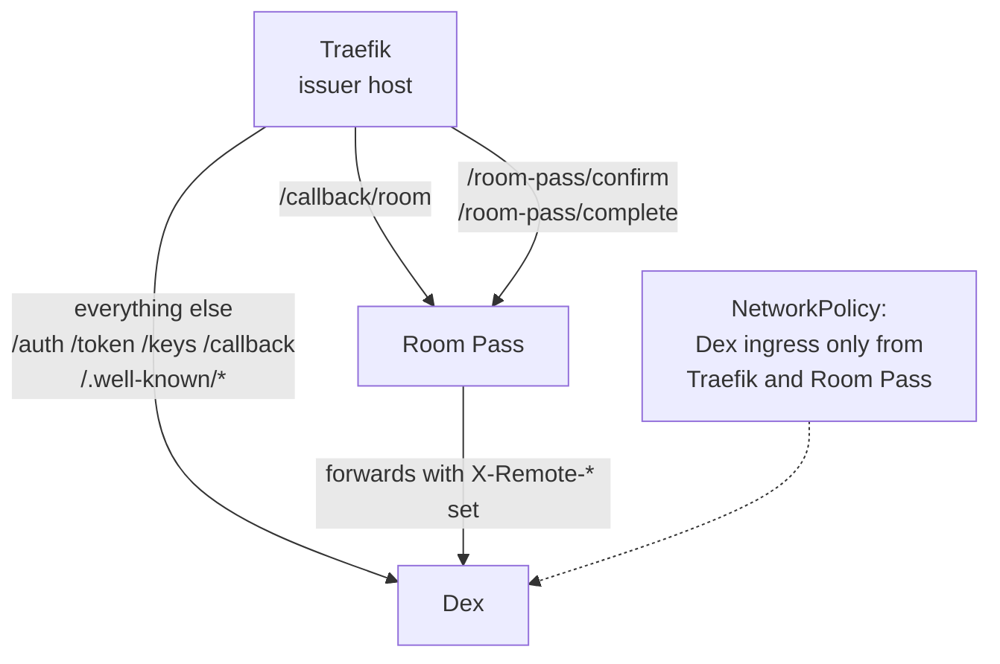
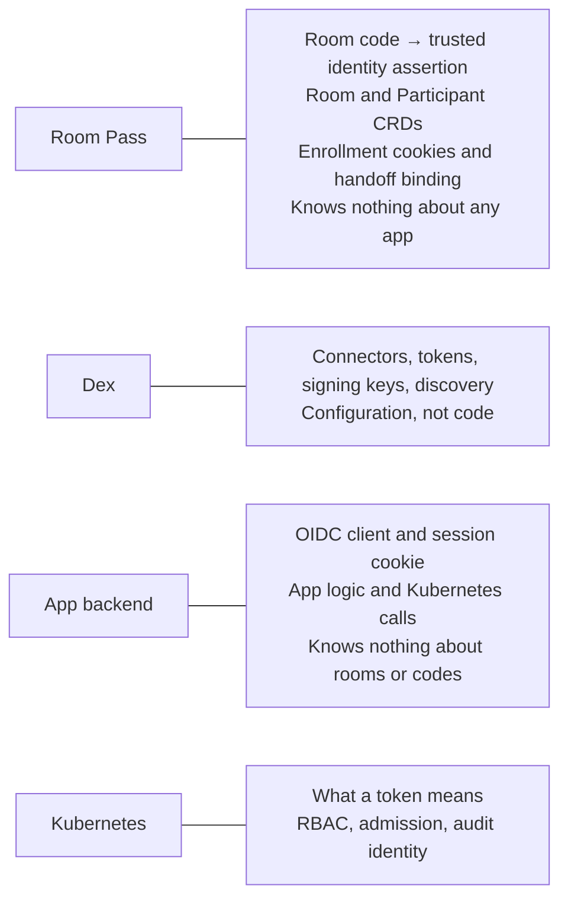

# How login works: Room Pass, Dex and the app backend

Rewritten 2026-09-10. Describes the **agreed target design**, not verified deployment
state. No cluster was inspected. Where this contradicts
[advised_architecture.md](advised_architecture.md) or the
[implementation plan](implementation_plan.md), this document is newer — see
[What this replaces](#what-this-replaces).

## The one idea that makes this simple

"Login" is not one thing. It is three jobs, and each has exactly one owner:

| Job | Owner | Is it code you write? |
| --- | --- | --- |
| Prove who a human is | A **Dex connector** | No. Configuration. |
| Be the app's OIDC client and own the browser session | The **app backend** | Yes — written once, never again. |
| Do app work as that identity | The **app backend** | Yes — this is your actual product. |

The consequence worth internalising: **there is only ever one login flow in the
app.** Redirect to Dex, receive a code, exchange it, verify the ID token, set a
cookie. The backend never learns *how* the person proved themselves. A room code
and a GitHub account are two connectors on the same issuer, and adding the second
one costs zero lines of application code.

Room Pass is not a competing login system. It is **the implementation of one
connector** — the room-code way of proving identity — plus the gateway that stops
anyone else forging that connector's input. That is a genuinely separate concern
with its own lifecycle, which is why it stays a separate component.

## Components and trust zones



Four boundaries carry the whole security model. Everything else is plumbing.

| | Boundary | What crosses it | Why it matters |
| --- | --- | --- | --- |
| **B1** | Browser → anything | Cookies, form fields, redirects | **Nothing here is identity.** No endpoint accepts a browser-supplied subject, email or group. Room codes and display names are enrollment input, never authorization input. |
| **B2** | Room Pass → Dex | `X-Remote-*` headers | These headers **are** the identity assertion. Dex's authproxy connector trusts them unconditionally. Anything able to reach Dex's `/callback/room` directly can assert an identity. |
| **B3** | ID token → Kubernetes | A signed JWT | The API server's authenticator decides **what a token means**. This is where a forged assertion is contained — see [The trap](#the-trap-and-the-fix). |
| **B4** | Service identities → Kubernetes | ServiceAccount tokens | Room Pass may write Participants. The app backend must **never** retry a denied participant operation as itself. |

## The login flow

One flow. The connector choice is the only fork, and it happens inside Dex.



Note what the app backend does **not** do: it does not know about rooms, codes,
Participants, connectors or GitHub. The two branches are indistinguishable to it.

## The trap, and the fix

This is the part that decides whether one shared Dex is safe.

The current platform authenticator
([authentication-config.reference.yaml](../external/k8s/k8s.koudijs.dev/2-gitops/auth/authentication-config.reference.yaml))
maps the email claim straight to a Kubernetes username with no prefix, and
[humans-rbac.yaml](../external/k8s/k8s.koudijs.dev/2-gitops/auth/rbac/humans-rbac.yaml)
binds one email to `cluster-admin`:

```yaml
username:
  claim: "email"
  prefix: ""
```

Add the `room` authproxy connector to that issuer and the consequence is immediate.
Authproxy's entire contract is trusting a header. Room Pass sets
`X-Remote-User-Email` — today to a synthetic `<id>@demo.invalid`, because that is
what [its code chooses to do](internal/server/server.go). But that is a
**convention inside one program**, not an enforced boundary. Anything that reaches
B2 and asserts the administrator's address becomes `cluster-admin`.



The fix does not rely on Room Pass behaving, or on network policy being perfect.
Dex places `federated_claims.connector_id` in the ID token, so the API server can
tell the two connectors apart **without trusting anyone in the request path**.
Derive the username from that:

```yaml
claimMappings:
  username:
    expression: >-
      claims.?federated_claims.?connector_id.orValue('') == 'github'
        ? 'github:' + claims.email
        : 'demo:' + claims.sub
claimValidationRules:
  - expression: >-
      claims.?federated_claims.?connector_id.orValue('') != 'room' ||
      dyn(claims.groups).all(g, g.startsWith('demo:'))
    message: the room connector may only assert demo groups
```



### The scope that makes or breaks this

Dex emits `federated_claims` **only when the client requests the `federated:id`
scope**. `tokens/issuer.go` builds the claim inside a `case scope ==
ScopeFederatedID` branch, so a client asking for the usual
`openid profile email groups` gets a token with no connector in it at all.

That makes the scope a hard configuration requirement on **every** client whose
tokens Kubernetes validates — the app backend, `kubectl`/kubelogin, and anything
else added later. It is why the validation rule above rejects a token with no
`federated_claims` outright instead of quietly falling through to a branch: a
client that forgets the scope should fail with a message naming the fix, not
authenticate as something unintended.

The direction of failure is the safe one. Suppressing the claim cannot gain
privilege — it only gets the token rejected — and `connector_id` is set by Dex
from its own server-side state, so it cannot be forged by the caller.

Three properties are worth naming explicitly:

- **The default branch is the low-privilege one.** A token with no recognisable
  connector becomes a `demo:` user, not an operator. Failure adds no privilege.
- **The email claim loses its authority.** It survives only as an attribution extra
  for Git commits, which is all it was ever meant to be.
- **Network isolation becomes defence in depth** rather than the only defence. That
  is the difference between a design and a hope.

Cost: a one-time rewrite of existing bindings onto the `github:` prefix. Take it.

### What merging actually costs on this cluster

The dedicated demo Dex was not only a trust-separation preference. The
[deployed manifest](../external/k8s/k8s.koudijs.dev/2-gitops/voter-demo/dex.yaml)
records a concrete reason: the platform Dex has a public Ingress and **no
NetworkPolicy**, so every pod in the cluster can reach it — including the
`web-preview-pr-*` namespaces that run pull-request code. The demo Dex has no
Ingress and a NetworkPolicy admitting only Room Pass.

Moving the `room` connector onto the shared issuer therefore trades a property
away. Today, forging a participant identity requires getting past a
NetworkPolicy. Afterwards, any in-cluster workload can POST invented
`X-Remote-*` headers to `/callback/room` and receive a genuine, correctly signed
participant token. Traefik path routing does not prevent this: it is an L7
control, and the ClusterIP Service is still there.

Connector-prefixed usernames are what make that survivable rather than fatal —
the forged token is a `demo:` identity holding demo RBAC, so the blast radius is
demo data, attribution and availability, which is the
[proportionate risk](#the-trap-and-the-fix) the demo was always accepting from
participants themselves. What is genuinely lost is that the room code stops
being a real gate for anything already running in the cluster.

Two ways to buy the property back, neither required for correctness:

- Add a NetworkPolicy to the platform Dex restricting ingress to Traefik, the
  kube-apiserver and its known client workloads. This is the control whose
  absence the demo-Dex comment complains about, and it is worth having
  independently of this decision.
- Keep the dedicated demo Dex. One deployment more, and the connector-prefix
  work still applies — it is what makes *any* shared-issuer future safe.

### The same control makes public GitHub login safe

The GitHub connector is currently restricted to one organisation
([dex.yaml](../external/k8s/k8s.koudijs.dev/2-gitops/auth/dex/dex.yaml)):

```yaml
orgs:
  - name: koudijs-dev
```

Letting anyone log in with their own handle means dropping that. The change is one
line and no code — but be deliberate about what it means: **every GitHub user can
then obtain a valid token from your issuer.** They receive no RBAC bindings, so they
can do essentially nothing, but they do land in `system:authenticated`, and the
`kubernetes` Dex client is public (PKCE, localhost redirects), so anyone could run
`kubelogin` and authenticate against the cluster.

With connector-prefixed usernames that is a reasonable position to hold: strangers
become `github:<email>` with nothing bound to them, while operator grants live on
`github:` names that no other connector can produce. Before flipping it, review what
your cluster binds to `system:authenticated`.

## Routing: one issuer without breaking GitHub login

An earlier version of this document worried that putting the shared issuer behind
the Room Pass gateway would break the GitHub connector's `/callback`. It would —
so don't. Room Pass does not need to proxy the issuer. It needs to **own two paths
on it**, which Traefik can arrange:



Why this is better than proxying everything:

- GitHub login is untouched. It reaches Dex's `/callback` directly.
- Room Pass stays a small enrollment service instead of becoming an issuer proxy —
  which is the separation you wanted anyway.
- **The existing gateway contract stays correct.** Today
  [`ServeHTTP`](internal/server/server.go) rejects every `/callback` path except
  `/callback/room`, and its tests assert that. Under this routing that rule is still
  right, now as defence in depth against a Traefik misroute. No test rewrite.

Two things move to Traefik as a result: rate limiting on `/auth` (the gateway's
limiter no longer sees that traffic), and the protocol-path allowlist. Keep the
gateway's unconditional stripping of `X-Remote-*`, `Impersonate-*`, `X-Forwarded-*`
and `Forwarded` on every inbound request — that is B2's inner guard, and Dex's own
stripping on the generic `/callback` does not cover custom header names.

## Who owns what



No component does two jobs, and none knows about more than its neighbours. The
backend's remaining login surface is small — [`oidc.go`](../voter/oidc.go),
[`oidc_handlers.go`](../voter/oidc_handlers.go) and
[`session_cookie.go`](../voter/session_cookie.go) — and it is written once
for every connector you will ever add.

Two cleanups belong with this design:

- **Remove the legacy identity mode.** `OIDC_ENABLED=false` selects a path where the
  browser asserts its own identity and the backend impersonates via its
  ServiceAccount ([identity.go](../voter/identity.go),
  [join_codes.go](../voter/join_codes.go), `/public/login`). That is a second
  login flow that violates B1 and B4 by construction. OIDC should be the only path.
- ~~Rename `auth-service/`.~~ **Done.** It is now `voter/`, and the frontend
  bundle is built into the same image and served by that binary, so the
  application is one deployable rather than three names for two.

## Why the token lives in a cookie, and what expiry means

The verified ID token goes into a signed, encrypted, `HttpOnly` cookie on the
application origin. JavaScript cannot read it; the browser attaches it
automatically; the backend decrypts it and uses it as the bearer credential at B3.
There is no server-side token database. Unfinished login transactions live in
bounded backend memory and are lost on restart, which costs a participant one
re-login.

The `authproxy` connector [issues no refresh token](https://dexidp.io/docs/connectors/authproxy/).
So a session ends when the ID token expires and login starts again — but Room Pass
remembers the enrollment, so the second login needs no room code and produces the
same identity. Clearing the app cookie signs out of the app; it does not revoke an
issued Dex token or delete the enrollment. Room Pass cookies and the app cookie are
separate things for separate purposes; there is no universal "OIDC cookie".

## Verify before adopting

This is a source- and configuration-supported design, not a tested deployment.

1. ~~`federated_claims.connector_id` is actually emitted~~ — **verified in the
   Dex source**, with a condition attached. See
   [the scope requirement](#the-scope-that-makes-or-breaks-this) and prove it in
   a real token for the GitHub connector too; the room connector is now asserted
   by the [end-to-end test](test/e2e/e2e_test.go).
2. **Audiences.** The app's ID token carries the app's client ID, not `kubernetes`.
   The authenticator must accept both audiences, or participant calls fail at B3.
3. **Forged headers are contained.** Send `X-Remote-*` to Dex's `/callback/room`
   and to `/callback` directly, and to the gateway, and confirm the resulting
   username is never an operator identity.
4. **Direct-to-Dex isolation.** From an unrelated pod, confirm Dex is unreachable.
5. **Both logins still work** — GitHub and room code — against one issuer, plus
   `kubectl` and the Flux dashboard.
6. **Denial does not fall back.** A rejected participant operation must not be
   retried as the backend's ServiceAccount.
7. **`system:authenticated` bindings** are acceptable for strangers, before opening
   the GitHub connector.

## What this replaces

| Earlier advice | Status |
| --- | --- |
| A dedicated demo Dex for trust separation | **Superseded.** One issuer with connector-prefixed usernames gives stronger separation than two issuers with unprefixed emails, and removes a deployment. |
| Evaluate oauth2-proxy for application login | **Closed — considered, not chosen.** The OIDC client is already written and working. A proxy would delete working code, add a deployment and a proxy-to-backend credential boundary, and still leave CSRF, expiry and frontend lifecycle to the backend. |
| GitHub login is out of scope for the demo | **Reversed.** It is a connector, not a flow, and the connector-prefix control makes opening it a deliberate, bounded decision. |
| The gateway must be extended to permit `/callback` | **Not needed.** Traefik path routing keeps GitHub's callback away from Room Pass, so the current reject-everything-but-`/callback/room` contract stays correct. |
