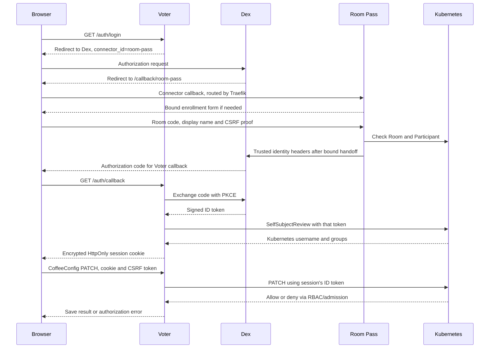

# How login works

Updated 2026-09-10 against source and the earlier deployment handoff. This explains
the implemented design; [current state](../state-of-the-repo.md) distinguishes
working login from the application journeys still being restored.

## Login, identity and permission are separate

Room Pass answers: **does this browser have valid enrollment in an active room?**
GitHub and LinkedIn answer their own account-authentication questions. Dex turns
that connector result into a signed identity token. Voter establishes an
application session from that token. Kubernetes decides what the identity may do.

You can therefore let everybody log in through LinkedIn, or eventually GitHub,
without making everybody an administrator. The owner gets an explicit binding;
an unrelated account does not match it. Room attendees get the explicit
`demo:voter-audience` group grant instead. Existing shared grants still count.
See [the access matrix](../docs/authorization.md) for the actual current policy.

GitHub remains organization-restricted in the recorded configuration. Opening it
requires checking the other Dex clients too: Grafana, Flux Web and oauth2-proxy
each have their own authorization rules.

## Follow an attendee login

The diagram abbreviates Room Pass's browser-bound, single-use handoff. A copied
cross-host link alone cannot enroll another browser. A returning enrollment can
reuse its Participant identity while the Room and Participant remain valid.

Choosing `/auth/login?connector=github` or `?connector=linkedin` uses the same
Voter callback and cookie mechanism, with the provider's connector replacing
Room Pass. The application allowlists those connector choices.

## Why a typed name cannot become an operator

Room Pass chooses an opaque participant identity and synthetic email. A display
name is attribution, not a login credential. Dex records which connector issued
the identity in `federated_claims.connector_id`; the Kubernetes authenticator
uses that claim to select `demo:`, `github:` or `linkedin:` as the username prefix.
The room connector is restricted to demo-prefixed groups.

This matters even if somebody manages to forge trusted headers: a room-connector
token must not map into an operator username or group. Network isolation and
routing must also prevent direct access to the trusted-header connector, because
otherwise attackers could bypass room enrollment even with demo-only authority.
The handoff records a Dex NetworkPolicy admitting only Traefik and Room Pass.

Every client whose token goes to Kubernetes must request the `federated:id` scope.
Without it Dex does not include the connector claim, and authentication fails.
The rendered platform authenticator is the policy to test, not an approximation
copied into a documentation example.

## What the browser keeps

The Voter cookie contains the ID token, encrypted and signed using persisted
application keys. It is HttpOnly and Secure. JavaScript gets identity metadata and
a per-session CSRF token through `/auth/session`, but cannot read the ID token.
The backend constructs a fresh Kubernetes client using that request's token.
Browser-supplied Authorization or impersonation headers cannot change it.

The displayed Kubernetes username comes from SelfSubjectReview. It can be empty
if that review failed; Voter must not invent a `demo:` name for an external user.

A cookie mutation requires matching CSRF proof. Voter allows absent Origin with
valid proof but rejects foreign and `null` origins. Room Pass's form also allows
`null` with its signed CSRF cookie and matching form field. This difference is
intentional in the current code and covered by regression cases; a Go HTTP client
still cannot establish how an actual browser sends these headers.

## What stopping and logging out mean

Stopping a Room prevents new enrollment/identity handoff. It cannot revoke a Dex
ID token already issued. That token remains usable until expiry wherever its
Kubernetes grants permit it. Removing an applicable RoleBinding removes that
grant, but other matching bindings can still authorize operations.

`/auth/logout` clears the Voter cookie only. It does not clear Room Pass enrollment
or revoke the Dex token. The next login may therefore recognize the attendee
without asking for the room code again. Session expiry is bounded by token expiry.

## Where the design stands

There is one Dex issuer, one Voter image containing Vue and Go, and a separate
Room Pass service. The old ForwardAuth/ServiceAccount impersonation runtime and
dedicated demo Dex have been retired. oauth2-proxy was considered as the app's
OIDC client; Voter currently owns that role itself.

The [architecture](advised_architecture.md) records deployment boundaries and
[implementation plan](implementation_plan.md) tracks real-policy, browser and
application restoration work. The dated [handoff](state-2026-09-10.md) preserves
the earlier deployment observations with review corrections.
