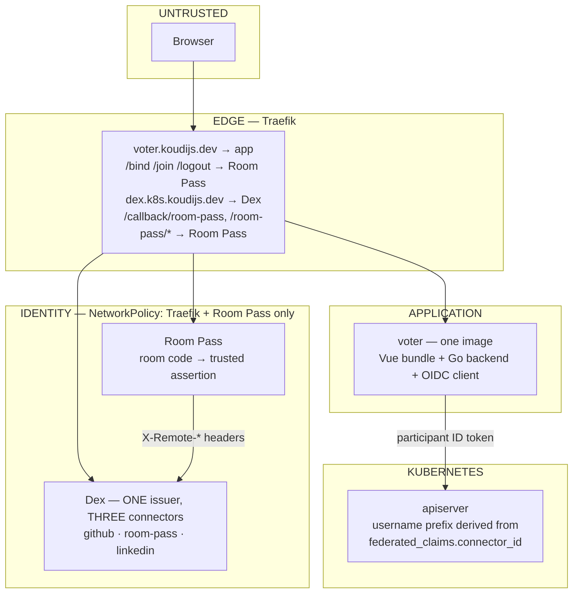

# Where the login work stands — 2026-09-10

Written at the end of a long working session, as a handoff. It records what is
**deployed and verified**, what is **deliberately unfinished**, and what is
**broken**. Every claim here was checked against the running cluster or the
repository at the time of writing; where something was not verified, it says so.

## Review addendum — 2026-09-10

The architecture, implementation plan, login explanation and root state document
have now been reconciled against local source. This handoff remains the original
session record; no live cluster verification was repeated during that review.
See [authorization and tests](../docs/authorization.md) for the current access matrix.

Corrections to the original observations below:

- Voter rejects `Origin: null`; only Room Pass tolerates it with valid CSRF proof.
- The named LinkedIn owner has a checked-in **cluster-admin** binding as well as
  Flux Web admin. The claim below that the exception is only Flux UI is incorrect.
- "Nothing" for other authenticated users means no named grants in these files;
  effective access also includes shared bindings such as `system:authenticated`.
- Follow-up cleanup removed root `k8s/` and `k8s-examples/`, including the old
  impersonation deployment. The external platform owns the application deployment.
  Voter's unused server credential client and legacy examples were also removed.
- The user now reports working login. That does not independently identify which
  connectors have completed an end-to-end test.

Companions: [login explained](login-explained.md),
[architecture](advised_architecture.md), [implementation plan](implementation_plan.md).

## Follow-up: metrics and browser verification

Room Pass now exposes operational metrics on a separate port, and Chromium tests
exercise the local Dex/Room Pass fixture in CI. The first browser run exposed CSP
`form-action 'self'` blocking the cross-origin redirect after enrollment. The form
now allows the configured issuer origin, and the browser test verifies completion.
See [metrics](docs/metrics.md) and [browser tests](test/browser/README.md).

The observations below remain the original handoff, not current live state.

## The shape of it now



| Connector | Who | Kubernetes username | Can do |
| --- | --- | --- | --- |
| `github` | operators, restricted to the `koudijs-dev` org | `github:<email>` | bound in `humans-rbac.yaml` |
| `room-pass` | conference participants, via room code | `demo:<dex-sub>` | demo RBAC only |
| `linkedin` | anyone with a LinkedIn account | `linkedin:<email>` | **nothing**, unless named |

## Done and verified

### One Dex, separated by connector rather than by issuer

`dex-demo` is deleted. The platform Dex serves all three connectors, and what
keeps them apart is the kube-apiserver deriving the username prefix from
`federated_claims.connector_id` — a claim Dex sets from its own state that no
caller can forge. A forged `X-Remote-*` header at the participant connector can
therefore only ever produce a `demo:` identity holding demo RBAC.

Verified: all three control planes carry an identical authenticator
(`md5sum` matched), all three apiservers healthy, etcd quorum intact throughout
the rolling reboot.

### The NetworkPolicy that makes it safe

The demo Dex existed because the platform Dex had a public Ingress and **no**
NetworkPolicy — every pod, including `web-preview-pr-*` running pull-request
code, could reach it. That policy is now written: Dex admits only Traefik and
Room Pass.

Verified live: a pod in `default` times out connecting to `dex-dex.dex.svc:5556`.

`podSelector: {}` is deliberate — a `matchLabels` that guessed the chart's
labels wrong would select nothing and silently protect nothing.

### One image, one deployable

`auth-service/` → `voter/`. The Vue bundle is built into the same image and
served by the Go binary from `STATIC_DIR`, so frontend and backend can never sit
at different revisions. The separate nginx image is gone.

### The legacy authentication model is deleted

Backend went 6,259 → 2,560 lines. No `/public/login`, no browser-asserted
identity, no ServiceAccount impersonation, and **no `OIDC_ENABLED`** — the
deployment can no longer be configured into trusting the browser. A test pins
the absence of every removed endpoint.

### Two bugs found and fixed

**`Referrer-Policy: no-referrer` made every browser fail.** Room Pass set that
header on every response, and under it a browser serialises the `Origin` of a
form POST as `null`; the CSRF check demanded an exact match. curl implements no
referrer policy and the e2e suite drives the flow with a Go HTTP client, so
**nothing in the test suite could see it** — only a real browser failed. Fixed
with `same-origin` plus tolerating absent/`null` Origin, since the double-submit
token is the real defence.

**The app invented a Kubernetes username.** `/auth/session` returned
`"demo:" + subject`, a guess at the apiserver's `claimMappings`, which became
wrong the moment a second connector existed — a LinkedIn login was displayed as
a `demo:` identity. It now asks Kubernetes (`SelfSubjectReview` at login), so
the name on screen is the name in the audit log.

### Smaller things

- `/auth/login` preselects `connector_id=room-pass`, so the audience never sees
  Dex's connector chooser. `/auth/login?connector=github|linkedin` is the
  operator door, allowlisted rather than free text.
- The connector is named `room-pass` everywhere. Its id is also its callback
  path, so this is `CONNECTOR_ID` config rather than a string in Go.
- Room Pass logs **why** it rejects a join — which of the four CSRF conditions
  failed, and which cookies the browser actually sent. It previously logged
  nothing at all.
- The join page shows a returning participant the name they chose.
- The SPA no longer claims `/join`, which shadowed Room Pass's real form.

## Not finished — deliberately

### 1. The application is a login with almost no app behind it

**This is the biggest gap.** Deleting the legacy session removed every endpoint
that depended on it. Those endpoints were already returning 401 in this
deployment, so nothing working was lost — but the SPA still calls them:

| Frontend calls | Backend |
| --- | --- |
| `/public/storefront`, `/public/orders` | gone |
| `/public/admin/coffeeconfig{,/watch,/changes,/changes/stream}` | gone |
| `/public/admin/orders{,/debug,/stream}` | gone |
| `/public/coffeeconfig` | **ported** to participant tokens |

Porting these to the participant-token path is the work that makes the demo a
demo again. `participant_coffee.go` is the pattern to follow. Start with the
storefront, since that is the screen a participant lands on.

### 2. Transitional entries to remove once confirmed

- `humans-rbac.yaml` still binds the **bare** `simonkoudijs@gmail.com` alongside
  `github:simonkoudijs@gmail.com`. Kept so the reboot could not lock anyone out.
  Confirm `kubectl auth whoami` reports the prefixed name, then delete the two
  bare subjects.
- `1-talos/values.yaml` still lists `legacyConnectorIds: ["room"]`, accepted so
  the reboot and the Dex rename did not have to be simultaneous. Removing it
  needs another rolling reboot, so batch it with the next authenticator change.

### 3. Interim authorization, coupled to one email

Nothing in Dex restricts which connector may authenticate which client, so every
client on the issuer had to be restricted itself. Two are currently blunter than
they should be:

- **oauth2-proxy**: `emailDomains: ["gmail.com"]` — excludes participants
  (`@demo.invalid`) but admits any gmail account that gets through Dex.
- **Grafana**: `role_attribute_strict: true` with the path matching one address.

Both should become `allowed-groups` / a group expression once the operator team
slug is settled — it is `koudijs-dev:the-specific-group` (a placeholder)
everywhere in the platform repo. Each file names the intended replacement.

### 4. LinkedIn is configured but not proven

The connector is wired, the credentials are in place, and Dex redirects to
LinkedIn with the right parameters. **Nobody has completed a LinkedIn login end
to end.** Expect it to authenticate and hold no Kubernetes permissions —
`linkedin:` is bound to nothing except the one named grant for the Flux Web UI.

If LinkedIn rejects the redirect, check the app's authorized redirect URL is
exactly `https://dex.k8s.koudijs.dev/callback` — an `oidc` connector gets the
generic path, not a suffixed one.

## Broken

### FluxInstance has been Stalled since 14:55

```
build failed: add operation does not apply: doc is missing path:
"/spec/versions/1/schema/openAPIV3Schema/properties/spec/properties/
 eventSources/items/properties/kind/enum/-": missing value
```

A patch appends to the Receiver CRD's `eventSources.kind` enum at version index
1, and that path no longer exists — most likely a Flux distribution bump
reshaping the CRD. **Unrelated to any authentication work**, but it means Flux
is not reconciling its own components. Not investigated.

## Worth reviewing with fresh eyes

Ranked by how much a second opinion would help:

1. **The CEL in `_authentication-config.tpl`.** It is the whole containment
   argument, it is templated, and a mistake in it is a privilege boundary. Read
   the *rendered* output on a node, not the template.
2. **`checkCSRF` and `csrfReason`** in both services now tolerate absent and
   `null` Origin. That reasoning is written down in the code; check it holds.
3. **The three-way split of who may reach which Dex client.** Flux Web enforces
   an allowlist in CEL, Grafana in JMESPath, oauth2-proxy by email domain. Three
   mechanisms, three files, one intent — the kind of thing that drifts.
4. **What `system:authenticated` grants**, now that a stranger with a LinkedIn
   account can obtain a valid token from this issuer.
5. **The `linkedin:simon@configbutler.ai` cluster-admin binding**, which trusts
   LinkedIn's email verification for cluster-admin.

## Things a reviewer will notice, that are known

- `docs/` and `plans/` still say `auth-service`. They are historical design
  notes for the deleted impersonation model; left as history.
- The e2e suite is **not run by CI** (`task test-e2e` creates a k3d cluster). It
  also drives the flow with a Go HTTP client, which is precisely why it could
  not catch the `Origin: null` bug. A browser-driven check would have.
- The join page's placeholder is `BCD-FGH`, implying a dashed 7-character code,
  but real codes are 6 undashed characters. Dashes are stripped server-side, so
  this is cosmetic — but it sent one person down the wrong path already.
- Seven leftover `Participant` objects from testing.
- Dex reads connector credentials from `envFrom` at pod start, so
  `podAnnotations.configbutler.ai/secrets-revision` must be **bumped whenever
  `dex-secrets.yaml` changes** or the new value is silently ignored.

## Two things that cost the most time

Recorded because they are non-obvious and will recur.

**Dex only emits `federated_claims` when the client requests the `federated:id`
scope.** The entire connector-prefix design rests on that claim. A client that
forgets the scope gets a token with no connector, which the authenticator now
rejects outright rather than quietly mapping to something else. Every client
whose tokens reach the apiserver must request it — `kubectl oidc-login`
included, via `--oidc-extra-scope=federated:id`.

**`talm template --offline` silently drops networking.** The tool's own error
message suggests `--offline` when it cannot authenticate. The render then loses
`LinkConfig` (static IP, gateway) and `Layer2VIPConfig` entirely and randomises
the hostname — applying it to three control planes would have taken the cluster
off the network with no API left to recover through. The actual fix was dropping
the `-i` (insecure) flag, which belongs to maintenance-mode bringup, not a
running cluster. **Always diff a fresh render against the config already on
disk before applying it.**

## Documents that needed reconciling (resolved by the review addendum)

`advised_architecture.md` and `implementation_plan.md` predate all of this and
still describe a dedicated demo Dex, `auth-service/`, and a legacy mode that no
longer exists. `login-explained.md` was rewritten mid-session and is closer, but
still says the connector is called `room` and does not mention LinkedIn.

A good first task for a fresh session: reconcile the three against this
document, or fold them into one.
